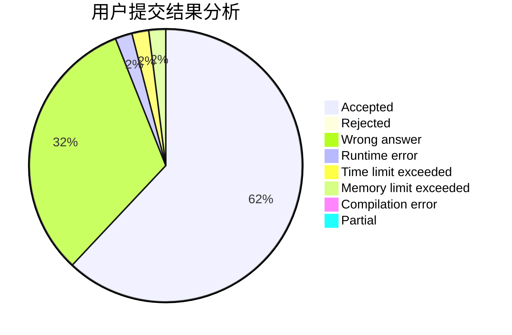
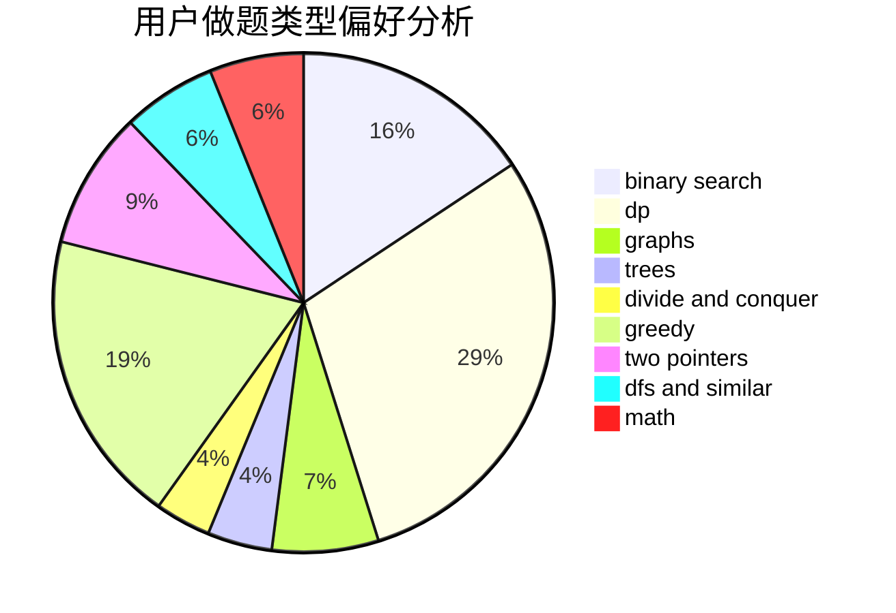

# NaVi_Awson

<!-- tabs:start -->

#### **用户提交结果分析**

#### **用户做题类型偏好分析**

<!-- tabs:end -->
# 推荐题目
[1151E](https://codeforces.com/contest/1151/problem/E)
[1007A](https://codeforces.com/contest/1007/problem/A)
[1368F](https://codeforces.com/contest/1368/problem/F)
[644A](https://codeforces.com/contest/644/problem/A)
[1246C](https://codeforces.com/contest/1246/problem/C)
[659B](https://codeforces.com/contest/659/problem/B)
[1065G](https://codeforces.com/contest/1065/problem/G)
[1139D](https://codeforces.com/contest/1139/problem/D)
[1432D](https://codeforces.com/contest/1432/problem/D)
[1083B](https://codeforces.com/contest/1083/problem/B)
