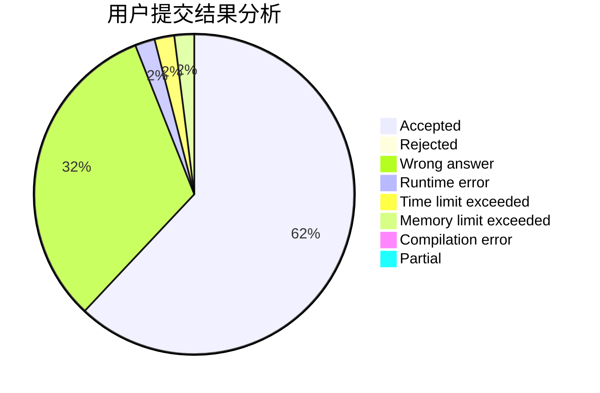
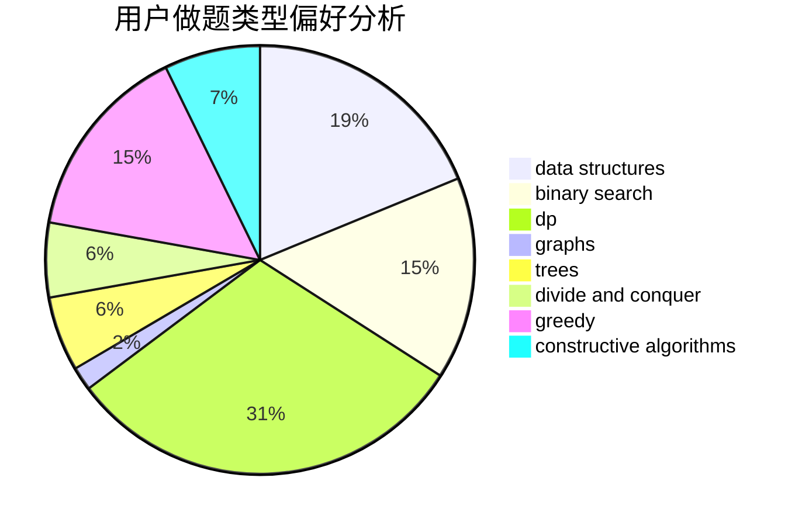
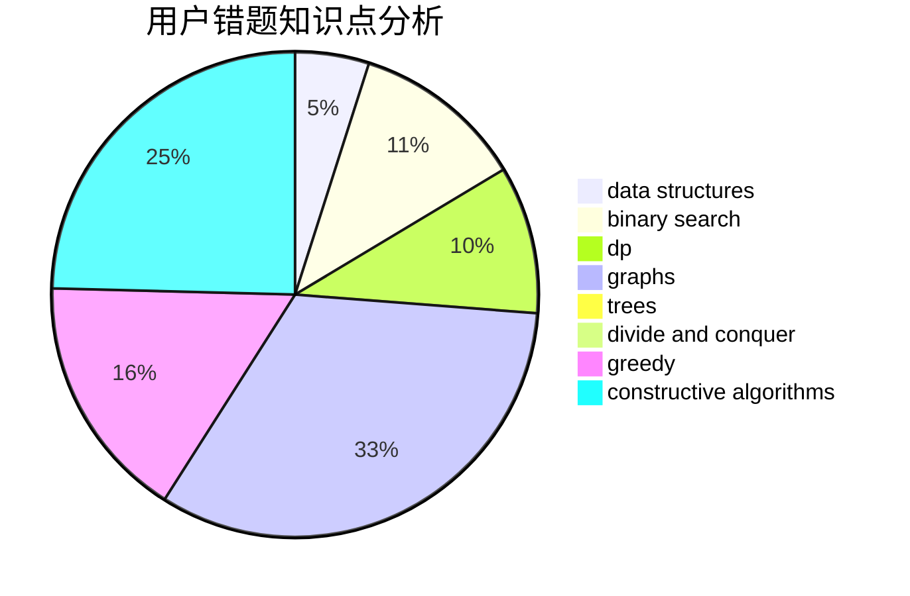

# NaVi_Awson

<!-- tabs:start -->

#### **用户提交结果分析**

#### **用户做题类型偏好分析**

#### **用户错题知识点分析**

<!-- tabs:end -->
# 推荐题目
[1151E](https://codeforces.com/contest/1151/problem/E)		combinatorics,
                        data structures,
                        dp,
                        math		  
[1007A](https://codeforces.com/contest/1007/problem/A)		combinatorics,
                        data structures,
                        math,
                        sortings,
                        two pointers		  
[1368F](https://codeforces.com/contest/1368/problem/F)		games,
                        implementation,
                        interactive,
                        math		  
[644A](https://codeforces.com/contest/644/problem/A)		*special problem,
                        constructive algorithms		  
[1246C](https://codeforces.com/contest/1246/problem/C)		dsu,graphs,sortings,trees		  
[659B](https://codeforces.com/contest/659/problem/B)		constructive algorithms,
                        sortings		  
[1065G](https://codeforces.com/contest/1065/problem/G)		strings		  
[1139D](https://codeforces.com/contest/1139/problem/D)		dp,
                        math,
                        number theory,
                        probabilities		  
[1432D](https://codeforces.com/contest/1432/problem/D)		dsu,graphs,sortings,trees		  
[1083B](https://codeforces.com/contest/1083/problem/B)		greedy,
                        strings		  
