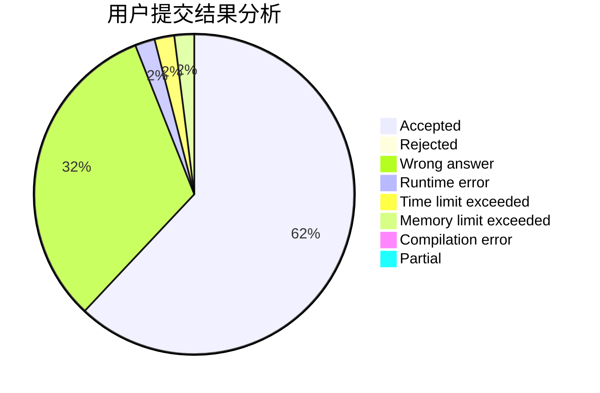
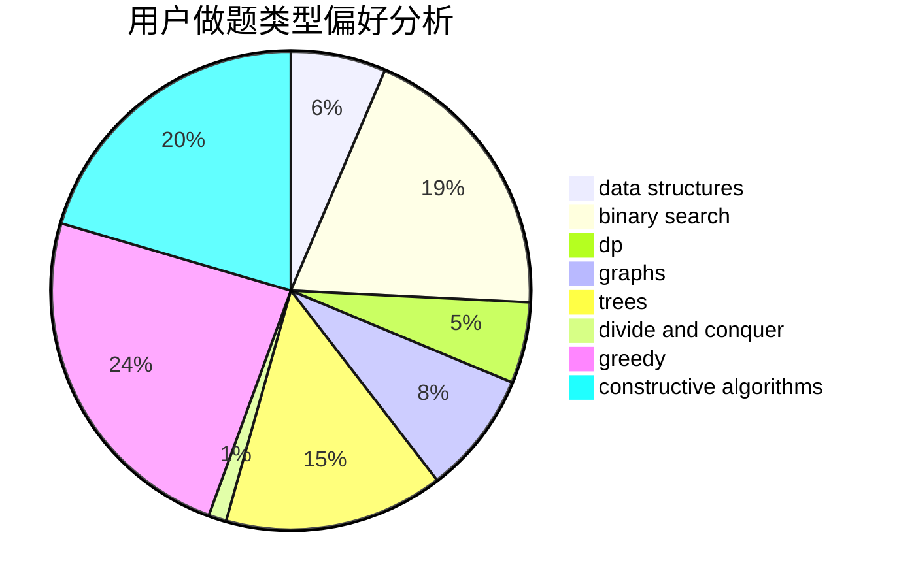
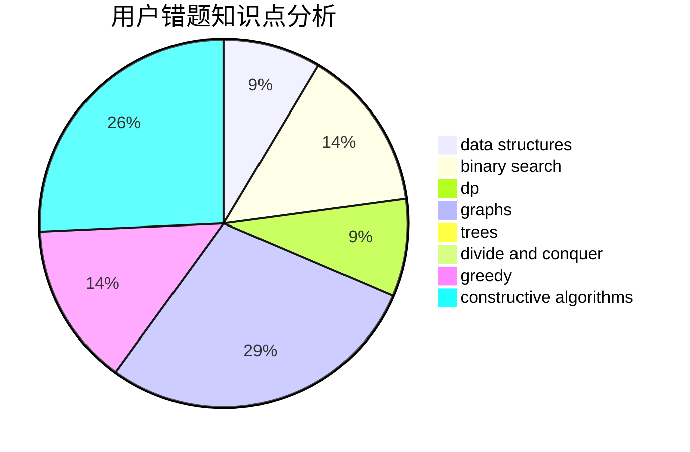

# NaVi_Awson

<!-- tabs:start -->

#### **用户提交结果分析**

#### **用户做题类型偏好分析**

#### **用户错题知识点分析**

<!-- tabs:end -->
# 推荐题目
[114B](https://codeforces.com/contest/114/problem/B)		bitmasks,
                        brute force,
                        graphs		  
[1006D](https://codeforces.com/contest/1006/problem/D)		implementation		  
[1360G](https://codeforces.com/contest/1360/problem/G)		constructive algorithms,
                        greedy,
                        math		  
[620E](https://codeforces.com/contest/620/problem/E)		bitmasks,
                        data structures,
                        trees		  
[1240F](https://codeforces.com/contest/1240/problem/F)		graphs		  
[629C](https://codeforces.com/contest/629/problem/C)		dp,
                        strings		  
[1065C](https://codeforces.com/contest/1065/problem/C)		greedy		  
[1137C](https://codeforces.com/contest/1137/problem/C)		dp,
                        graphs,
                        implementation		  
[1423N](https://codeforces.com/contest/1423/problem/N)		nan		  
[1082F](https://codeforces.com/contest/1082/problem/F)		dp,
                        strings,
                        trees		  
