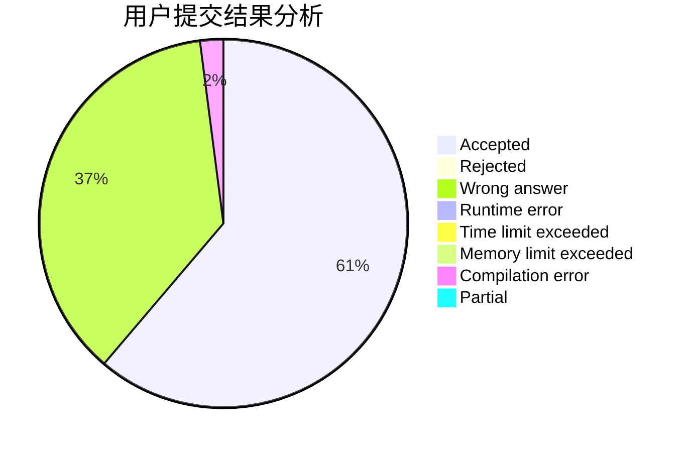
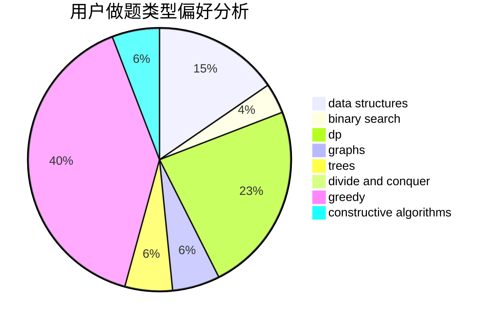
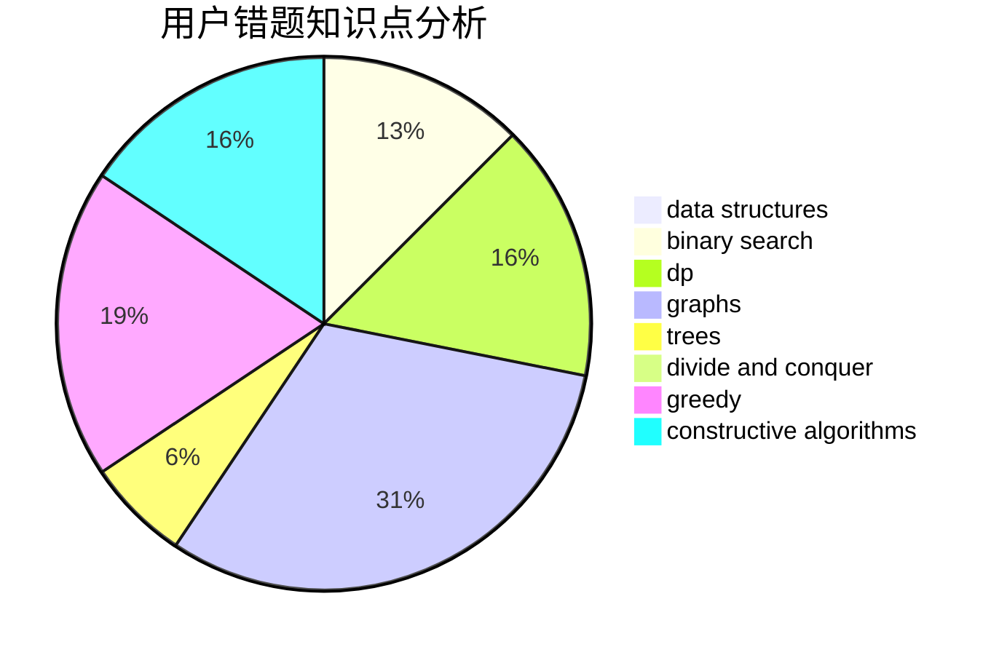

# NaVi_Gation

<!-- tabs:start -->

#### **用户提交结果分析**

#### **用户做题类型偏好分析**

#### **用户错题知识点分析**

<!-- tabs:end -->
# 推荐题目
[1108D](https://codeforces.com/contest/1108/problem/D)		constructive algorithms,
                        dp,
                        greedy		  
[1479D](https://codeforces.com/contest/1479/problem/D)		binary search,
                        bitmasks,
                        brute force,
                        data structures,
                        probabilities,
                        trees		  
[813F](https://codeforces.com/contest/813/problem/F)		data structures,
                        dsu,
                        graphs		  
[475A](https://codeforces.com/contest/475/problem/A)		implementation		  
[566E](https://codeforces.com/contest/566/problem/E)		bitmasks,
                        constructive algorithms,
                        trees		  
[660D](https://codeforces.com/contest/660/problem/D)		geometry		  
[571C](https://codeforces.com/contest/571/problem/C)		constructive algorithms,
                        dfs and similar,
                        graphs,
                        greedy		  
[1423K](https://codeforces.com/contest/1423/problem/K)		binary search,
                        math,
                        number theory,
                        two pointers		  
[383C](https://codeforces.com/contest/383/problem/C)		data structures,
                        dfs and similar,
                        trees		  
[1189E](https://codeforces.com/contest/1189/problem/E)		dsu,graphs,sortings,trees		  
