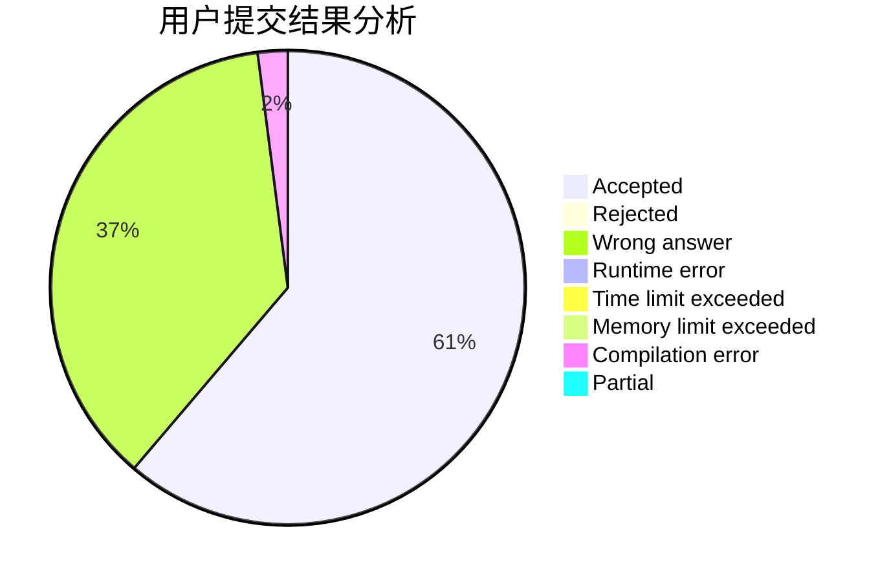
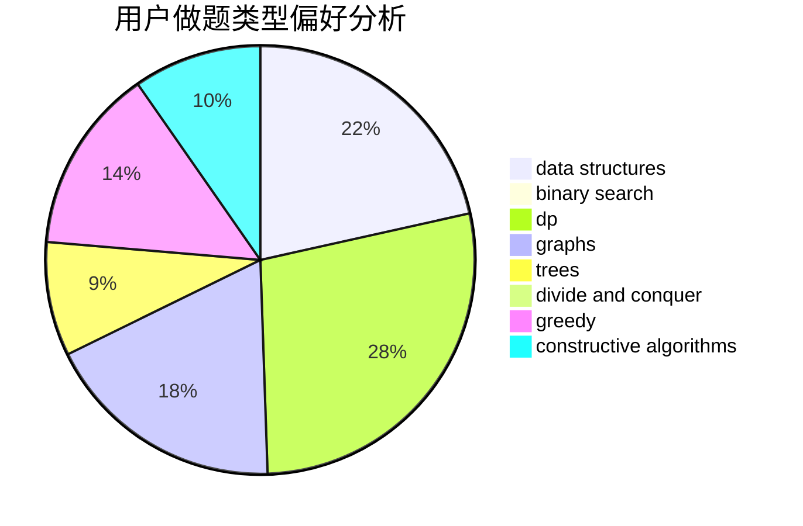
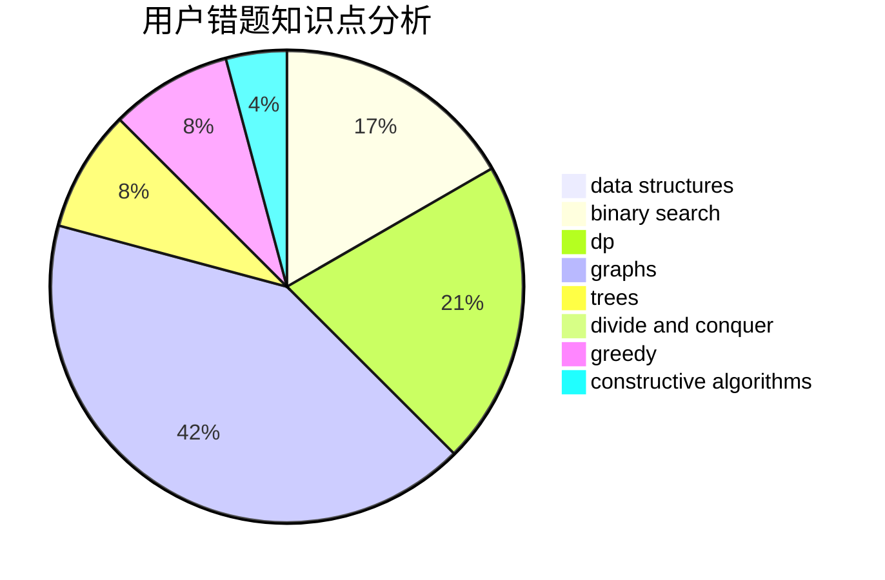

# NaVi_Gation

<!-- tabs:start -->

#### **用户提交结果分析**

#### **用户做题类型偏好分析**

#### **用户错题知识点分析**

<!-- tabs:end -->
# 推荐题目
[1108F](https://codeforces.com/contest/1108/problem/F)		binary search,
                        dsu,
                        graphs,
                        greedy		  
[1488B](https://codeforces.com/contest/1488/problem/B)		*special problem,
                        greedy		  
[832B](https://codeforces.com/contest/832/problem/B)		implementation,
                        strings		  
[494A](https://codeforces.com/contest/494/problem/A)		greedy		  
[585D](https://codeforces.com/contest/585/problem/D)		meet-in-the-middle		  
[681B](https://codeforces.com/contest/681/problem/B)		brute force		  
[591D](https://codeforces.com/contest/591/problem/D)		dsu,graphs,sortings,trees		  
[1432A](https://codeforces.com/contest/1432/problem/A)		dsu,graphs,sortings,trees		  
[414C](https://codeforces.com/contest/414/problem/C)		combinatorics,
                        divide and conquer		  
[11952](https://codeforces.com/contest/1195/problem/2)		dsu,graphs,sortings,trees		  
