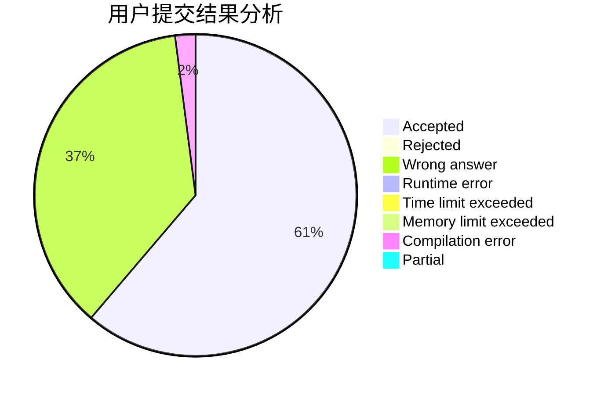
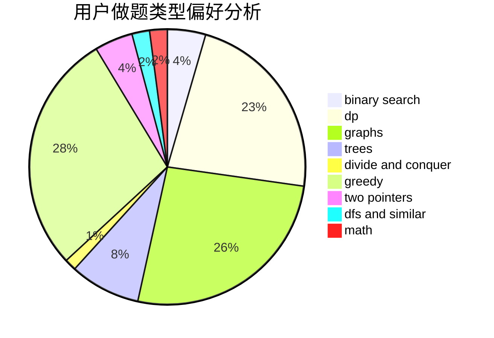

# NaVi_Gation

<!-- tabs:start -->

#### **用户提交结果分析**

#### **用户做题类型偏好分析**

<!-- tabs:end -->
# 推荐题目
[1108F](https://codeforces.com/contest/1108/problem/F)
[1488B](https://codeforces.com/contest/1488/problem/B)
[832B](https://codeforces.com/contest/832/problem/B)
[494A](https://codeforces.com/contest/494/problem/A)
[585D](https://codeforces.com/contest/585/problem/D)
[681B](https://codeforces.com/contest/681/problem/B)
[591D](https://codeforces.com/contest/591/problem/D)
[1432A](https://codeforces.com/contest/1432/problem/A)
[414C](https://codeforces.com/contest/414/problem/C)
[11952](https://codeforces.com/contest/1195/problem/2)
