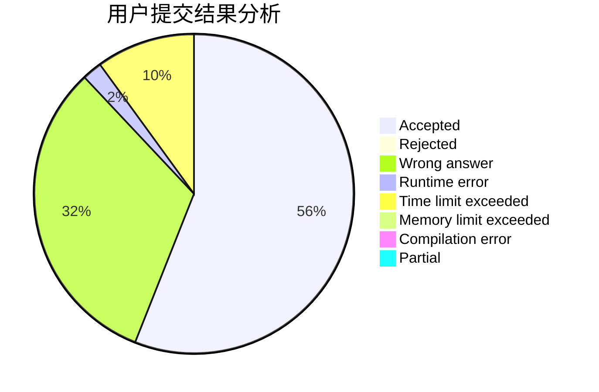
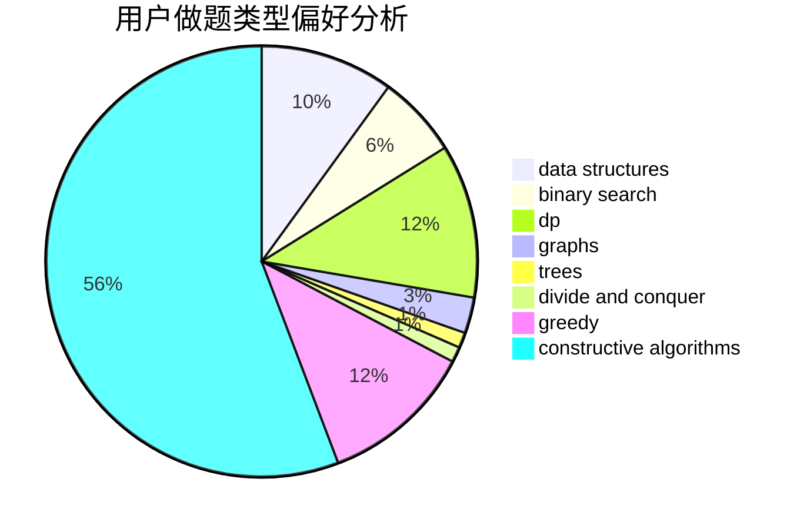
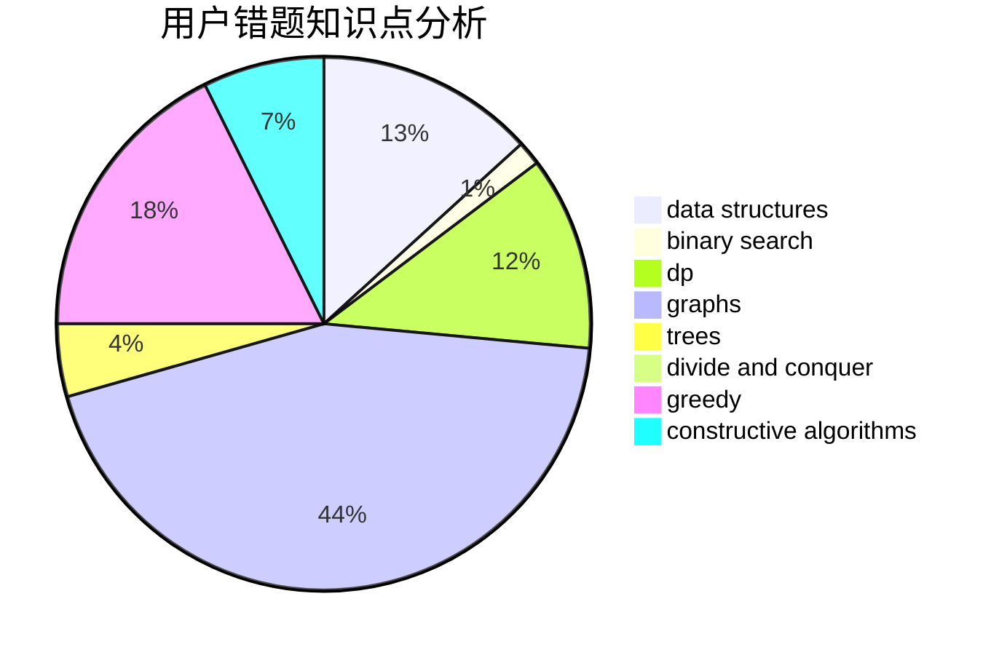

# NaVi_Simple

<!-- tabs:start -->

#### **用户提交结果分析**

#### **用户做题类型偏好分析**

#### **用户错题知识点分析**

<!-- tabs:end -->
# 推荐题目
[1486D](https://codeforces.com/contest/1486/problem/D)		binary search,
                        data structures,
                        dp		  
[1392D](https://codeforces.com/contest/1392/problem/D)		dp,
                        greedy		  
[348B](https://codeforces.com/contest/348/problem/B)		dfs and similar,
                        number theory,
                        trees		  
[1296F](https://codeforces.com/contest/1296/problem/F)		constructive algorithms,
                        dfs and similar,
                        greedy,
                        sortings,
                        trees		  
[869E](https://codeforces.com/contest/869/problem/E)		data structures,
                        hashing		  
[607E](https://codeforces.com/contest/607/problem/E)		binary search,
                        geometry		  
[1253D](https://codeforces.com/contest/1253/problem/D)		constructive algorithms,
                        dfs and similar,
                        dsu,
                        graphs,
                        greedy,
                        sortings		  
[567B](https://codeforces.com/contest/567/problem/B)		implementation		  
[919C](https://codeforces.com/contest/919/problem/C)		brute force,
                        implementation		  
[5132](https://codeforces.com/contest/513/problem/2)		dsu,graphs,sortings,trees		  
