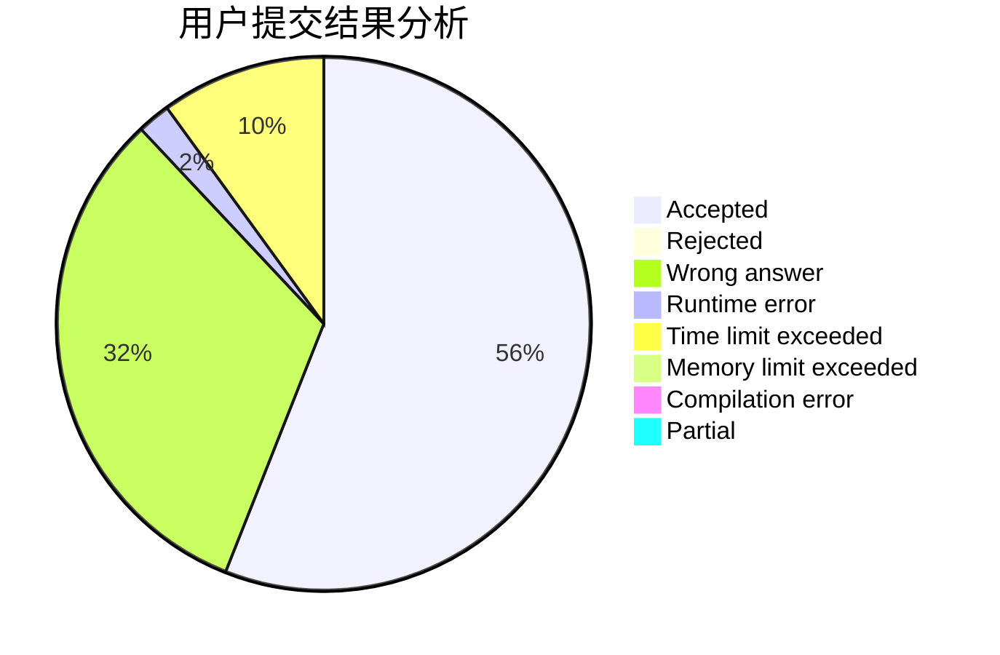
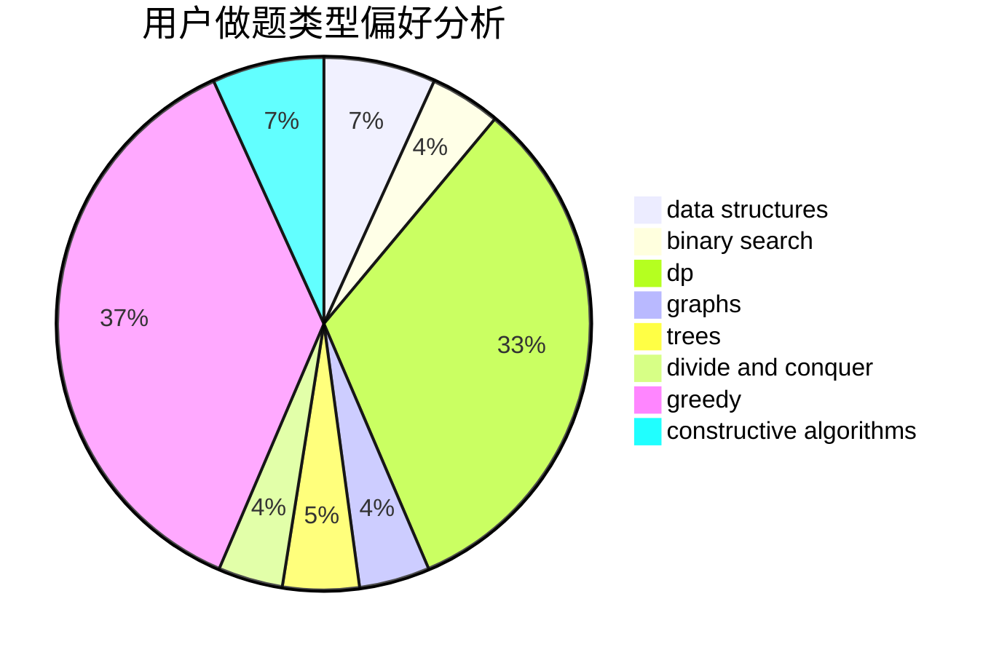
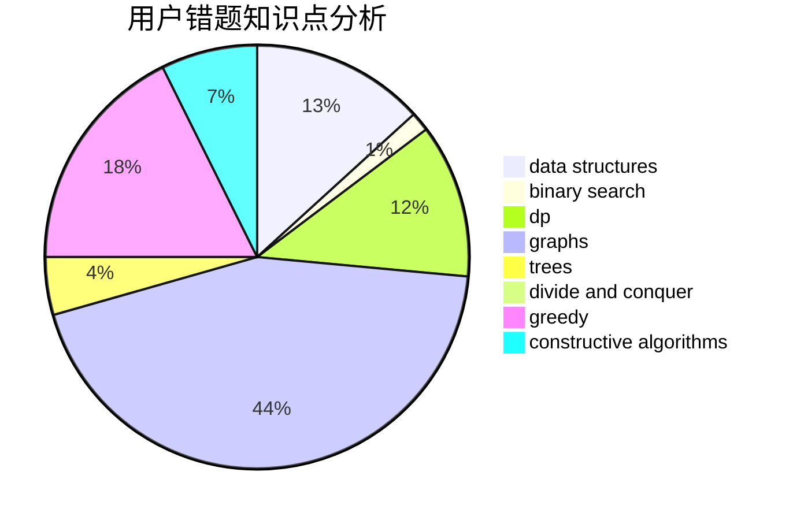

# NaVi_Simple

<!-- tabs:start -->

#### **用户提交结果分析**

#### **用户做题类型偏好分析**

#### **用户错题知识点分析**

<!-- tabs:end -->
# 推荐题目
[1477F](https://codeforces.com/contest/1477/problem/F)		combinatorics,
                        fft,
                        math,
                        probabilities		  
[1382B](https://codeforces.com/contest/1382/problem/B)		dp,
                        games		  
[318A](https://codeforces.com/contest/318/problem/A)		math		  
[1290C](https://codeforces.com/contest/1290/problem/C)		dfs and similar,
                        dsu,
                        graphs		  
[850F](https://codeforces.com/contest/850/problem/F)		math		  
[587D](https://codeforces.com/contest/587/problem/D)		2-sat,
                        binary search		  
[1249E](https://codeforces.com/contest/1249/problem/E)		dp,
                        shortest paths		  
[542F](https://codeforces.com/contest/542/problem/F)		dp,
                        greedy		  
[903B](https://codeforces.com/contest/903/problem/B)		greedy,
                        implementation		  
[492E](https://codeforces.com/contest/492/problem/E)		math		  
