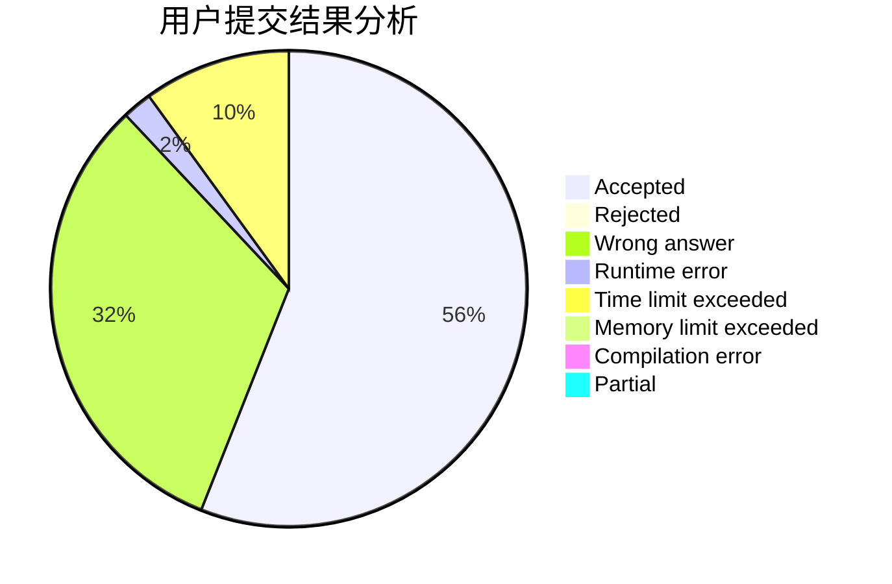
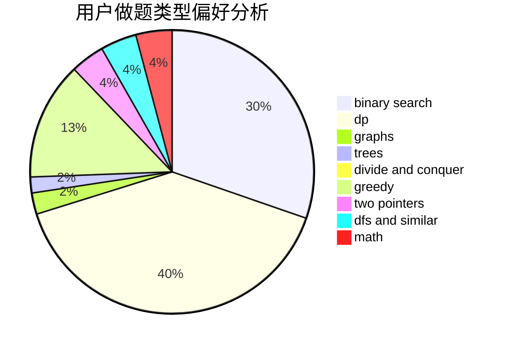

# NaVi_Simple

<!-- tabs:start -->

#### **用户提交结果分析**

#### **用户做题类型偏好分析**

<!-- tabs:end -->
# 推荐题目
[1486D](https://codeforces.com/contest/1486/problem/D)
[1392D](https://codeforces.com/contest/1392/problem/D)
[348B](https://codeforces.com/contest/348/problem/B)
[1296F](https://codeforces.com/contest/1296/problem/F)
[869E](https://codeforces.com/contest/869/problem/E)
[607E](https://codeforces.com/contest/607/problem/E)
[1253D](https://codeforces.com/contest/1253/problem/D)
[567B](https://codeforces.com/contest/567/problem/B)
[919C](https://codeforces.com/contest/919/problem/C)
[5132](https://codeforces.com/contest/513/problem/2)
