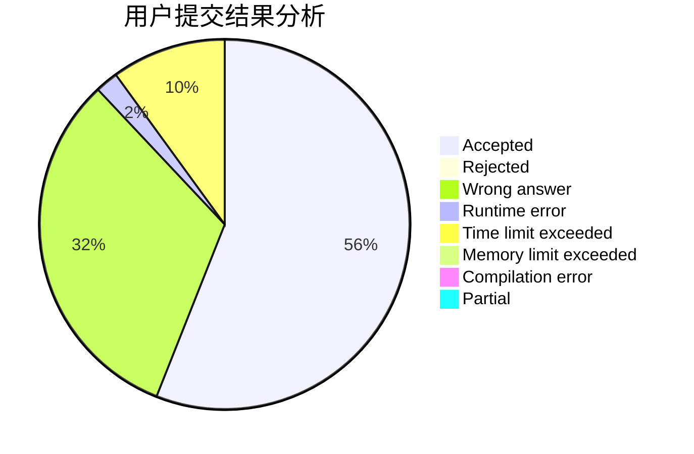
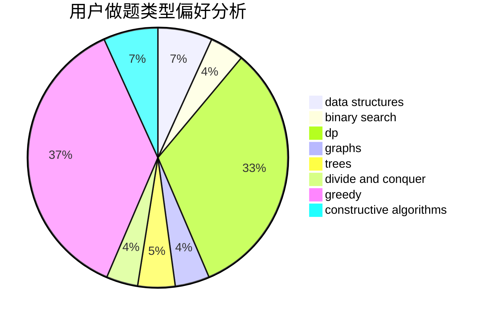
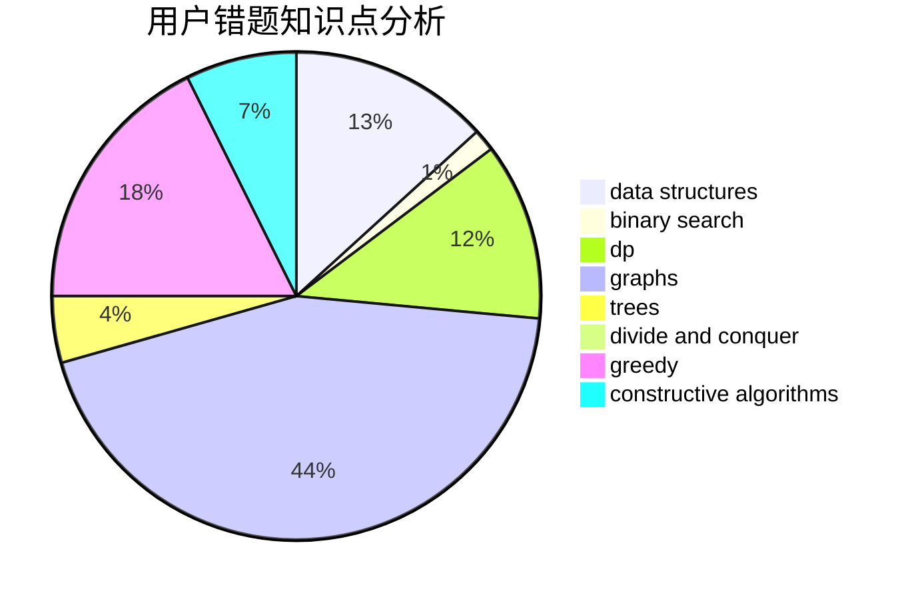

# NaVi_Simple
<!-- tabs:start -->
#### **用户提交结果分析**

#### **用户做题类型偏好分析**

#### **用户错题知识点分析**

<!-- tabs:end -->
# 推荐题目
[Duff in Mafia](http://codeforces.com/problemset/problem/587/D)		2-sat,
                        binary search		  
[Even Odds](http://codeforces.com/problemset/problem/318/A)		math		  
[Quest](http://codeforces.com/problemset/problem/542/F)		dp,
                        greedy		  
[The Modcrab](http://codeforces.com/problemset/problem/903/B)		greedy,
                        implementation		  
[Rainbow Balls](http://codeforces.com/problemset/problem/850/F)		math		  
[Vanya and Field](http://codeforces.com/problemset/problem/492/E)		math		  
[Is it rated?](http://codeforces.com/problemset/problem/807/A)		implementation,
                        sortings		  
[Bearish Fanpages](https://codeforces.com/contest/674/problem/D)		nan		  
[Divisibility](http://codeforces.com/problemset/problem/597/A)		math		  
[Prefix Enlightenment](http://codeforces.com/problemset/problem/1290/C)		dfs and similar,
                        dsu,
                        graphs		  
<!-- tabs:start -->
#### **data structures**
[Duff in Mafia](http://codeforces.com/problemset/problem/1208/E)		data structures,
                        implementation		  
[Even Odds](http://codeforces.com/problemset/problem/549/F)		data structures,
                        divide and conquer		  
[Quest](https://codeforces.com/contest/966/problem/E)		data structures,
                        trees		  
[The Modcrab](http://codeforces.com/problemset/problem/525/D)		constructive algorithms,
                        data structures,
                        graphs,
                        greedy,
                        shortest paths		  
[Rainbow Balls](http://codeforces.com/problemset/problem/1488/F)		*special problem,
                        *special problem,
                        binary search,
                        data structures		  
[Vanya and Field](http://codeforces.com/problemset/problem/1416/D)		data structures,
                        dsu,
                        graphs,
                        implementation,
                        trees		  
[Is it rated?](http://codeforces.com/problemset/problem/1492/C)		binary search,
                        data structures,
                        dp,
                        greedy,
                        two pointers		  
[Bearish Fanpages](http://codeforces.com/problemset/problem/1490/G)		binary search,
                        data structures,
                        math		  
[Divisibility](http://codeforces.com/problemset/problem/1479/D)		binary search,
                        bitmasks,
                        brute force,
                        data structures,
                        probabilities,
                        trees		  
[Prefix Enlightenment](http://codeforces.com/problemset/problem/1497/A)		brute force,
                        data structures,
                        greedy,
                        sortings		  
#### **binary search**
[Duff in Mafia](http://codeforces.com/problemset/problem/587/D)		2-sat,
                        binary search		  
[Even Odds](http://codeforces.com/problemset/problem/812/C)		binary search,
                        sortings		  
[Quest](http://codeforces.com/problemset/problem/1488/F)		*special problem,
                        *special problem,
                        binary search,
                        data structures		  
[The Modcrab](http://codeforces.com/problemset/problem/1010/B)		binary search,
                        interactive		  
[Rainbow Balls](http://codeforces.com/problemset/problem/1492/C)		binary search,
                        data structures,
                        dp,
                        greedy,
                        two pointers		  
[Vanya and Field](http://codeforces.com/problemset/problem/1463/D)		binary search,
                        constructive algorithms,
                        greedy,
                        two pointers		  
[Is it rated?](http://codeforces.com/problemset/problem/1490/G)		binary search,
                        data structures,
                        math		  
[Bearish Fanpages](http://codeforces.com/problemset/problem/1479/D)		binary search,
                        bitmasks,
                        brute force,
                        data structures,
                        probabilities,
                        trees		  
[Divisibility](http://codeforces.com/problemset/problem/1436/E)		binary search,
                        data structures,
                        two pointers		  
[Prefix Enlightenment](http://codeforces.com/problemset/problem/1461/D)		binary search,
                        brute force,
                        data structures,
                        divide and conquer,
                        implementation,
                        sortings		  
#### **dp**
[Duff in Mafia](http://codeforces.com/problemset/problem/542/F)		dp,
                        greedy		  
[Even Odds](http://codeforces.com/problemset/problem/1249/E)		dp,
                        shortest paths		  
[Quest](http://codeforces.com/problemset/problem/1382/B)		dp,
                        games		  
[The Modcrab](http://codeforces.com/problemset/problem/1105/E)		bitmasks,
                        brute force,
                        dp,
                        meet-in-the-middle		  
[Rainbow Balls](http://codeforces.com/problemset/problem/1204/C)		dp,
                        graphs,
                        greedy,
                        shortest paths		  
[Vanya and Field](http://codeforces.com/problemset/problem/1492/C)		binary search,
                        data structures,
                        dp,
                        greedy,
                        two pointers		  
[Is it rated?](https://codeforces.com/contest/1457/problem/C)		brute force,
                        dp,
                        implementation		  
[Bearish Fanpages](http://codeforces.com/problemset/problem/1491/C)		brute force,
                        data structures,
                        dp,
                        greedy,
                        implementation		  
[Divisibility](http://codeforces.com/problemset/problem/1437/C)		dp,
                        flows,
                        graph matchings,
                        greedy,
                        math,
                        sortings		  
[Prefix Enlightenment](http://codeforces.com/problemset/problem/1499/B)		brute force,
                        dp,
                        greedy,
                        implementation		  
#### **graph**
[Duff in Mafia](http://codeforces.com/problemset/problem/1290/C)		dfs and similar,
                        dsu,
                        graphs		  
[Even Odds](http://codeforces.com/problemset/problem/1027/D)		dfs and similar,
                        graphs		  
[Quest](https://codeforces.com/contest/745/problem/C)		dfs and similar,
                        graphs		  
[The Modcrab](http://codeforces.com/problemset/problem/525/D)		constructive algorithms,
                        data structures,
                        graphs,
                        greedy,
                        shortest paths		  
[Rainbow Balls](http://codeforces.com/problemset/problem/1204/C)		dp,
                        graphs,
                        greedy,
                        shortest paths		  
[Vanya and Field](http://codeforces.com/problemset/problem/1416/D)		data structures,
                        dsu,
                        graphs,
                        implementation,
                        trees		  
[Is it rated?](http://codeforces.com/problemset/problem/1487/C)		brute force,
                        constructive algorithms,
                        dfs and similar,
                        graphs,
                        greedy,
                        implementation,
                        math		  
[Bearish Fanpages](http://codeforces.com/problemset/problem/1437/C)		dp,
                        flows,
                        graph matchings,
                        greedy,
                        math,
                        sortings		  
[Divisibility](http://codeforces.com/problemset/problem/1470/D)		constructive algorithms,
                        dfs and similar,
                        graph matchings,
                        graphs,
                        greedy		  
[Prefix Enlightenment](http://codeforces.com/problemset/problem/1476/C)		dp,
                        graphs,
                        greedy		  
#### **trees**
[Duff in Mafia](https://codeforces.com/contest/966/problem/E)		data structures,
                        trees		  
[Even Odds](http://codeforces.com/problemset/problem/1416/D)		data structures,
                        dsu,
                        graphs,
                        implementation,
                        trees		  
[Quest](http://codeforces.com/problemset/problem/1479/D)		binary search,
                        bitmasks,
                        brute force,
                        data structures,
                        probabilities,
                        trees		  
[The Modcrab](http://codeforces.com/problemset/problem/1511/C)		brute force,
                        data structures,
                        implementation,
                        trees		  
[Rainbow Balls](http://codeforces.com/problemset/problem/1499/F)		combinatorics,
                        dfs and similar,
                        dp,
                        trees		  
[Vanya and Field](http://codeforces.com/problemset/problem/1491/E)		brute force,
                        dfs and similar,
                        divide and conquer,
                        number theory,
                        trees		  
[Is it rated?](http://codeforces.com/problemset/problem/1466/D)		data structures,
                        greedy,
                        sortings,
                        trees		  
[Bearish Fanpages](http://codeforces.com/problemset/problem/1495/D)		combinatorics,
                        dfs and similar,
                        graphs,
                        math,
                        shortest paths,
                        trees		  
[Divisibility](http://codeforces.com/problemset/problem/1303/G)		data structures,
                        divide and conquer,
                        geometry,
                        trees		  
[Prefix Enlightenment](http://codeforces.com/problemset/problem/1454/E)		combinatorics,
                        dfs and similar,
                        graphs,
                        trees		  
#### **divide and conquer**
[Duff in Mafia](http://codeforces.com/problemset/problem/549/F)		data structures,
                        divide and conquer		  
[Even Odds](http://codeforces.com/problemset/problem/1461/D)		binary search,
                        brute force,
                        data structures,
                        divide and conquer,
                        implementation,
                        sortings		  
[Quest](http://codeforces.com/problemset/problem/1466/G)		combinatorics,
                        divide and conquer,
                        hashing,
                        math,
                        string suffix structures,
                        strings		  
[The Modcrab](http://codeforces.com/problemset/problem/1490/D)		dfs and similar,
                        divide and conquer,
                        implementation		  
[Rainbow Balls](https://codeforces.com/contest/1483/problem/C)		data structures,
                        divide and conquer,
                        dp		  
[Vanya and Field](http://codeforces.com/problemset/problem/1491/E)		brute force,
                        dfs and similar,
                        divide and conquer,
                        number theory,
                        trees		  
[Is it rated?](http://codeforces.com/problemset/problem/1303/G)		data structures,
                        divide and conquer,
                        geometry,
                        trees		  
[Bearish Fanpages](http://codeforces.com/problemset/problem/1494/D)		constructive algorithms,
                        data structures,
                        dfs and similar,
                        divide and conquer,
                        dsu,
                        greedy,
                        sortings,
                        trees		  
[Divisibility](http://codeforces.com/problemset/problem/1482/E)		data structures,
                        divide and conquer,
                        dp		  
[Prefix Enlightenment](http://codeforces.com/problemset/problem/566/C)		dfs and similar,
                        divide and conquer,
                        trees		  
#### **greedy**
[Duff in Mafia](http://codeforces.com/problemset/problem/542/F)		dp,
                        greedy		  
[Even Odds](http://codeforces.com/problemset/problem/903/B)		greedy,
                        implementation		  
[Quest](http://codeforces.com/problemset/problem/354/A)		brute force,
                        greedy,
                        math		  
[The Modcrab](http://codeforces.com/problemset/problem/1088/C)		constructive algorithms,
                        greedy,
                        math		  
[Rainbow Balls](http://codeforces.com/problemset/problem/525/D)		constructive algorithms,
                        data structures,
                        graphs,
                        greedy,
                        shortest paths		  
[Vanya and Field](http://codeforces.com/problemset/problem/490/A)		greedy,
                        implementation,
                        sortings		  
[Is it rated?](http://codeforces.com/problemset/problem/1204/C)		dp,
                        graphs,
                        greedy,
                        shortest paths		  
[Bearish Fanpages](http://codeforces.com/problemset/problem/1256/D)		greedy		  
[Divisibility](http://codeforces.com/problemset/problem/1492/C)		binary search,
                        data structures,
                        dp,
                        greedy,
                        two pointers		  
[Prefix Enlightenment](https://codeforces.com/contest/1496/problem/C)		geometry,
                        greedy,
                        math,
                        sortings		  
#### **constructive algorithms**
[Duff in Mafia](http://codeforces.com/problemset/problem/1088/C)		constructive algorithms,
                        greedy,
                        math		  
[Even Odds](http://codeforces.com/problemset/problem/525/D)		constructive algorithms,
                        data structures,
                        graphs,
                        greedy,
                        shortest paths		  
[Quest](https://codeforces.com/contest/966/problem/C)		constructive algorithms,
                        math		  
[The Modcrab](http://codeforces.com/problemset/problem/1493/A)		constructive algorithms,
                        greedy		  
[Rainbow Balls](http://codeforces.com/problemset/problem/1463/D)		binary search,
                        constructive algorithms,
                        greedy,
                        two pointers		  
[Vanya and Field](https://codeforces.com/contest/1456/problem/B)		bitmasks,
                        brute force,
                        constructive algorithms		  
[Is it rated?](http://codeforces.com/problemset/problem/1492/D)		bitmasks,
                        constructive algorithms,
                        greedy,
                        math		  
[Bearish Fanpages](https://codeforces.com/contest/1504/problem/D)		constructive algorithms,
                        games,
                        interactive		  
[Divisibility](https://codeforces.com/contest/1483/problem/A)		brute force,
                        constructive algorithms,
                        greedy,
                        implementation		  
[Prefix Enlightenment](https://codeforces.com/contest/1457/problem/D)		bitmasks,
                        brute force,
                        constructive algorithms		  
#### **sortings**
[Duff in Mafia](http://codeforces.com/problemset/problem/807/A)		implementation,
                        sortings		  
[Even Odds](http://codeforces.com/problemset/problem/812/C)		binary search,
                        sortings		  
[Quest](http://codeforces.com/problemset/problem/490/A)		greedy,
                        implementation,
                        sortings		  
[The Modcrab](https://codeforces.com/contest/1496/problem/C)		geometry,
                        greedy,
                        math,
                        sortings		  
[Rainbow Balls](http://codeforces.com/problemset/problem/1495/A)		geometry,
                        greedy,
                        math,
                        sortings		  
[Vanya and Field](http://codeforces.com/problemset/problem/1497/A)		brute force,
                        data structures,
                        greedy,
                        sortings		  
[Is it rated?](http://codeforces.com/problemset/problem/1427/A)		math,
                        sortings		  
[Bearish Fanpages](http://codeforces.com/problemset/problem/1461/D)		binary search,
                        brute force,
                        data structures,
                        divide and conquer,
                        implementation,
                        sortings		  
[Divisibility](http://codeforces.com/problemset/problem/1437/C)		dp,
                        flows,
                        graph matchings,
                        greedy,
                        math,
                        sortings		  
[Prefix Enlightenment](http://codeforces.com/problemset/problem/1473/A)		greedy,
                        implementation,
                        math,
                        sortings		  
<!-- tabs:end -->
