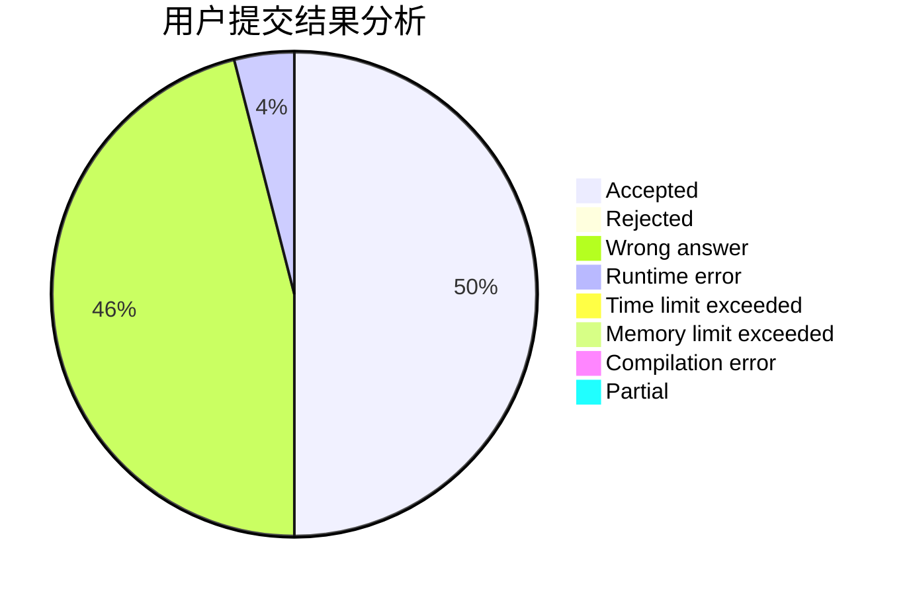
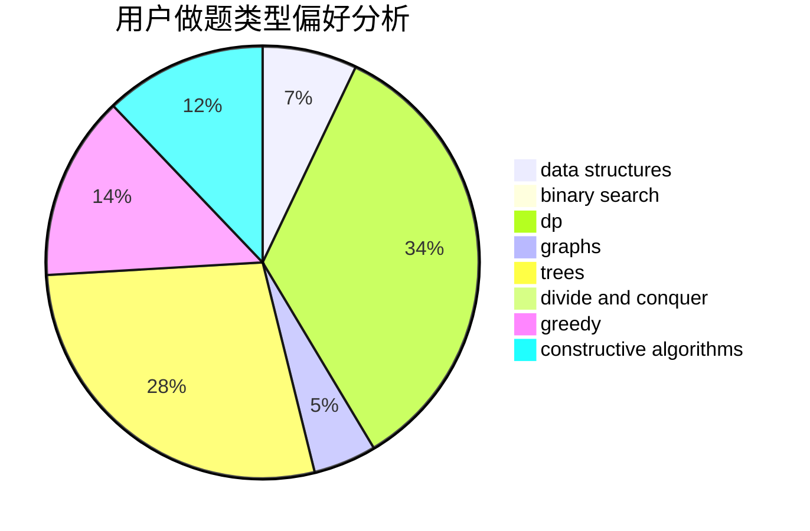

# Nakisa

<!-- tabs:start -->

#### **用户提交结果分析**

#### **用户做题类型偏好分析**

#### **用户错题知识点分析**

<!-- tabs:end -->
# 推荐题目
[739D](https://codeforces.com/contest/739/problem/D)		graph matchings		  
[335D](https://codeforces.com/contest/335/problem/D)		brute force,
                        dp		  
[611F](https://codeforces.com/contest/611/problem/F)		binary search,
                        implementation		  
[1385E](https://codeforces.com/contest/1385/problem/E)		constructive algorithms,
                        dfs and similar,
                        graphs		  
[681B](https://codeforces.com/contest/681/problem/B)		brute force		  
[100A](https://codeforces.com/contest/100/problem/A)		*special problem,
                        implementation		  
[138D](https://codeforces.com/contest/138/problem/D)		dp,
                        games		  
[30C](https://codeforces.com/contest/30/problem/C)		dp,
                        probabilities		  
[1214B](https://codeforces.com/contest/1214/problem/B)		brute force,
                        math		  
[810B](https://codeforces.com/contest/810/problem/B)		greedy,
                        sortings		  
