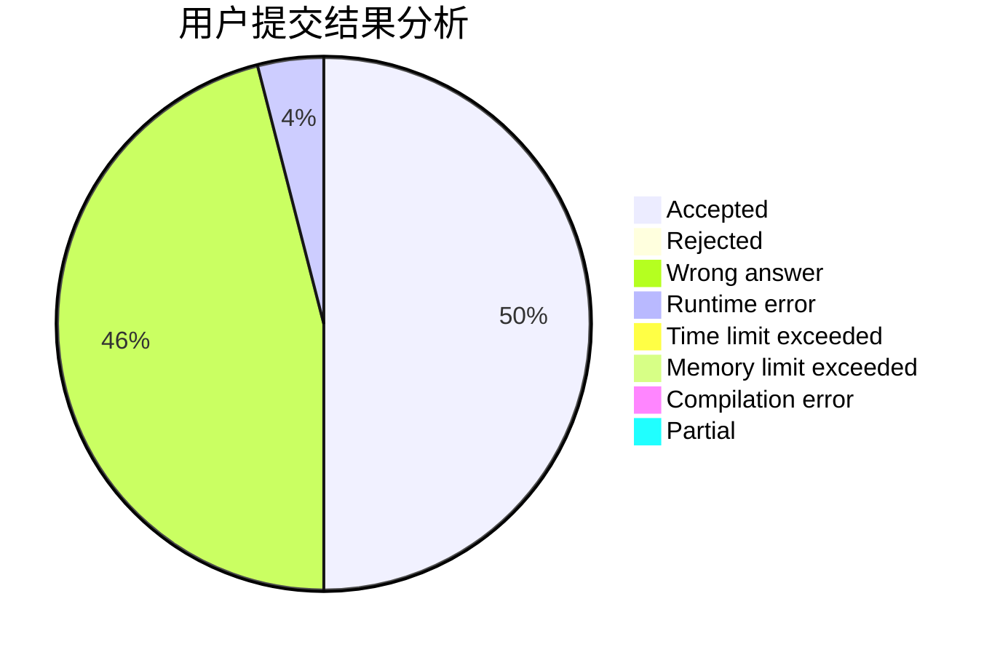
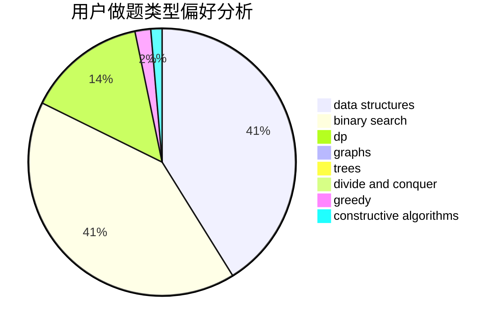

# Nakisa

<!-- tabs:start -->

#### **用户提交结果分析**

#### **用户做题类型偏好分析**

#### **用户错题知识点分析**

<!-- tabs:end -->
# 推荐题目
[722C](https://codeforces.com/contest/722/problem/C)		data structures,
                        dsu		  
[311E](https://codeforces.com/contest/311/problem/E)		flows		  
[592D](https://codeforces.com/contest/592/problem/D)		dfs and similar,
                        dp,
                        graphs,
                        trees		  
[1376B1](https://codeforces.com/contest/1376B/problem/1)		dsu,graphs,sortings,trees		  
[660D](https://codeforces.com/contest/660/problem/D)		geometry		  
[1009E](https://codeforces.com/contest/1009/problem/E)		combinatorics,
                        math,
                        probabilities		  
[1380F](https://codeforces.com/contest/1380/problem/F)		data structures,
                        dp,
                        matrices		  
[294B](https://codeforces.com/contest/294/problem/B)		dp,
                        greedy		  
[1208E](https://codeforces.com/contest/1208/problem/E)		data structures,
                        implementation		  
[796A](https://codeforces.com/contest/796/problem/A)		brute force,
                        implementation		  
