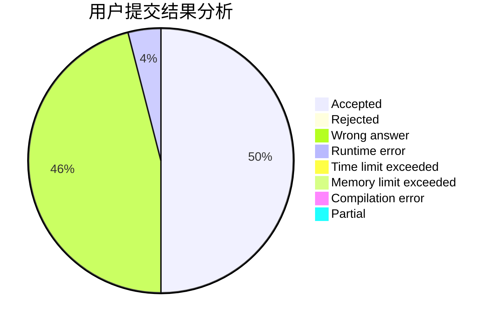
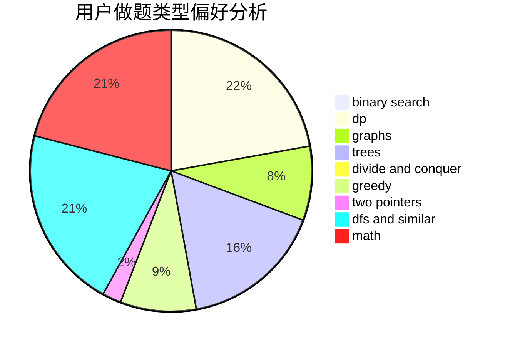

# Nakisa

<!-- tabs:start -->

#### **用户提交结果分析**

#### **用户做题类型偏好分析**

<!-- tabs:end -->
# 推荐题目
[739D](https://codeforces.com/contest/739/problem/D)
[335D](https://codeforces.com/contest/335/problem/D)
[611F](https://codeforces.com/contest/611/problem/F)
[1385E](https://codeforces.com/contest/1385/problem/E)
[681B](https://codeforces.com/contest/681/problem/B)
[100A](https://codeforces.com/contest/100/problem/A)
[138D](https://codeforces.com/contest/138/problem/D)
[30C](https://codeforces.com/contest/30/problem/C)
[1214B](https://codeforces.com/contest/1214/problem/B)
[810B](https://codeforces.com/contest/810/problem/B)
