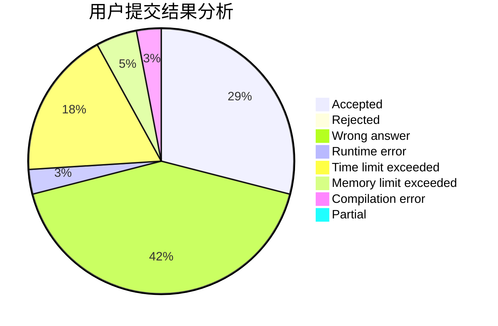
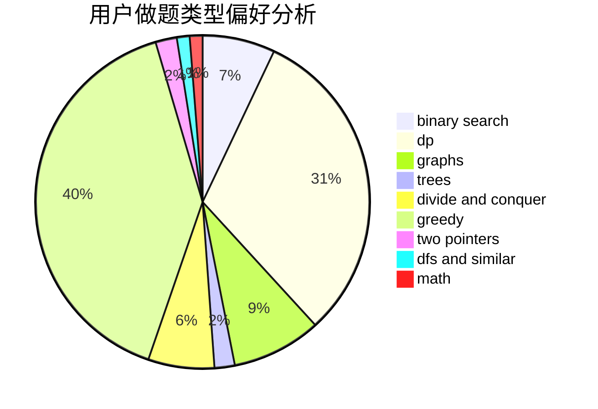

# 913887524gsd

<!-- tabs:start -->

#### **用户提交结果分析**

#### **用户做题类型偏好分析**

<!-- tabs:end -->
# 推荐题目
[1350E](https://codeforces.com/contest/1350/problem/E)
[114B](https://codeforces.com/contest/114/problem/B)
[1455G](https://codeforces.com/contest/1455/problem/G)
[1307A](https://codeforces.com/contest/1307/problem/A)
[1011A](https://codeforces.com/contest/1011/problem/A)
[11301](https://codeforces.com/contest/1130/problem/1)
[1380D](https://codeforces.com/contest/1380/problem/D)
[1089F](https://codeforces.com/contest/1089/problem/F)
[140B](https://codeforces.com/contest/140/problem/B)
[1042A](https://codeforces.com/contest/1042/problem/A)
