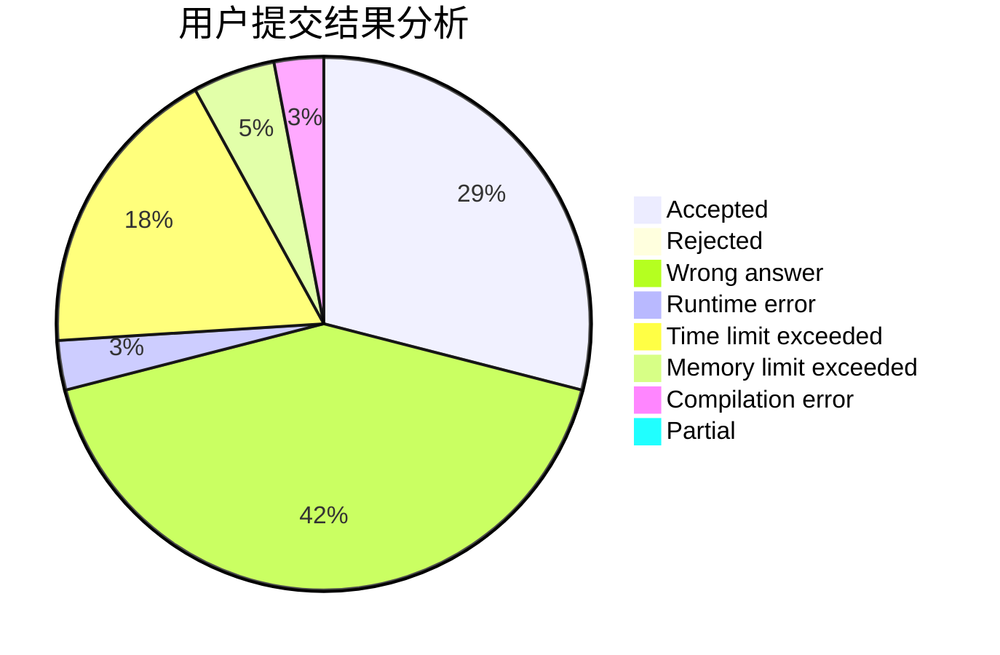
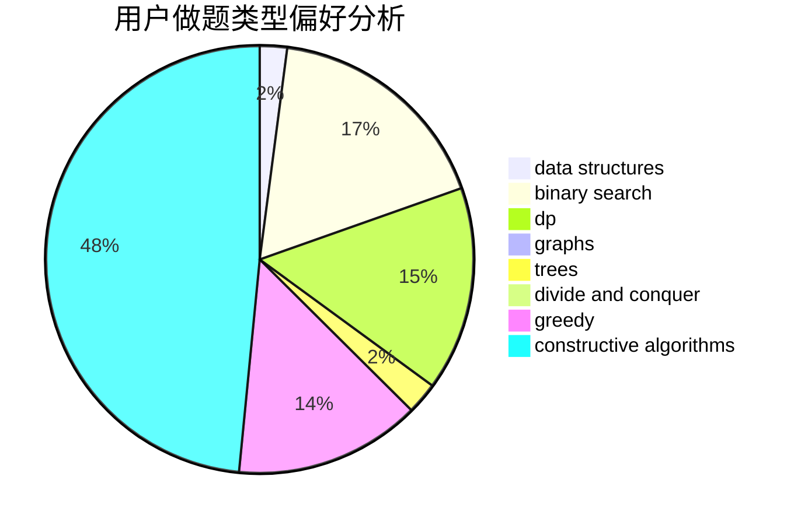
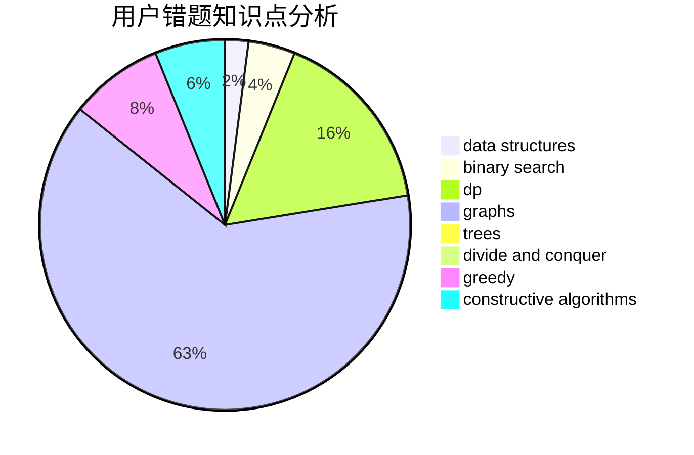

# 913887524gsd
<!-- tabs:start -->
#### **用户提交结果分析**

#### **用户做题类型偏好分析**

#### **用户错题知识点分析**

<!-- tabs:end -->
# 推荐题目
[Missile Silos](http://codeforces.com/problemset/problem/144/D)		data structures,
                        dfs and similar,
                        graphs,
                        shortest paths		  
[So Mean](http://codeforces.com/problemset/problem/1299/E)		interactive,
                        math		  
[Competition](http://codeforces.com/problemset/problem/144/E)		data structures,
                        greedy		  
[Vasya and Good Sequences](https://codeforces.com/contest/1058/problem/E)		bitmasks,
                        dp		  
[Born This Way](http://codeforces.com/problemset/problem/1148/B)		binary search,
                        brute force,
                        two pointers		  
[Hilbert's Hotel](http://codeforces.com/problemset/problem/1344/A)		math,
                        number theory,
                        sortings		  
[Mars rover](http://codeforces.com/problemset/problem/1010/D)		dfs and similar,
                        graphs,
                        implementation,
                        trees		  
[Frequency Problem (Easy Version)](https://codeforces.com/contest/1447/problem/F1)		data structures,
                        greedy		  
[Meeting](http://codeforces.com/problemset/problem/144/B)		implementation		  
[Line Distance](http://codeforces.com/problemset/problem/1446/F)		binary search,
                        data structures,
                        geometry		  
<!-- tabs:start -->
#### **data structures**
[Missile Silos](http://codeforces.com/problemset/problem/144/D)		data structures,
                        dfs and similar,
                        graphs,
                        shortest paths		  
[So Mean](http://codeforces.com/problemset/problem/144/E)		data structures,
                        greedy		  
[Competition](https://codeforces.com/contest/1447/problem/F1)		data structures,
                        greedy		  
[Vasya and Good Sequences](http://codeforces.com/problemset/problem/1446/F)		binary search,
                        data structures,
                        geometry		  
[Born This Way](http://codeforces.com/problemset/problem/1442/B)		combinatorics,
                        data structures,
                        dsu,
                        greedy,
                        implementation		  
[Hilbert's Hotel](https://codeforces.com/contest/1382/problem/C2)		constructive algorithms,
                        data structures,
                        implementation,
                        strings,
                        two pointers		  
[Mars rover](http://codeforces.com/problemset/problem/1446/D2)		data structures,
                        greedy,
                        two pointers		  
[Frequency Problem (Easy Version)](http://codeforces.com/problemset/problem/1446/D1)		data structures,
                        greedy		  
[Meeting](https://codeforces.com/contest/1447/problem/F2)		data structures,
                        greedy,
                        two pointers		  
[Line Distance](http://codeforces.com/problemset/problem/1446/C)		binary search,
                        bitmasks,
                        data structures,
                        divide and conquer,
                        dp,
                        trees		  
#### **binary search**
[Missile Silos](http://codeforces.com/problemset/problem/1148/B)		binary search,
                        brute force,
                        two pointers		  
[So Mean](http://codeforces.com/problemset/problem/1446/F)		binary search,
                        data structures,
                        geometry		  
[Competition](http://codeforces.com/problemset/problem/1371/E2)		binary search,
                        combinatorics,
                        dp,
                        math,
                        number theory,
                        sortings		  
[Vasya and Good Sequences](http://codeforces.com/problemset/problem/1446/C)		binary search,
                        bitmasks,
                        data structures,
                        divide and conquer,
                        dp,
                        trees		  
[Born This Way](http://codeforces.com/problemset/problem/1041/D)		binary search,
                        data structures,
                        two pointers		  
[Hilbert's Hotel](https://codeforces.com/contest/1447/problem/E)		binary search,
                        bitmasks,
                        data structures,
                        divide and conquer,
                        dp,
                        trees		  
[Mars rover](http://codeforces.com/problemset/problem/1492/C)		binary search,
                        data structures,
                        dp,
                        greedy,
                        two pointers		  
[Frequency Problem (Easy Version)](http://codeforces.com/problemset/problem/1463/D)		binary search,
                        constructive algorithms,
                        greedy,
                        two pointers		  
[Meeting](http://codeforces.com/problemset/problem/1490/G)		binary search,
                        data structures,
                        math		  
[Line Distance](http://codeforces.com/problemset/problem/1479/D)		binary search,
                        bitmasks,
                        brute force,
                        data structures,
                        probabilities,
                        trees		  
#### **dp**
[Missile Silos](https://codeforces.com/contest/1058/problem/E)		bitmasks,
                        dp		  
[So Mean](http://codeforces.com/problemset/problem/1089/A)		dp		  
[Competition](http://codeforces.com/problemset/problem/1120/D)		dfs and similar,
                        dp,
                        dsu,
                        graphs,
                        greedy,
                        trees		  
[Vasya and Good Sequences](http://codeforces.com/problemset/problem/1371/E2)		binary search,
                        combinatorics,
                        dp,
                        math,
                        number theory,
                        sortings		  
[Born This Way](http://codeforces.com/problemset/problem/1446/C)		binary search,
                        bitmasks,
                        data structures,
                        divide and conquer,
                        dp,
                        trees		  
[Hilbert's Hotel](http://codeforces.com/problemset/problem/1446/B)		dp,
                        strings		  
[Mars rover](http://codeforces.com/problemset/problem/1286/A)		dp,
                        greedy,
                        sortings		  
[Frequency Problem (Easy Version)](https://codeforces.com/contest/1447/problem/E)		binary search,
                        bitmasks,
                        data structures,
                        divide and conquer,
                        dp,
                        trees		  
[Meeting](https://codeforces.com/contest/1447/problem/D)		dp,
                        strings		  
[Line Distance](http://codeforces.com/problemset/problem/1492/C)		binary search,
                        data structures,
                        dp,
                        greedy,
                        two pointers		  
#### **graph**
[Missile Silos](http://codeforces.com/problemset/problem/144/D)		data structures,
                        dfs and similar,
                        graphs,
                        shortest paths		  
[So Mean](http://codeforces.com/problemset/problem/1010/D)		dfs and similar,
                        graphs,
                        implementation,
                        trees		  
[Competition](http://codeforces.com/problemset/problem/1120/D)		dfs and similar,
                        dp,
                        dsu,
                        graphs,
                        greedy,
                        trees		  
[Vasya and Good Sequences](http://codeforces.com/problemset/problem/1009/G)		bitmasks,
                        flows,
                        graph matchings,
                        graphs,
                        greedy		  
[Born This Way](http://codeforces.com/problemset/problem/1487/C)		brute force,
                        constructive algorithms,
                        dfs and similar,
                        graphs,
                        greedy,
                        implementation,
                        math		  
[Hilbert's Hotel](http://codeforces.com/problemset/problem/1437/C)		dp,
                        flows,
                        graph matchings,
                        greedy,
                        math,
                        sortings		  
[Mars rover](http://codeforces.com/problemset/problem/1470/D)		constructive algorithms,
                        dfs and similar,
                        graph matchings,
                        graphs,
                        greedy		  
[Frequency Problem (Easy Version)](http://codeforces.com/problemset/problem/1476/C)		dp,
                        graphs,
                        greedy		  
[Meeting](http://codeforces.com/problemset/problem/1304/D)		constructive algorithms,
                        graphs,
                        greedy,
                        two pointers		  
[Line Distance](http://codeforces.com/problemset/problem/1475/C)		combinatorics,
                        graphs,
                        math		  
#### **trees**
[Missile Silos](http://codeforces.com/problemset/problem/1010/D)		dfs and similar,
                        graphs,
                        implementation,
                        trees		  
[So Mean](http://codeforces.com/problemset/problem/1120/D)		dfs and similar,
                        dp,
                        dsu,
                        graphs,
                        greedy,
                        trees		  
[Competition](http://codeforces.com/problemset/problem/1446/C)		binary search,
                        bitmasks,
                        data structures,
                        divide and conquer,
                        dp,
                        trees		  
[Vasya and Good Sequences](https://codeforces.com/contest/1447/problem/E)		binary search,
                        bitmasks,
                        data structures,
                        divide and conquer,
                        dp,
                        trees		  
[Born This Way](http://codeforces.com/problemset/problem/1479/D)		binary search,
                        bitmasks,
                        brute force,
                        data structures,
                        probabilities,
                        trees		  
[Hilbert's Hotel](http://codeforces.com/problemset/problem/1511/C)		brute force,
                        data structures,
                        implementation,
                        trees		  
[Mars rover](http://codeforces.com/problemset/problem/1499/F)		combinatorics,
                        dfs and similar,
                        dp,
                        trees		  
[Frequency Problem (Easy Version)](http://codeforces.com/problemset/problem/1491/E)		brute force,
                        dfs and similar,
                        divide and conquer,
                        number theory,
                        trees		  
[Meeting](http://codeforces.com/problemset/problem/1466/D)		data structures,
                        greedy,
                        sortings,
                        trees		  
[Line Distance](http://codeforces.com/problemset/problem/1495/D)		combinatorics,
                        dfs and similar,
                        graphs,
                        math,
                        shortest paths,
                        trees		  
#### **divide and conquer**
[Missile Silos](http://codeforces.com/problemset/problem/1446/C)		binary search,
                        bitmasks,
                        data structures,
                        divide and conquer,
                        dp,
                        trees		  
[So Mean](https://codeforces.com/contest/1447/problem/E)		binary search,
                        bitmasks,
                        data structures,
                        divide and conquer,
                        dp,
                        trees		  
[Competition](http://codeforces.com/problemset/problem/1461/D)		binary search,
                        brute force,
                        data structures,
                        divide and conquer,
                        implementation,
                        sortings		  
[Vasya and Good Sequences](http://codeforces.com/problemset/problem/1466/G)		combinatorics,
                        divide and conquer,
                        hashing,
                        math,
                        string suffix structures,
                        strings		  
[Born This Way](http://codeforces.com/problemset/problem/1490/D)		dfs and similar,
                        divide and conquer,
                        implementation		  
[Hilbert's Hotel](https://codeforces.com/contest/1483/problem/C)		data structures,
                        divide and conquer,
                        dp		  
[Mars rover](http://codeforces.com/problemset/problem/1491/E)		brute force,
                        dfs and similar,
                        divide and conquer,
                        number theory,
                        trees		  
[Frequency Problem (Easy Version)](http://codeforces.com/problemset/problem/1303/G)		data structures,
                        divide and conquer,
                        geometry,
                        trees		  
[Meeting](http://codeforces.com/problemset/problem/1494/D)		constructive algorithms,
                        data structures,
                        dfs and similar,
                        divide and conquer,
                        dsu,
                        greedy,
                        sortings,
                        trees		  
[Line Distance](http://codeforces.com/problemset/problem/1482/E)		data structures,
                        divide and conquer,
                        dp		  
#### **greedy**
[Missile Silos](http://codeforces.com/problemset/problem/144/E)		data structures,
                        greedy		  
[So Mean](https://codeforces.com/contest/1447/problem/F1)		data structures,
                        greedy		  
[Competition](http://codeforces.com/problemset/problem/1442/B)		combinatorics,
                        data structures,
                        dsu,
                        greedy,
                        implementation		  
[Vasya and Good Sequences](http://codeforces.com/problemset/problem/1446/D2)		data structures,
                        greedy,
                        two pointers		  
[Born This Way](http://codeforces.com/problemset/problem/1446/D1)		data structures,
                        greedy		  
[Hilbert's Hotel](http://codeforces.com/problemset/problem/1249/D1)		greedy		  
[Mars rover](http://codeforces.com/problemset/problem/1120/D)		dfs and similar,
                        dp,
                        dsu,
                        graphs,
                        greedy,
                        trees		  
[Frequency Problem (Easy Version)](https://codeforces.com/contest/1447/problem/F2)		data structures,
                        greedy,
                        two pointers		  
[Meeting](http://codeforces.com/problemset/problem/1009/G)		bitmasks,
                        flows,
                        graph matchings,
                        graphs,
                        greedy		  
[Line Distance](http://codeforces.com/problemset/problem/1447/B)		greedy,
                        math		  
#### **constructive algorithms**
[Missile Silos](https://codeforces.com/contest/1382/problem/C2)		constructive algorithms,
                        data structures,
                        implementation,
                        strings,
                        two pointers		  
[So Mean](http://codeforces.com/problemset/problem/1450/C2)		constructive algorithms,
                        math		  
[Competition](http://codeforces.com/problemset/problem/1446/E)		constructive algorithms,
                        dfs and similar		  
[Vasya and Good Sequences](http://codeforces.com/problemset/problem/1450/A)		constructive algorithms,
                        sortings		  
[Born This Way](http://codeforces.com/problemset/problem/1450/C1)		constructive algorithms,
                        math		  
[Hilbert's Hotel](http://codeforces.com/problemset/problem/1400/C)		2-sat,
                        brute force,
                        constructive algorithms,
                        greedy		  
[Mars rover](http://codeforces.com/problemset/problem/1447/A)		constructive algorithms,
                        math		  
[Frequency Problem (Easy Version)](https://codeforces.com/contest/1447/problem/C)		constructive algorithms,
                        greedy,
                        sortings		  
[Meeting](http://codeforces.com/problemset/problem/1493/A)		constructive algorithms,
                        greedy		  
[Line Distance](http://codeforces.com/problemset/problem/1463/D)		binary search,
                        constructive algorithms,
                        greedy,
                        two pointers		  
#### **sortings**
[Missile Silos](http://codeforces.com/problemset/problem/1344/A)		math,
                        number theory,
                        sortings		  
[So Mean](http://codeforces.com/problemset/problem/1371/E2)		binary search,
                        combinatorics,
                        dp,
                        math,
                        number theory,
                        sortings		  
[Competition](http://codeforces.com/problemset/problem/1450/A)		constructive algorithms,
                        sortings		  
[Vasya and Good Sequences](http://codeforces.com/problemset/problem/1286/A)		dp,
                        greedy,
                        sortings		  
[Born This Way](https://codeforces.com/contest/1447/problem/C)		constructive algorithms,
                        greedy,
                        sortings		  
[Hilbert's Hotel](https://codeforces.com/contest/1496/problem/C)		geometry,
                        greedy,
                        math,
                        sortings		  
[Mars rover](http://codeforces.com/problemset/problem/1495/A)		geometry,
                        greedy,
                        math,
                        sortings		  
[Frequency Problem (Easy Version)](http://codeforces.com/problemset/problem/1497/A)		brute force,
                        data structures,
                        greedy,
                        sortings		  
[Meeting](http://codeforces.com/problemset/problem/1427/A)		math,
                        sortings		  
[Line Distance](http://codeforces.com/problemset/problem/1461/D)		binary search,
                        brute force,
                        data structures,
                        divide and conquer,
                        implementation,
                        sortings		  
<!-- tabs:end -->
