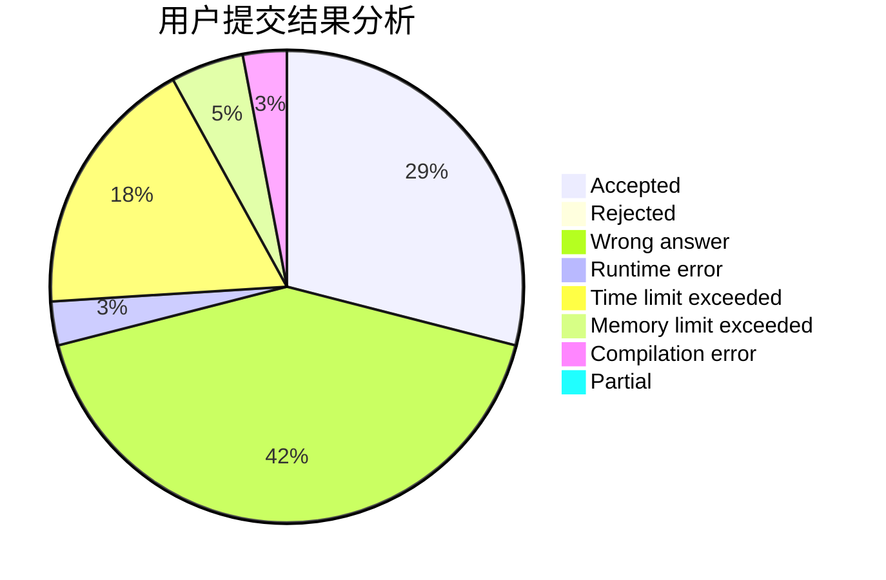
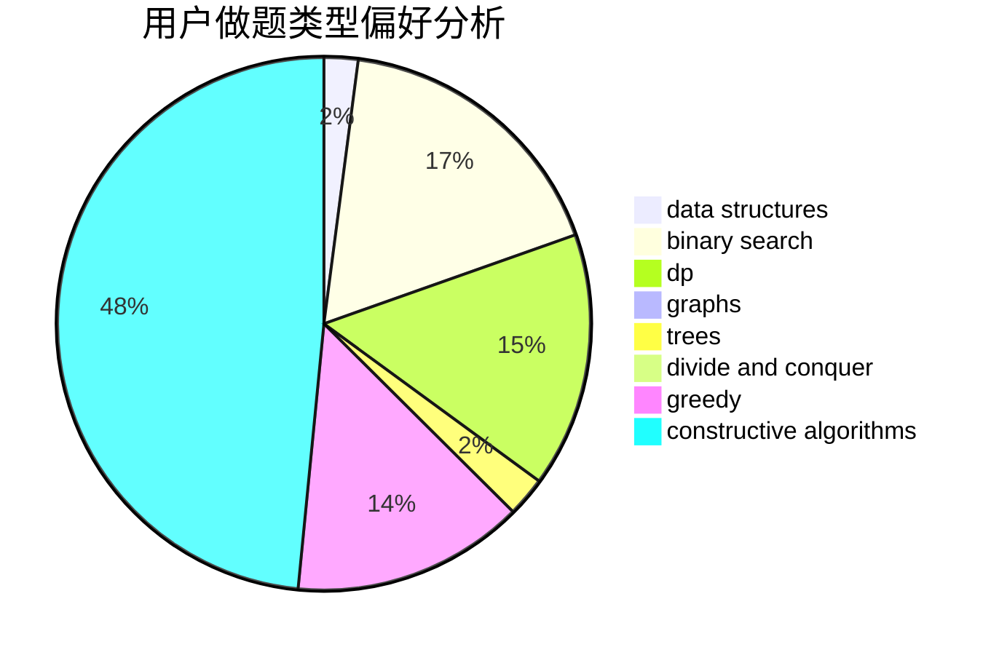
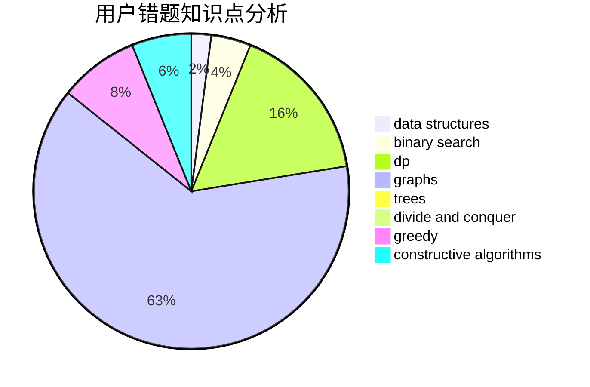

# 913887524gsd

<!-- tabs:start -->

#### **用户提交结果分析**

#### **用户做题类型偏好分析**

#### **用户错题知识点分析**

<!-- tabs:end -->
# 推荐题目
[1344A](https://codeforces.com/contest/1344/problem/A)		math,
                        number theory,
                        sortings		  
[1148B](https://codeforces.com/contest/1148/problem/B)		binary search,
                        brute force,
                        two pointers		  
[1446D2](https://codeforces.com/contest/1446D/problem/2)		data structures,
                        greedy,
                        two pointers		  
[1299E](https://codeforces.com/contest/1299/problem/E)		interactive,
                        math		  
[1010D](https://codeforces.com/contest/1010/problem/D)		dfs and similar,
                        graphs,
                        implementation,
                        trees		  
[1120D](https://codeforces.com/contest/1120/problem/D)		dfs and similar,
                        dp,
                        dsu,
                        graphs,
                        greedy,
                        trees		  
[1371E2](https://codeforces.com/contest/1371E/problem/2)		binary search,
                        combinatorics,
                        dp,
                        math,
                        number theory,
                        sortings		  
[1089A](https://codeforces.com/contest/1089/problem/A)		dp		  
[1400C](https://codeforces.com/contest/1400/problem/C)		2-sat,
                        brute force,
                        constructive algorithms,
                        greedy		  
[1041D](https://codeforces.com/contest/1041/problem/D)		binary search,
                        data structures,
                        two pointers		  
