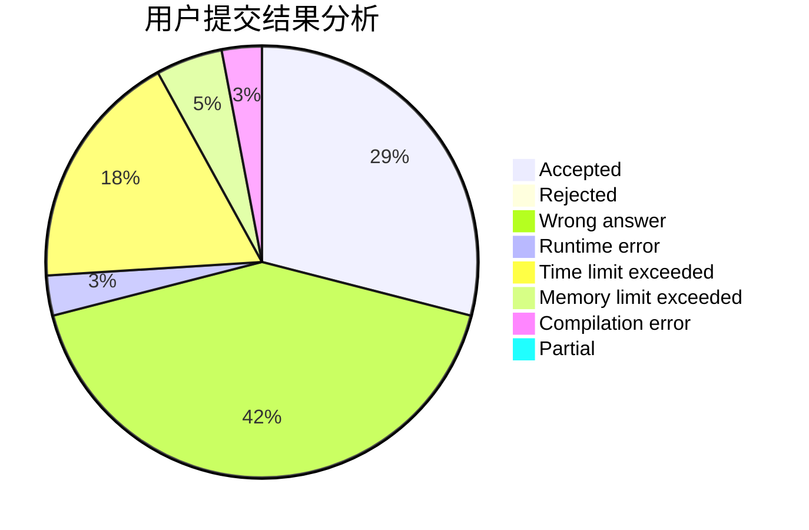
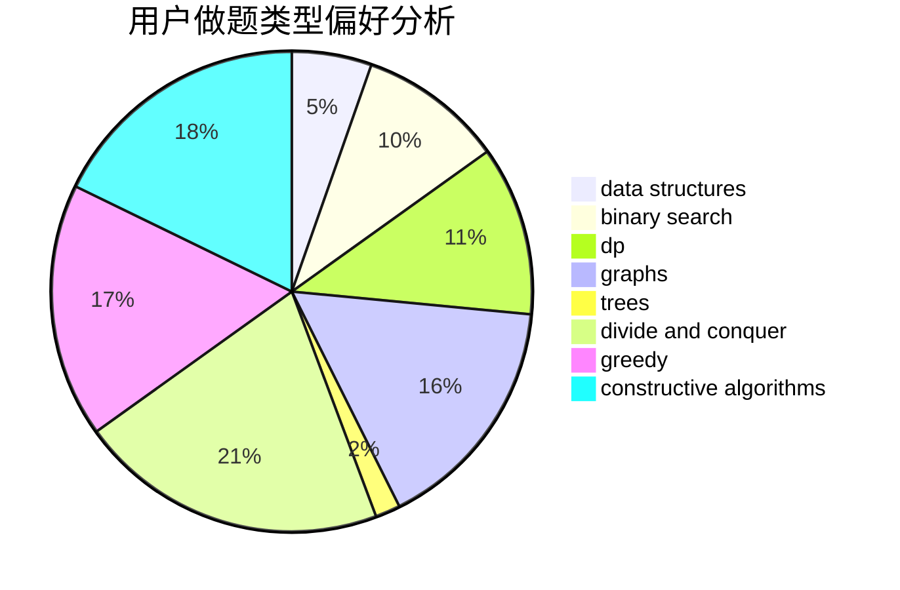
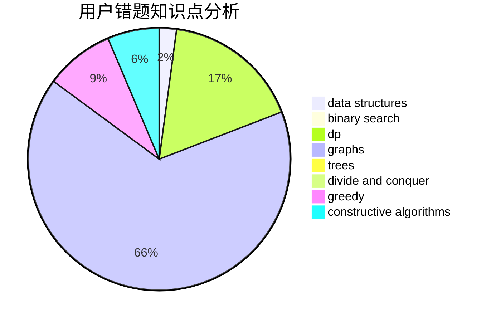

# 913887524gsd

<!-- tabs:start -->

#### **用户提交结果分析**

#### **用户做题类型偏好分析**

#### **用户错题知识点分析**

<!-- tabs:end -->
# 推荐题目
[1350E](https://codeforces.com/contest/1350/problem/E)		dsu,graphs,sortings,trees		  
[114B](https://codeforces.com/contest/114/problem/B)		bitmasks,
                        brute force,
                        graphs		  
[1455G](https://codeforces.com/contest/1455/problem/G)		data structures,
                        dp		  
[1307A](https://codeforces.com/contest/1307/problem/A)		greedy,
                        implementation		  
[1011A](https://codeforces.com/contest/1011/problem/A)		greedy,
                        implementation,
                        sortings		  
[11301](https://codeforces.com/contest/1130/problem/1)		dsu,graphs,sortings,trees		  
[1380D](https://codeforces.com/contest/1380/problem/D)		constructive algorithms,
                        greedy,
                        implementation,
                        math,
                        two pointers		  
[1089F](https://codeforces.com/contest/1089/problem/F)		math		  
[140B](https://codeforces.com/contest/140/problem/B)		brute force,
                        greedy,
                        implementation		  
[1042A](https://codeforces.com/contest/1042/problem/A)		binary search,
                        implementation		  
