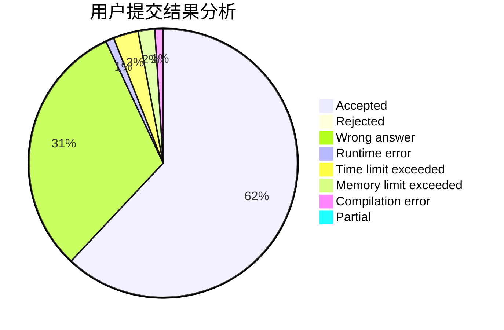
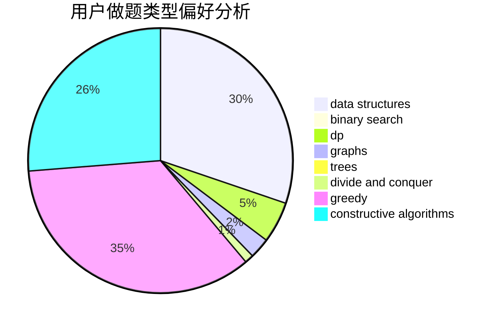
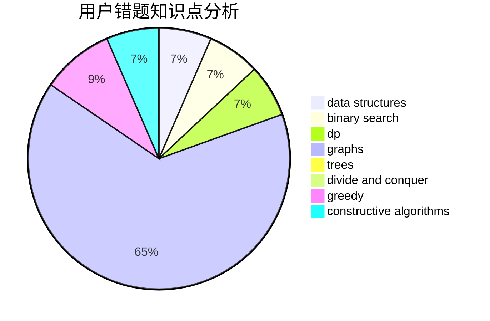

# Namazabi12

<!-- tabs:start -->

#### **用户提交结果分析**

#### **用户做题类型偏好分析**

#### **用户错题知识点分析**

<!-- tabs:end -->
# 推荐题目
[243A](https://codeforces.com/contest/243/problem/A)		bitmasks		  
[627F](https://codeforces.com/contest/627/problem/F)		dfs and similar,
                        dsu,
                        graphs,
                        trees		  
[923D](https://codeforces.com/contest/923/problem/D)		constructive algorithms,
                        implementation,
                        strings		  
[518B](https://codeforces.com/contest/518/problem/B)		greedy,
                        implementation,
                        strings		  
[438B](https://codeforces.com/contest/438/problem/B)		dsu,graphs,sortings,trees		  
[434A](https://codeforces.com/contest/434/problem/A)		dsu,graphs,sortings,trees		  
[69E](https://codeforces.com/contest/69/problem/E)		data structures,
                        implementation		  
[681E](https://codeforces.com/contest/681/problem/E)		geometry,
                        sortings		  
[1298E](https://codeforces.com/contest/1298/problem/E)		dsu,graphs,sortings,trees		  
[635A](https://codeforces.com/contest/635/problem/A)		brute force,
                        implementation		  
