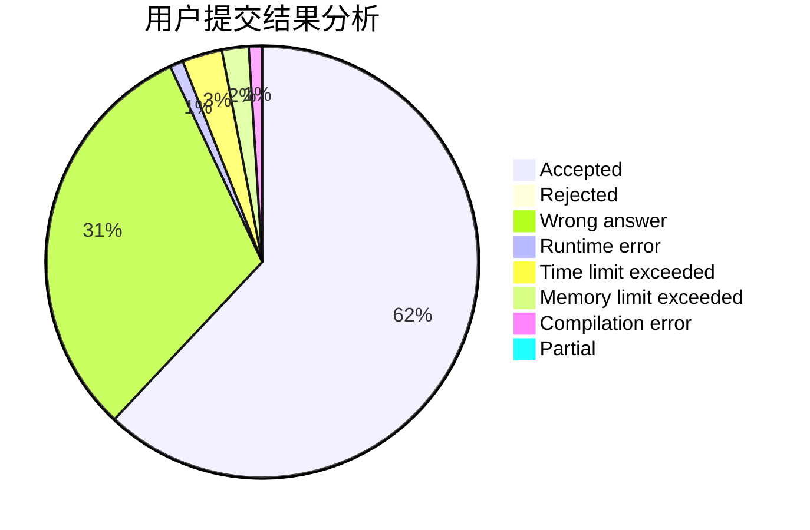
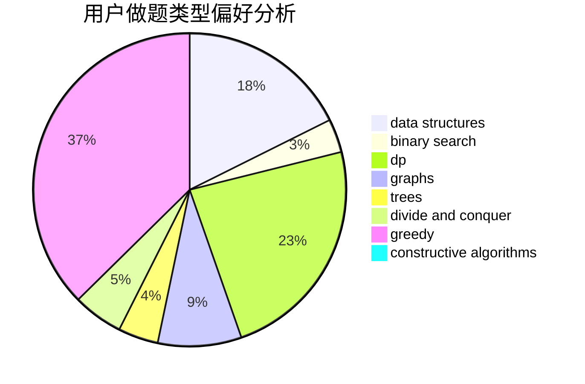
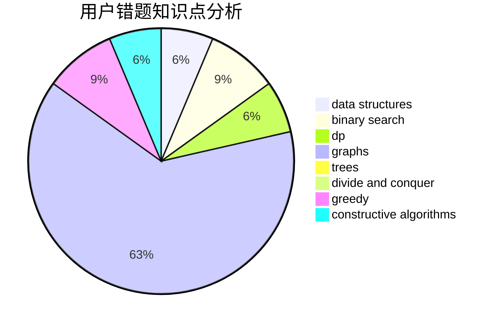

# Namazabi12

<!-- tabs:start -->

#### **用户提交结果分析**

#### **用户做题类型偏好分析**

#### **用户错题知识点分析**

<!-- tabs:end -->
# 推荐题目
[224A](https://codeforces.com/contest/224/problem/A)		brute force,
                        geometry,
                        math		  
[609A](https://codeforces.com/contest/609/problem/A)		greedy,
                        implementation,
                        sortings		  
[909A](https://codeforces.com/contest/909/problem/A)		brute force,
                        greedy,
                        sortings		  
[497E](https://codeforces.com/contest/497/problem/E)		dp,
                        matrices		  
[412C](https://codeforces.com/contest/412/problem/C)		implementation,
                        strings		  
[405A](https://codeforces.com/contest/405/problem/A)		greedy,
                        implementation,
                        sortings		  
[675B](https://codeforces.com/contest/675/problem/B)		brute force,
                        constructive algorithms,
                        math		  
[660F](https://codeforces.com/contest/660/problem/F)		binary search,
                        data structures,
                        geometry,
                        ternary search		  
[1291F](https://codeforces.com/contest/1291/problem/F)		graphs,
                        interactive		  
[617B](https://codeforces.com/contest/617/problem/B)		combinatorics		  
