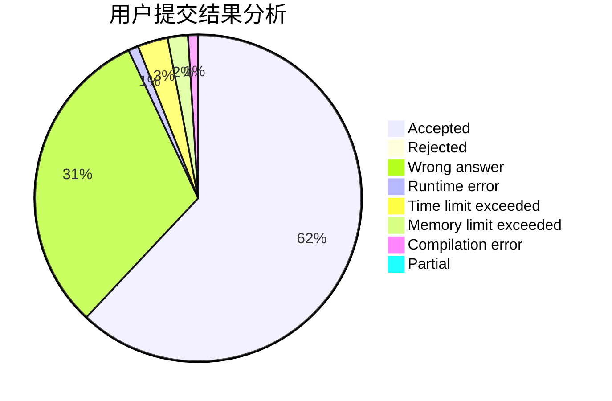
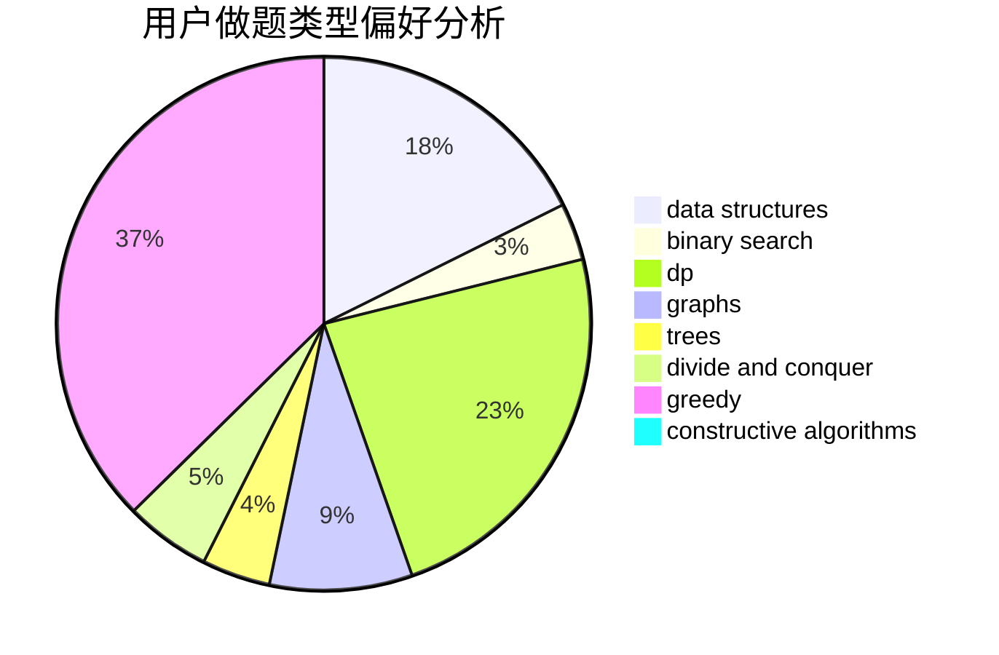
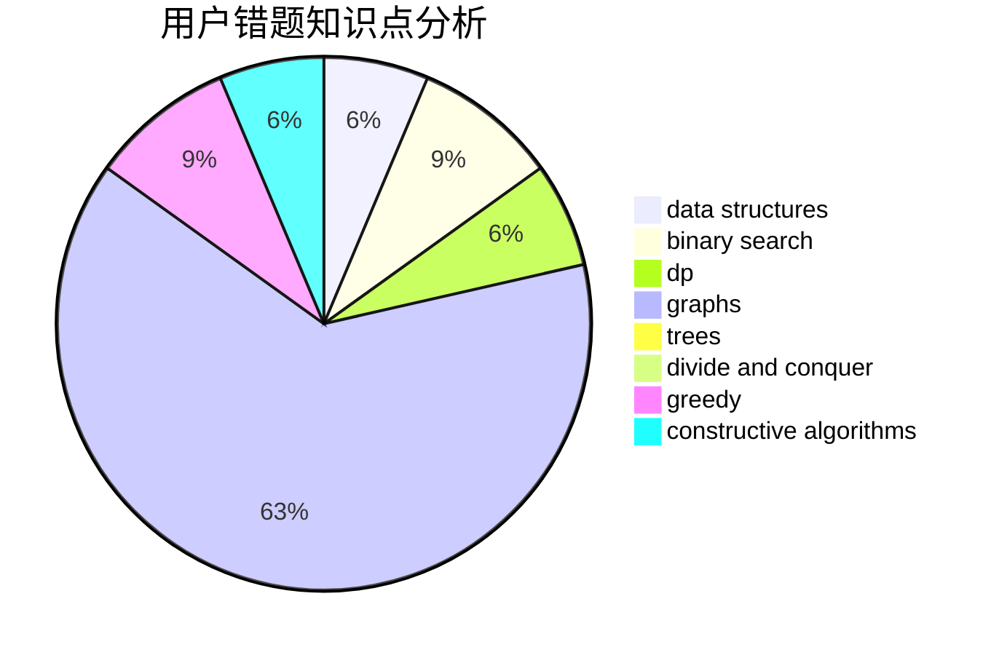

# Namazabi12
<!-- tabs:start -->
#### **用户提交结果分析**

#### **用户做题类型偏好分析**

#### **用户错题知识点分析**

<!-- tabs:end -->
# 推荐题目
[Parallelepiped](http://codeforces.com/problemset/problem/224/A)		brute force,
                        geometry,
                        math		  
[Subsequences Return](http://codeforces.com/problemset/problem/497/E)		dp,
                        matrices		  
[Bear and Bowling 4](http://codeforces.com/problemset/problem/660/F)		binary search,
                        data structures,
                        geometry,
                        ternary search		  
[Curriculum Vitae](http://codeforces.com/problemset/problem/846/A)		brute force,
                        implementation		  
[Really Big Numbers](http://codeforces.com/problemset/problem/817/C)		binary search,
                        brute force,
                        dp,
                        math		  
[Codeforces World Finals](http://codeforces.com/problemset/problem/30/B)		implementation		  
[Gravity Flip](http://codeforces.com/problemset/problem/405/A)		greedy,
                        implementation,
                        sortings		  
[Флеш-карты](http://codeforces.com/problemset/problem/609/A)		greedy,
                        implementation,
                        sortings		  
[Vanya and Triangles](http://codeforces.com/problemset/problem/552/D)		brute force,
                        combinatorics,
                        data structures,
                        geometry,
                        math,
                        sortings		  
[Pattern](http://codeforces.com/problemset/problem/412/C)		implementation,
                        strings		  
<!-- tabs:start -->
#### **data structures**
[Parallelepiped](http://codeforces.com/problemset/problem/660/F)		binary search,
                        data structures,
                        geometry,
                        ternary search		  
[Subsequences Return](http://codeforces.com/problemset/problem/552/D)		brute force,
                        combinatorics,
                        data structures,
                        geometry,
                        math,
                        sortings		  
[Bear and Bowling 4](http://codeforces.com/problemset/problem/1322/B)		binary search,
                        bitmasks,
                        constructive algorithms,
                        data structures,
                        math,
                        sortings		  
[Curriculum Vitae](http://codeforces.com/problemset/problem/900/E)		data structures,
                        dp,
                        strings		  
[Really Big Numbers](http://codeforces.com/problemset/problem/1492/C)		binary search,
                        data structures,
                        dp,
                        greedy,
                        two pointers		  
[Codeforces World Finals](http://codeforces.com/problemset/problem/1490/G)		binary search,
                        data structures,
                        math		  
[Gravity Flip](http://codeforces.com/problemset/problem/1479/D)		binary search,
                        bitmasks,
                        brute force,
                        data structures,
                        probabilities,
                        trees		  
[Флеш-карты](http://codeforces.com/problemset/problem/1497/A)		brute force,
                        data structures,
                        greedy,
                        sortings		  
[Vanya and Triangles](http://codeforces.com/problemset/problem/1491/C)		brute force,
                        data structures,
                        dp,
                        greedy,
                        implementation		  
[Pattern](http://codeforces.com/problemset/problem/1492/B)		data structures,
                        greedy,
                        math		  
#### **binary search**
[Parallelepiped](http://codeforces.com/problemset/problem/660/F)		binary search,
                        data structures,
                        geometry,
                        ternary search		  
[Subsequences Return](http://codeforces.com/problemset/problem/817/C)		binary search,
                        brute force,
                        dp,
                        math		  
[Bear and Bowling 4](http://codeforces.com/problemset/problem/1322/B)		binary search,
                        bitmasks,
                        constructive algorithms,
                        data structures,
                        math,
                        sortings		  
[Curriculum Vitae](http://codeforces.com/problemset/problem/1476/B)		binary search,
                        brute force,
                        greedy,
                        math		  
[Really Big Numbers](http://codeforces.com/problemset/problem/1492/C)		binary search,
                        data structures,
                        dp,
                        greedy,
                        two pointers		  
[Codeforces World Finals](http://codeforces.com/problemset/problem/1463/D)		binary search,
                        constructive algorithms,
                        greedy,
                        two pointers		  
[Gravity Flip](http://codeforces.com/problemset/problem/1490/G)		binary search,
                        data structures,
                        math		  
[Флеш-карты](http://codeforces.com/problemset/problem/1479/D)		binary search,
                        bitmasks,
                        brute force,
                        data structures,
                        probabilities,
                        trees		  
[Vanya and Triangles](http://codeforces.com/problemset/problem/1436/E)		binary search,
                        data structures,
                        two pointers		  
[Pattern](http://codeforces.com/problemset/problem/1461/D)		binary search,
                        brute force,
                        data structures,
                        divide and conquer,
                        implementation,
                        sortings		  
#### **dp**
[Parallelepiped](http://codeforces.com/problemset/problem/497/E)		dp,
                        matrices		  
[Subsequences Return](http://codeforces.com/problemset/problem/817/C)		binary search,
                        brute force,
                        dp,
                        math		  
[Bear and Bowling 4](http://codeforces.com/problemset/problem/567/F)		dp		  
[Curriculum Vitae](http://codeforces.com/problemset/problem/900/E)		data structures,
                        dp,
                        strings		  
[Really Big Numbers](http://codeforces.com/problemset/problem/86/C)		dp,
                        string suffix structures,
                        trees		  
[Codeforces World Finals](http://codeforces.com/problemset/problem/704/B)		dp,
                        graphs,
                        greedy		  
[Gravity Flip](http://codeforces.com/problemset/problem/1492/C)		binary search,
                        data structures,
                        dp,
                        greedy,
                        two pointers		  
[Флеш-карты](https://codeforces.com/contest/1457/problem/C)		brute force,
                        dp,
                        implementation		  
[Vanya and Triangles](http://codeforces.com/problemset/problem/1491/C)		brute force,
                        data structures,
                        dp,
                        greedy,
                        implementation		  
[Pattern](http://codeforces.com/problemset/problem/1437/C)		dp,
                        flows,
                        graph matchings,
                        greedy,
                        math,
                        sortings		  
#### **graph**
[Parallelepiped](http://codeforces.com/problemset/problem/1291/F)		graphs,
                        interactive		  
[Subsequences Return](http://codeforces.com/problemset/problem/491/C)		flows,
                        graph matchings		  
[Bear and Bowling 4](http://codeforces.com/problemset/problem/704/B)		dp,
                        graphs,
                        greedy		  
[Curriculum Vitae](http://codeforces.com/problemset/problem/1487/C)		brute force,
                        constructive algorithms,
                        dfs and similar,
                        graphs,
                        greedy,
                        implementation,
                        math		  
[Really Big Numbers](http://codeforces.com/problemset/problem/1437/C)		dp,
                        flows,
                        graph matchings,
                        greedy,
                        math,
                        sortings		  
[Codeforces World Finals](http://codeforces.com/problemset/problem/1470/D)		constructive algorithms,
                        dfs and similar,
                        graph matchings,
                        graphs,
                        greedy		  
[Gravity Flip](http://codeforces.com/problemset/problem/1476/C)		dp,
                        graphs,
                        greedy		  
[Флеш-карты](http://codeforces.com/problemset/problem/1304/D)		constructive algorithms,
                        graphs,
                        greedy,
                        two pointers		  
[Vanya and Triangles](http://codeforces.com/problemset/problem/1475/C)		combinatorics,
                        graphs,
                        math		  
[Pattern](http://codeforces.com/problemset/problem/553/E)		dp,
                        fft,
                        graphs,
                        math,
                        probabilities		  
#### **trees**
[Parallelepiped](http://codeforces.com/problemset/problem/86/C)		dp,
                        string suffix structures,
                        trees		  
[Subsequences Return](http://codeforces.com/problemset/problem/1479/D)		binary search,
                        bitmasks,
                        brute force,
                        data structures,
                        probabilities,
                        trees		  
[Bear and Bowling 4](http://codeforces.com/problemset/problem/1511/C)		brute force,
                        data structures,
                        implementation,
                        trees		  
[Curriculum Vitae](http://codeforces.com/problemset/problem/1499/F)		combinatorics,
                        dfs and similar,
                        dp,
                        trees		  
[Really Big Numbers](http://codeforces.com/problemset/problem/1491/E)		brute force,
                        dfs and similar,
                        divide and conquer,
                        number theory,
                        trees		  
[Codeforces World Finals](http://codeforces.com/problemset/problem/1466/D)		data structures,
                        greedy,
                        sortings,
                        trees		  
[Gravity Flip](http://codeforces.com/problemset/problem/1495/D)		combinatorics,
                        dfs and similar,
                        graphs,
                        math,
                        shortest paths,
                        trees		  
[Флеш-карты](http://codeforces.com/problemset/problem/1303/G)		data structures,
                        divide and conquer,
                        geometry,
                        trees		  
[Vanya and Triangles](http://codeforces.com/problemset/problem/1454/E)		combinatorics,
                        dfs and similar,
                        graphs,
                        trees		  
[Pattern](http://codeforces.com/problemset/problem/1494/D)		constructive algorithms,
                        data structures,
                        dfs and similar,
                        divide and conquer,
                        dsu,
                        greedy,
                        sortings,
                        trees		  
#### **divide and conquer**
[Parallelepiped](http://codeforces.com/problemset/problem/1461/D)		binary search,
                        brute force,
                        data structures,
                        divide and conquer,
                        implementation,
                        sortings		  
[Subsequences Return](http://codeforces.com/problemset/problem/1466/G)		combinatorics,
                        divide and conquer,
                        hashing,
                        math,
                        string suffix structures,
                        strings		  
[Bear and Bowling 4](http://codeforces.com/problemset/problem/1490/D)		dfs and similar,
                        divide and conquer,
                        implementation		  
[Curriculum Vitae](https://codeforces.com/contest/1483/problem/C)		data structures,
                        divide and conquer,
                        dp		  
[Really Big Numbers](http://codeforces.com/problemset/problem/1491/E)		brute force,
                        dfs and similar,
                        divide and conquer,
                        number theory,
                        trees		  
[Codeforces World Finals](http://codeforces.com/problemset/problem/1303/G)		data structures,
                        divide and conquer,
                        geometry,
                        trees		  
[Gravity Flip](http://codeforces.com/problemset/problem/1494/D)		constructive algorithms,
                        data structures,
                        dfs and similar,
                        divide and conquer,
                        dsu,
                        greedy,
                        sortings,
                        trees		  
[Флеш-карты](http://codeforces.com/problemset/problem/1482/E)		data structures,
                        divide and conquer,
                        dp		  
[Vanya and Triangles](http://codeforces.com/problemset/problem/566/C)		dfs and similar,
                        divide and conquer,
                        trees		  
[Pattern](http://codeforces.com/problemset/problem/1428/F)		binary search,
                        data structures,
                        divide and conquer,
                        dp,
                        two pointers		  
#### **greedy**
[Parallelepiped](http://codeforces.com/problemset/problem/405/A)		greedy,
                        implementation,
                        sortings		  
[Subsequences Return](http://codeforces.com/problemset/problem/609/A)		greedy,
                        implementation,
                        sortings		  
[Bear and Bowling 4](http://codeforces.com/problemset/problem/909/A)		brute force,
                        greedy,
                        sortings		  
[Curriculum Vitae](http://codeforces.com/problemset/problem/1062/B)		greedy,
                        math,
                        number theory		  
[Really Big Numbers](https://codeforces.com/contest/477/problem/B)		constructive algorithms,
                        greedy,
                        math		  
[Codeforces World Finals](https://codeforces.com/contest/790/problem/A)		constructive algorithms,
                        greedy		  
[Gravity Flip](http://codeforces.com/problemset/problem/704/B)		dp,
                        graphs,
                        greedy		  
[Флеш-карты](http://codeforces.com/problemset/problem/1000/A)		greedy,
                        implementation		  
[Vanya and Triangles](http://codeforces.com/problemset/problem/1070/F)		greedy		  
[Pattern](http://codeforces.com/problemset/problem/1342/A)		greedy,
                        math		  
#### **constructive algorithms**
[Parallelepiped](http://codeforces.com/problemset/problem/675/B)		brute force,
                        constructive algorithms,
                        math		  
[Subsequences Return](https://codeforces.com/contest/477/problem/B)		constructive algorithms,
                        greedy,
                        math		  
[Bear and Bowling 4](http://codeforces.com/problemset/problem/1322/B)		binary search,
                        bitmasks,
                        constructive algorithms,
                        data structures,
                        math,
                        sortings		  
[Curriculum Vitae](https://codeforces.com/contest/790/problem/A)		constructive algorithms,
                        greedy		  
[Really Big Numbers](http://codeforces.com/problemset/problem/1493/A)		constructive algorithms,
                        greedy		  
[Codeforces World Finals](http://codeforces.com/problemset/problem/1463/D)		binary search,
                        constructive algorithms,
                        greedy,
                        two pointers		  
[Gravity Flip](https://codeforces.com/contest/1456/problem/B)		bitmasks,
                        brute force,
                        constructive algorithms		  
[Флеш-карты](http://codeforces.com/problemset/problem/1492/D)		bitmasks,
                        constructive algorithms,
                        greedy,
                        math		  
[Vanya and Triangles](https://codeforces.com/contest/1504/problem/D)		constructive algorithms,
                        games,
                        interactive		  
[Pattern](https://codeforces.com/contest/1483/problem/A)		brute force,
                        constructive algorithms,
                        greedy,
                        implementation		  
#### **sortings**
[Parallelepiped](http://codeforces.com/problemset/problem/405/A)		greedy,
                        implementation,
                        sortings		  
[Subsequences Return](http://codeforces.com/problemset/problem/609/A)		greedy,
                        implementation,
                        sortings		  
[Bear and Bowling 4](http://codeforces.com/problemset/problem/552/D)		brute force,
                        combinatorics,
                        data structures,
                        geometry,
                        math,
                        sortings		  
[Curriculum Vitae](http://codeforces.com/problemset/problem/909/A)		brute force,
                        greedy,
                        sortings		  
[Really Big Numbers](http://codeforces.com/problemset/problem/1322/B)		binary search,
                        bitmasks,
                        constructive algorithms,
                        data structures,
                        math,
                        sortings		  
[Codeforces World Finals](http://codeforces.com/problemset/problem/37/A)		sortings		  
[Gravity Flip](https://codeforces.com/contest/1496/problem/C)		geometry,
                        greedy,
                        math,
                        sortings		  
[Флеш-карты](http://codeforces.com/problemset/problem/1495/A)		geometry,
                        greedy,
                        math,
                        sortings		  
[Vanya and Triangles](http://codeforces.com/problemset/problem/1497/A)		brute force,
                        data structures,
                        greedy,
                        sortings		  
[Pattern](http://codeforces.com/problemset/problem/1427/A)		math,
                        sortings		  
<!-- tabs:end -->
