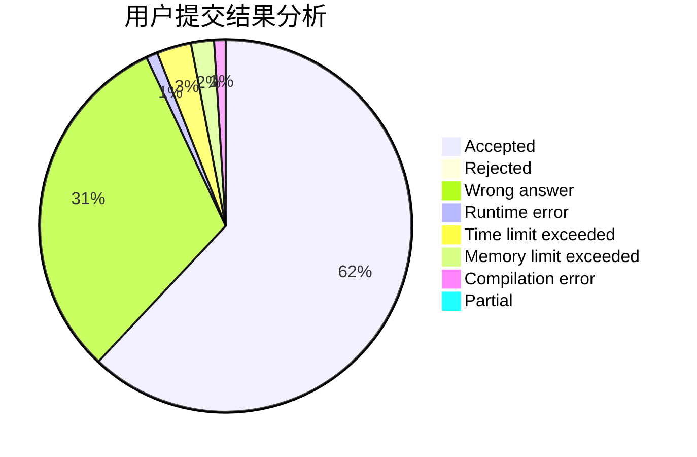
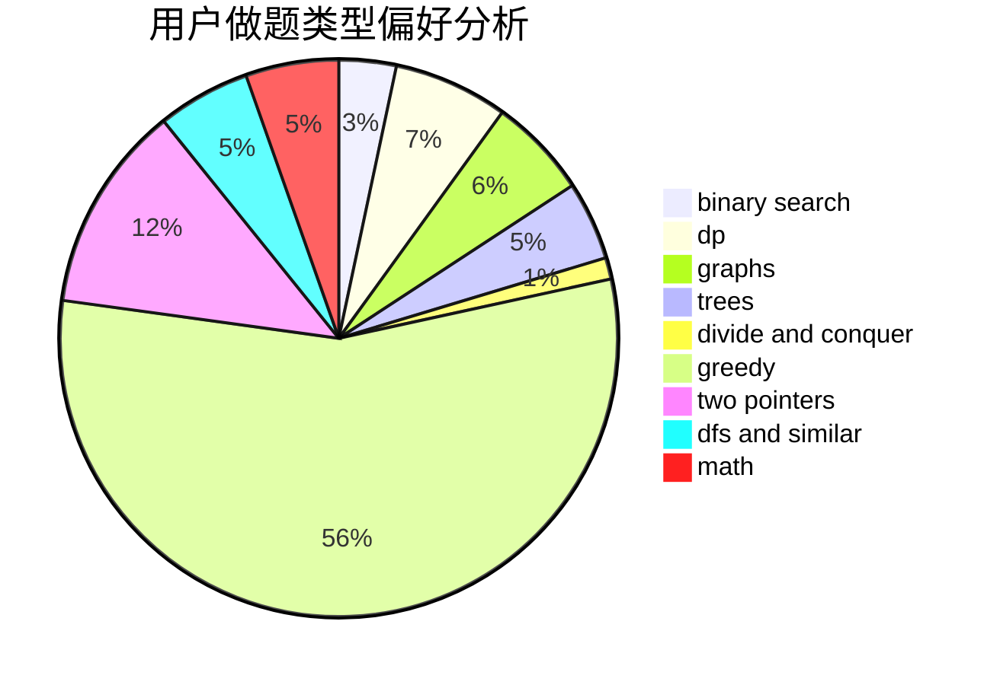

# Namazabi12

<!-- tabs:start -->

#### **用户提交结果分析**

#### **用户做题类型偏好分析**

<!-- tabs:end -->
# 推荐题目
[243A](https://codeforces.com/contest/243/problem/A)
[627F](https://codeforces.com/contest/627/problem/F)
[923D](https://codeforces.com/contest/923/problem/D)
[518B](https://codeforces.com/contest/518/problem/B)
[438B](https://codeforces.com/contest/438/problem/B)
[434A](https://codeforces.com/contest/434/problem/A)
[69E](https://codeforces.com/contest/69/problem/E)
[681E](https://codeforces.com/contest/681/problem/E)
[1298E](https://codeforces.com/contest/1298/problem/E)
[635A](https://codeforces.com/contest/635/problem/A)
