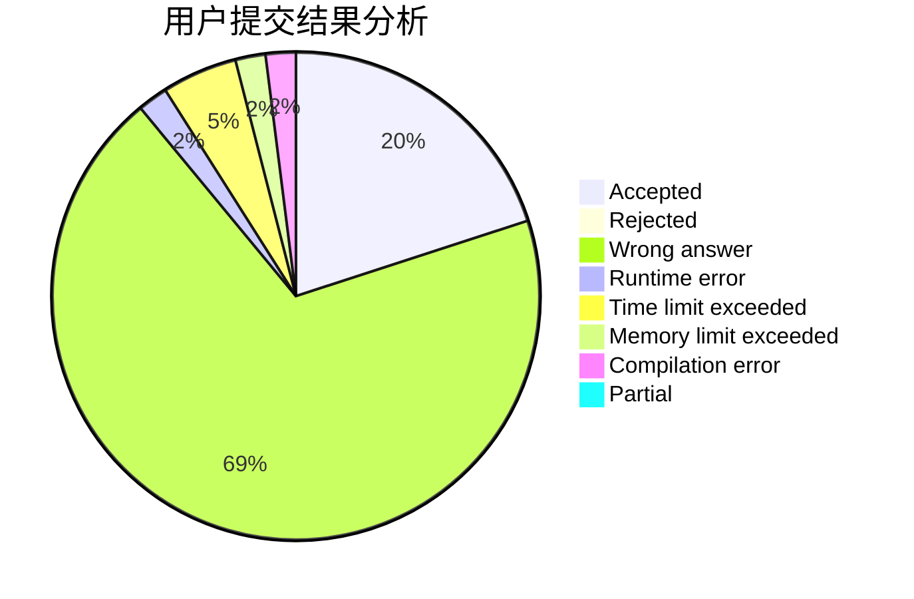
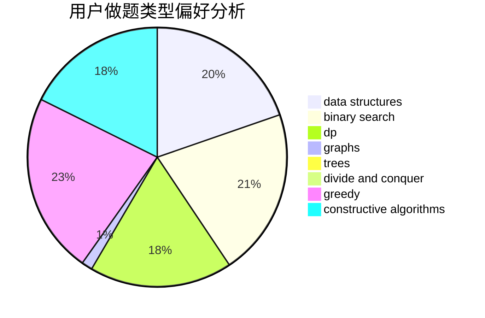
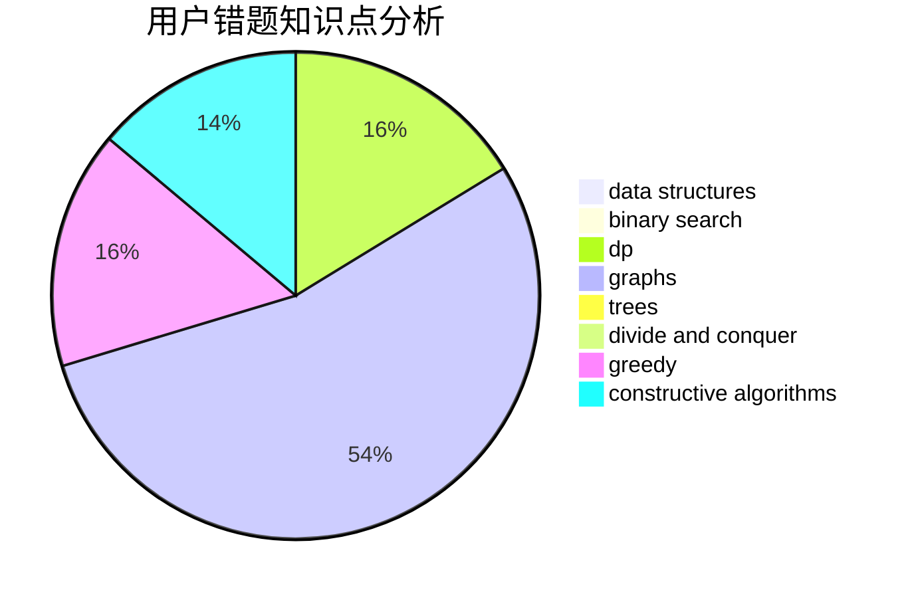

# Nanako

<!-- tabs:start -->

#### **用户提交结果分析**

#### **用户做题类型偏好分析**

#### **用户错题知识点分析**

<!-- tabs:end -->
# 推荐题目
[335D](https://codeforces.com/contest/335/problem/D)		brute force,
                        dp		  
[1506B](https://codeforces.com/contest/1506/problem/B)		greedy,
                        implementation		  
[1008E](https://codeforces.com/contest/1008/problem/E)		dsu,graphs,sortings,trees		  
[1211B](https://codeforces.com/contest/1211/problem/B)		*special problem,
                        implementation		  
[1261E](https://codeforces.com/contest/1261/problem/E)		dsu,graphs,sortings,trees		  
[114B](https://codeforces.com/contest/114/problem/B)		bitmasks,
                        brute force,
                        graphs		  
[171F](https://codeforces.com/contest/171/problem/F)		*special problem,
                        brute force,
                        implementation,
                        number theory		  
[1092D1](https://codeforces.com/contest/1092D/problem/1)		greedy,
                        implementation,
                        math		  
[1330A](https://codeforces.com/contest/1330/problem/A)		implementation		  
[959C](https://codeforces.com/contest/959/problem/C)		constructive algorithms,
                        trees		  
