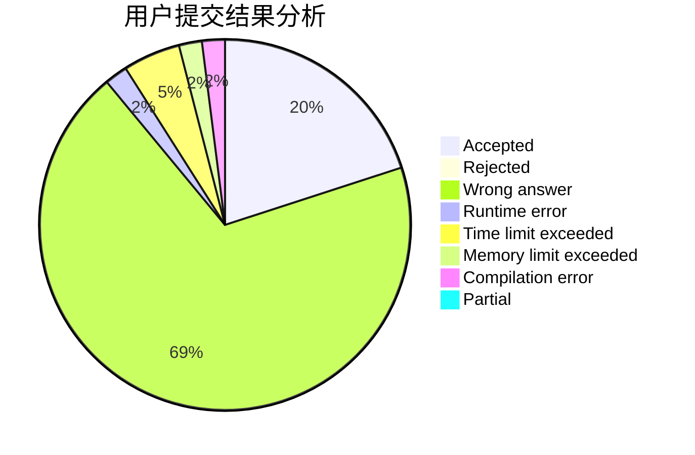
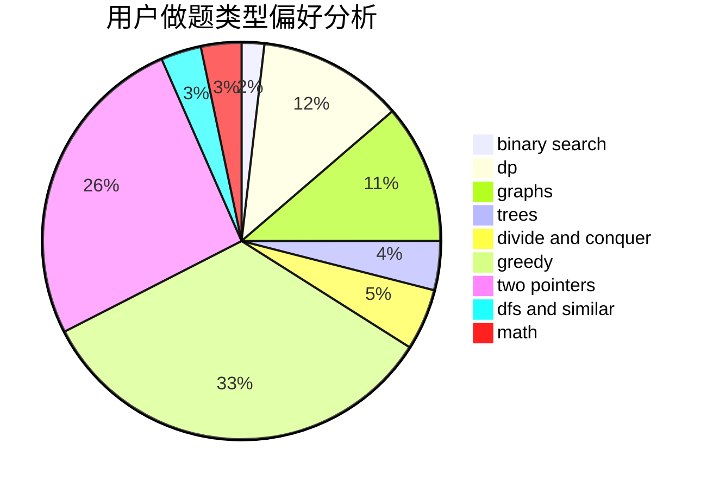

# Nanako

<!-- tabs:start -->

#### **用户提交结果分析**

#### **用户做题类型偏好分析**

<!-- tabs:end -->
# 推荐题目
[362C](https://codeforces.com/contest/362/problem/C)
[157C](https://codeforces.com/contest/157/problem/C)
[1009C](https://codeforces.com/contest/1009/problem/C)
[1217B](https://codeforces.com/contest/1217/problem/B)
[1267F](https://codeforces.com/contest/1267/problem/F)
[1151E](https://codeforces.com/contest/1151/problem/E)
[199D](https://codeforces.com/contest/199/problem/D)
[1092F](https://codeforces.com/contest/1092/problem/F)
[1336A](https://codeforces.com/contest/1336/problem/A)
[981B](https://codeforces.com/contest/981/problem/B)
