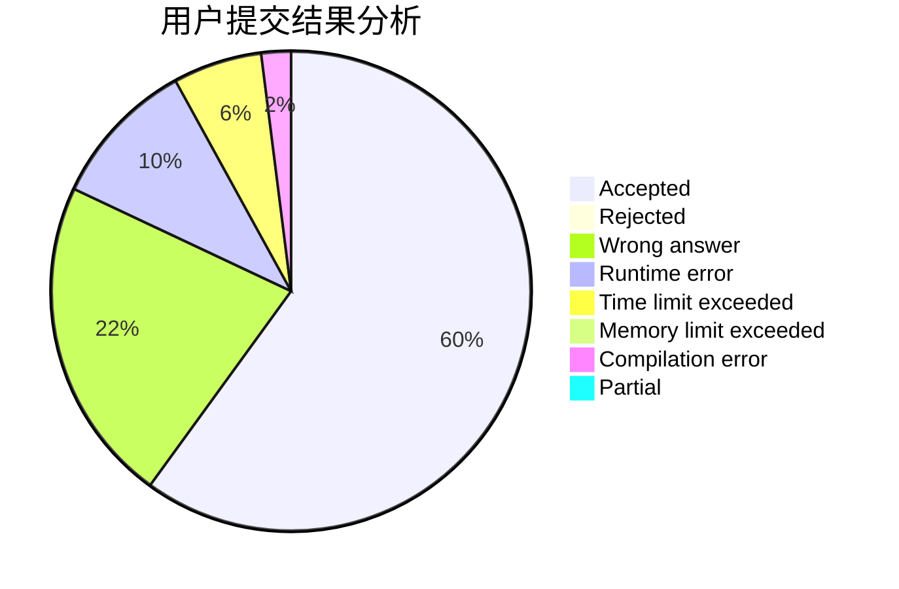
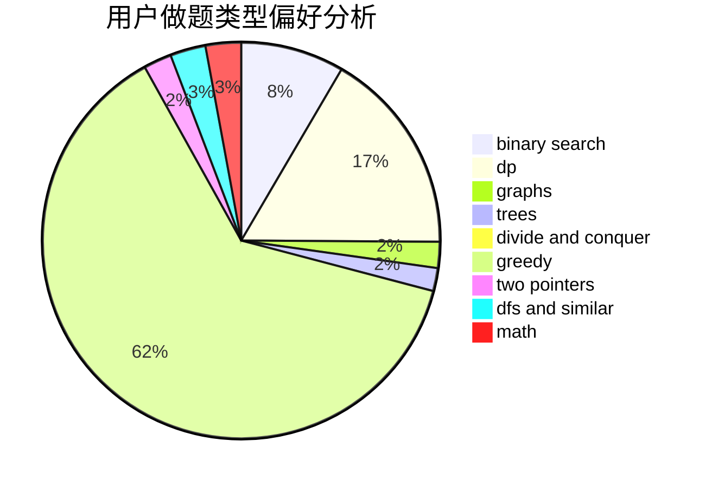

# Nanarikom

<!-- tabs:start -->

#### **用户提交结果分析**

#### **用户做题类型偏好分析**

<!-- tabs:end -->
# 推荐题目
[1016B](https://codeforces.com/contest/1016/problem/B)
[814D](https://codeforces.com/contest/814/problem/D)
[788D](https://codeforces.com/contest/788/problem/D)
[58E](https://codeforces.com/contest/58/problem/E)
[293A](https://codeforces.com/contest/293/problem/A)
[833C](https://codeforces.com/contest/833/problem/C)
[34A](https://codeforces.com/contest/34/problem/A)
[14D](https://codeforces.com/contest/14/problem/D)
[1205E](https://codeforces.com/contest/1205/problem/E)
[913G](https://codeforces.com/contest/913/problem/G)
