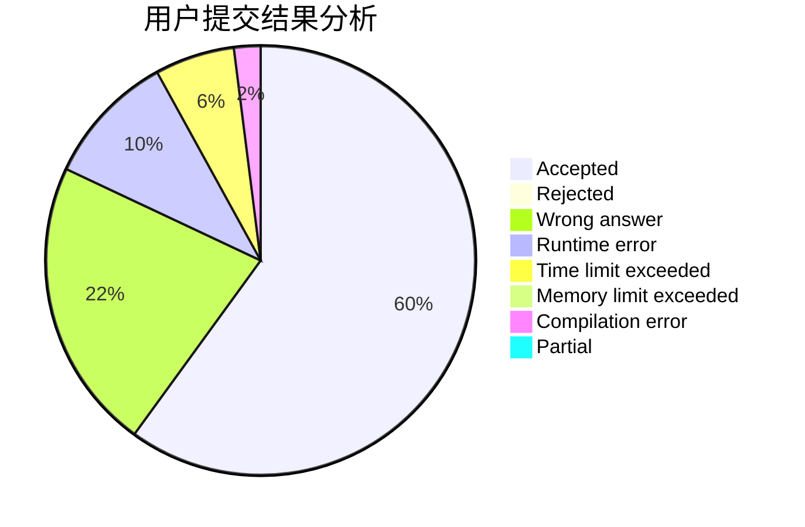
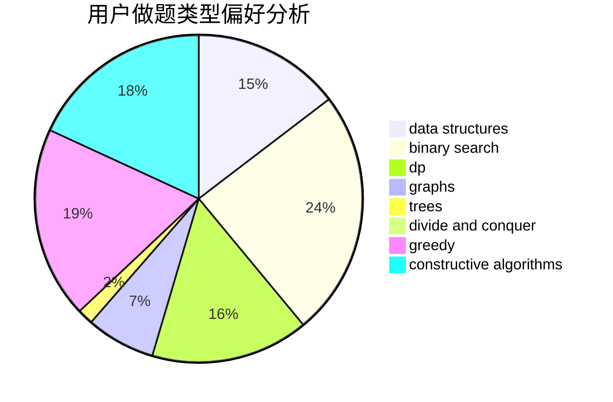
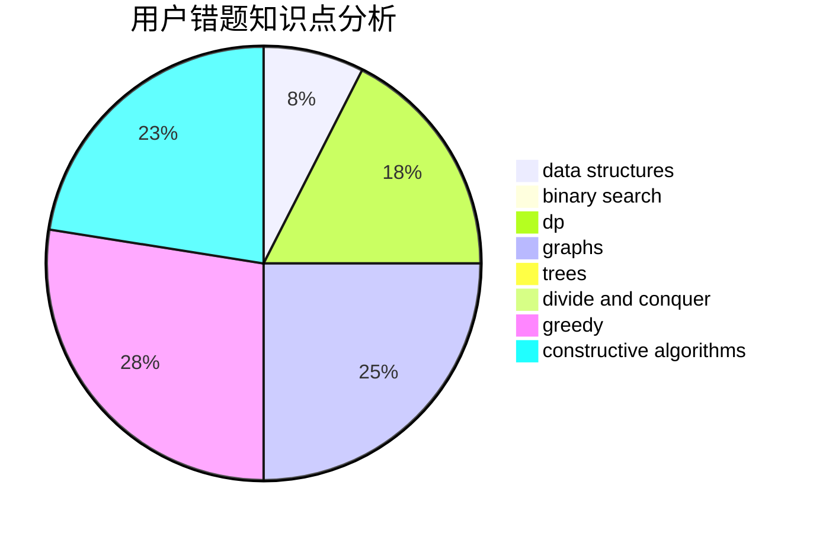

# Nanarikom

<!-- tabs:start -->

#### **用户提交结果分析**

#### **用户做题类型偏好分析**

#### **用户错题知识点分析**

<!-- tabs:end -->
# 推荐题目
[1016B](https://codeforces.com/contest/1016/problem/B)		brute force,
                        implementation		  
[814D](https://codeforces.com/contest/814/problem/D)		dfs and similar,
                        dp,
                        geometry,
                        greedy,
                        trees		  
[788D](https://codeforces.com/contest/788/problem/D)		constructive algorithms,
                        divide and conquer,
                        interactive		  
[58E](https://codeforces.com/contest/58/problem/E)		dp		  
[293A](https://codeforces.com/contest/293/problem/A)		games,
                        greedy		  
[833C](https://codeforces.com/contest/833/problem/C)		brute force,
                        combinatorics,
                        greedy,
                        math		  
[34A](https://codeforces.com/contest/34/problem/A)		implementation		  
[14D](https://codeforces.com/contest/14/problem/D)		dfs and similar,
                        dp,
                        graphs,
                        shortest paths,
                        trees,
                        two pointers		  
[1205E](https://codeforces.com/contest/1205/problem/E)		combinatorics,
                        strings		  
[913G](https://codeforces.com/contest/913/problem/G)		math,
                        number theory		  
