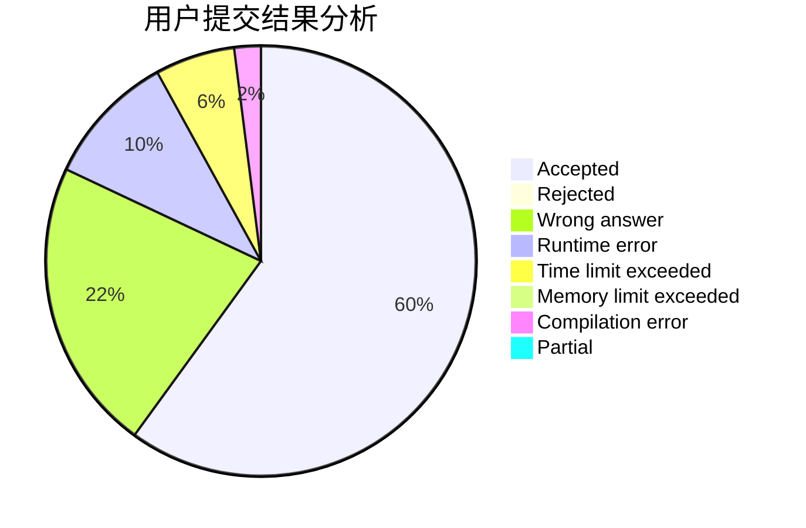
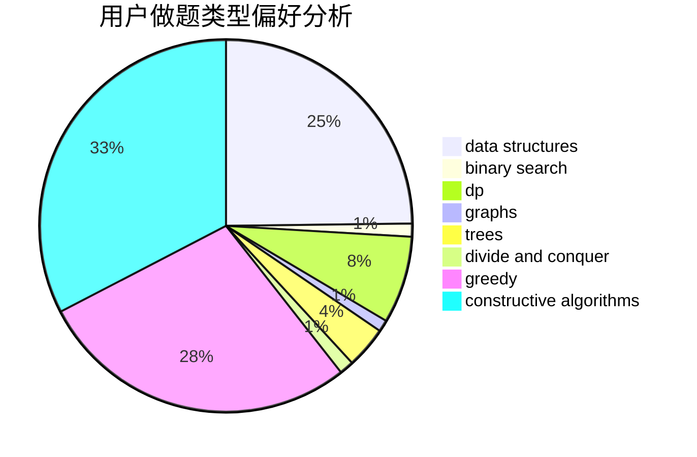
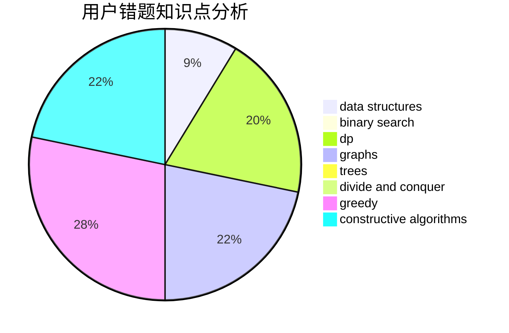

# Nanarikom

<!-- tabs:start -->

#### **用户提交结果分析**

#### **用户做题类型偏好分析**

#### **用户错题知识点分析**

<!-- tabs:end -->
# 推荐题目
[1015E2](https://codeforces.com/contest/1015E/problem/2)		binary search,
                        dp,
                        greedy		  
[7C](https://codeforces.com/contest/7/problem/C)		math,
                        number theory		  
[768E](https://codeforces.com/contest/768/problem/E)		bitmasks,
                        dp,
                        games		  
[56B](https://codeforces.com/contest/56/problem/B)		implementation		  
[277E](https://codeforces.com/contest/277/problem/E)		flows,
                        trees		  
[814E](https://codeforces.com/contest/814/problem/E)		combinatorics,
                        dp,
                        graphs,
                        shortest paths		  
[319B](https://codeforces.com/contest/319/problem/B)		data structures,
                        implementation		  
[1491G](https://codeforces.com/contest/1491/problem/G)		constructive algorithms,
                        graphs,
                        math		  
[1201A](https://codeforces.com/contest/1201/problem/A)		implementation,
                        strings		  
[896D](https://codeforces.com/contest/896/problem/D)		chinese remainder theorem,
                        combinatorics,
                        math,
                        number theory		  
