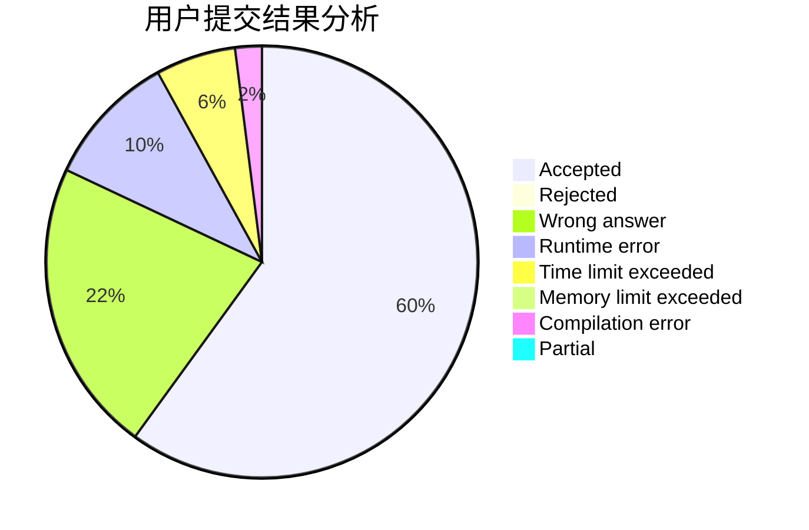
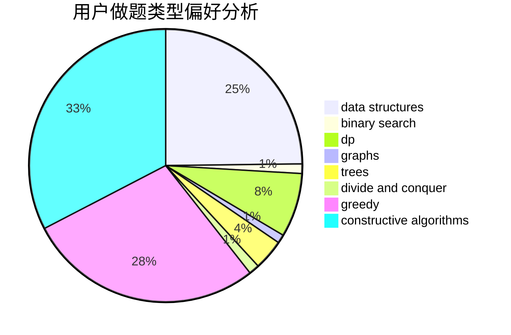
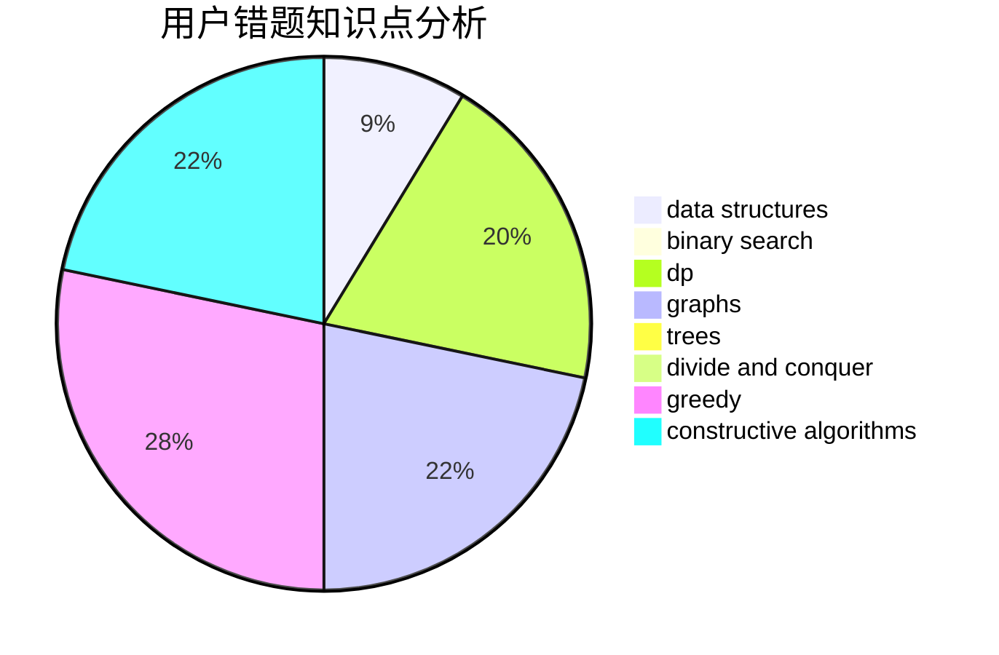

# Nanarikom
<!-- tabs:start -->
#### **用户提交结果分析**

#### **用户做题类型偏好分析**

#### **用户错题知识点分析**

<!-- tabs:end -->
# 推荐题目
[Binary Table (Hard Version)](https://codeforces.com/contest/1440/problem/C2)		constructive algorithms,
                        graphs,
                        greedy,
                        implementation		  
[Splits](http://codeforces.com/problemset/problem/964/A)		math		  
[Stars Drawing (Hard Edition)](http://codeforces.com/problemset/problem/1015/E2)		binary search,
                        dp,
                        greedy		  
[Count the Arrays](http://codeforces.com/problemset/problem/1312/D)		combinatorics,
                        math		  
[Queue in the Train](http://codeforces.com/problemset/problem/1239/C)		data structures,
                        greedy,
                        implementation		  
[Game of Stones](http://codeforces.com/problemset/problem/768/E)		bitmasks,
                        dp,
                        games		  
[Spoilt Permutation](http://codeforces.com/problemset/problem/56/B)		implementation		  
[Tournament](http://codeforces.com/problemset/problem/878/C)		data structures,
                        graphs		  
[Bank Robbery](http://codeforces.com/problemset/problem/794/A)		brute force,
                        implementation		  
[An unavoidable detour for home](http://codeforces.com/problemset/problem/814/E)		combinatorics,
                        dp,
                        graphs,
                        shortest paths		  
<!-- tabs:start -->
#### **data structures**
[Binary Table (Hard Version)](http://codeforces.com/problemset/problem/1239/C)		data structures,
                        greedy,
                        implementation		  
[Splits](http://codeforces.com/problemset/problem/878/C)		data structures,
                        graphs		  
[Stars Drawing (Hard Edition)](http://codeforces.com/problemset/problem/319/B)		data structures,
                        implementation		  
[Count the Arrays](http://codeforces.com/problemset/problem/400/E)		binary search,
                        bitmasks,
                        data structures		  
[Queue in the Train](http://codeforces.com/problemset/problem/229/B)		binary search,
                        data structures,
                        graphs,
                        shortest paths		  
[Game of Stones](https://codeforces.com/contest/528/problem/B)		data structures,
                        dp,
                        greedy,
                        implementation,
                        sortings		  
[Spoilt Permutation](http://codeforces.com/problemset/problem/1477/B)		data structures,
                        greedy		  
[Tournament](http://codeforces.com/problemset/problem/1492/C)		binary search,
                        data structures,
                        dp,
                        greedy,
                        two pointers		  
[Bank Robbery](http://codeforces.com/problemset/problem/1490/G)		binary search,
                        data structures,
                        math		  
[An unavoidable detour for home](http://codeforces.com/problemset/problem/1479/D)		binary search,
                        bitmasks,
                        brute force,
                        data structures,
                        probabilities,
                        trees		  
#### **binary search**
[Binary Table (Hard Version)](http://codeforces.com/problemset/problem/1015/E2)		binary search,
                        dp,
                        greedy		  
[Splits](http://codeforces.com/problemset/problem/1165/F1)		binary search,
                        greedy		  
[Stars Drawing (Hard Edition)](http://codeforces.com/problemset/problem/1117/C)		binary search		  
[Count the Arrays](http://codeforces.com/problemset/problem/400/E)		binary search,
                        bitmasks,
                        data structures		  
[Queue in the Train](http://codeforces.com/problemset/problem/255/D)		binary search,
                        implementation,
                        math		  
[Game of Stones](http://codeforces.com/problemset/problem/229/B)		binary search,
                        data structures,
                        graphs,
                        shortest paths		  
[Spoilt Permutation](http://codeforces.com/problemset/problem/1486/E)		binary search,
                        brute force,
                        constructive algorithms,
                        dp,
                        flows,
                        graphs,
                        shortest paths		  
[Tournament](http://codeforces.com/problemset/problem/1492/C)		binary search,
                        data structures,
                        dp,
                        greedy,
                        two pointers		  
[Bank Robbery](http://codeforces.com/problemset/problem/1463/D)		binary search,
                        constructive algorithms,
                        greedy,
                        two pointers		  
[An unavoidable detour for home](http://codeforces.com/problemset/problem/1490/G)		binary search,
                        data structures,
                        math		  
#### **dp**
[Binary Table (Hard Version)](http://codeforces.com/problemset/problem/1015/E2)		binary search,
                        dp,
                        greedy		  
[Splits](http://codeforces.com/problemset/problem/768/E)		bitmasks,
                        dp,
                        games		  
[Stars Drawing (Hard Edition)](http://codeforces.com/problemset/problem/814/E)		combinatorics,
                        dp,
                        graphs,
                        shortest paths		  
[Count the Arrays](http://codeforces.com/problemset/problem/1415/F)		dp		  
[Queue in the Train](https://codeforces.com/contest/861/problem/C)		dp,
                        greedy,
                        implementation		  
[Game of Stones](http://codeforces.com/problemset/problem/1266/H)		dp,
                        graphs,
                        math,
                        matrices,
                        meet-in-the-middle		  
[Spoilt Permutation](http://codeforces.com/problemset/problem/1040/B)		dp,
                        greedy,
                        math		  
[Tournament](https://codeforces.com/contest/528/problem/B)		data structures,
                        dp,
                        greedy,
                        implementation,
                        sortings		  
[Bank Robbery](http://codeforces.com/problemset/problem/913/F)		dp,
                        graphs,
                        math,
                        probabilities		  
[An unavoidable detour for home](http://codeforces.com/problemset/problem/348/E)		dfs and similar,
                        dp,
                        trees		  
#### **graph**
[Binary Table (Hard Version)](https://codeforces.com/contest/1440/problem/C2)		constructive algorithms,
                        graphs,
                        greedy,
                        implementation		  
[Splits](http://codeforces.com/problemset/problem/878/C)		data structures,
                        graphs		  
[Stars Drawing (Hard Edition)](http://codeforces.com/problemset/problem/814/E)		combinatorics,
                        dp,
                        graphs,
                        shortest paths		  
[Count the Arrays](http://codeforces.com/problemset/problem/1266/H)		dp,
                        graphs,
                        math,
                        matrices,
                        meet-in-the-middle		  
[Queue in the Train](http://codeforces.com/problemset/problem/229/B)		binary search,
                        data structures,
                        graphs,
                        shortest paths		  
[Game of Stones](http://codeforces.com/problemset/problem/1051/F)		graphs,
                        shortest paths,
                        trees		  
[Spoilt Permutation](http://codeforces.com/problemset/problem/1477/D)		constructive algorithms,
                        dfs and similar,
                        graphs		  
[Tournament](http://codeforces.com/problemset/problem/913/F)		dp,
                        graphs,
                        math,
                        probabilities		  
[Bank Robbery](http://codeforces.com/problemset/problem/1486/E)		binary search,
                        brute force,
                        constructive algorithms,
                        dp,
                        flows,
                        graphs,
                        shortest paths		  
[An unavoidable detour for home](http://codeforces.com/problemset/problem/839/C)		dfs and similar,
                        dp,
                        graphs,
                        probabilities,
                        trees		  
#### **trees**
[Binary Table (Hard Version)](http://codeforces.com/problemset/problem/277/E)		flows,
                        trees		  
[Splits](http://codeforces.com/problemset/problem/1051/F)		graphs,
                        shortest paths,
                        trees		  
[Stars Drawing (Hard Edition)](http://codeforces.com/problemset/problem/348/E)		dfs and similar,
                        dp,
                        trees		  
[Count the Arrays](http://codeforces.com/problemset/problem/839/C)		dfs and similar,
                        dp,
                        graphs,
                        probabilities,
                        trees		  
[Queue in the Train](http://codeforces.com/problemset/problem/1479/D)		binary search,
                        bitmasks,
                        brute force,
                        data structures,
                        probabilities,
                        trees		  
[Game of Stones](http://codeforces.com/problemset/problem/1511/C)		brute force,
                        data structures,
                        implementation,
                        trees		  
[Spoilt Permutation](http://codeforces.com/problemset/problem/1499/F)		combinatorics,
                        dfs and similar,
                        dp,
                        trees		  
[Tournament](http://codeforces.com/problemset/problem/1491/E)		brute force,
                        dfs and similar,
                        divide and conquer,
                        number theory,
                        trees		  
[Bank Robbery](http://codeforces.com/problemset/problem/1466/D)		data structures,
                        greedy,
                        sortings,
                        trees		  
[An unavoidable detour for home](http://codeforces.com/problemset/problem/1495/D)		combinatorics,
                        dfs and similar,
                        graphs,
                        math,
                        shortest paths,
                        trees		  
#### **divide and conquer**
[Binary Table (Hard Version)](http://codeforces.com/problemset/problem/873/D)		constructive algorithms,
                        divide and conquer		  
[Splits](http://codeforces.com/problemset/problem/1461/D)		binary search,
                        brute force,
                        data structures,
                        divide and conquer,
                        implementation,
                        sortings		  
[Stars Drawing (Hard Edition)](http://codeforces.com/problemset/problem/1466/G)		combinatorics,
                        divide and conquer,
                        hashing,
                        math,
                        string suffix structures,
                        strings		  
[Count the Arrays](http://codeforces.com/problemset/problem/1490/D)		dfs and similar,
                        divide and conquer,
                        implementation		  
[Queue in the Train](https://codeforces.com/contest/1483/problem/C)		data structures,
                        divide and conquer,
                        dp		  
[Game of Stones](http://codeforces.com/problemset/problem/1491/E)		brute force,
                        dfs and similar,
                        divide and conquer,
                        number theory,
                        trees		  
[Spoilt Permutation](http://codeforces.com/problemset/problem/1303/G)		data structures,
                        divide and conquer,
                        geometry,
                        trees		  
[Tournament](http://codeforces.com/problemset/problem/1494/D)		constructive algorithms,
                        data structures,
                        dfs and similar,
                        divide and conquer,
                        dsu,
                        greedy,
                        sortings,
                        trees		  
[Bank Robbery](http://codeforces.com/problemset/problem/1482/E)		data structures,
                        divide and conquer,
                        dp		  
[An unavoidable detour for home](http://codeforces.com/problemset/problem/566/C)		dfs and similar,
                        divide and conquer,
                        trees		  
#### **greedy**
[Binary Table (Hard Version)](https://codeforces.com/contest/1440/problem/C2)		constructive algorithms,
                        graphs,
                        greedy,
                        implementation		  
[Splits](http://codeforces.com/problemset/problem/1015/E2)		binary search,
                        dp,
                        greedy		  
[Stars Drawing (Hard Edition)](http://codeforces.com/problemset/problem/1239/C)		data structures,
                        greedy,
                        implementation		  
[Count the Arrays](http://codeforces.com/problemset/problem/472/C)		greedy		  
[Queue in the Train](http://codeforces.com/problemset/problem/1165/F1)		binary search,
                        greedy		  
[Game of Stones](http://codeforces.com/problemset/problem/920/C)		dfs and similar,
                        greedy,
                        math,
                        sortings,
                        two pointers		  
[Spoilt Permutation](https://codeforces.com/contest/861/problem/C)		dp,
                        greedy,
                        implementation		  
[Tournament](https://codeforces.com/contest/1191/problem/E)		brute force,
                        games,
                        greedy		  
[Bank Robbery](http://codeforces.com/problemset/problem/1040/B)		dp,
                        greedy,
                        math		  
[An unavoidable detour for home](https://codeforces.com/contest/528/problem/B)		data structures,
                        dp,
                        greedy,
                        implementation,
                        sortings		  
#### **constructive algorithms**
[Binary Table (Hard Version)](https://codeforces.com/contest/1440/problem/C2)		constructive algorithms,
                        graphs,
                        greedy,
                        implementation		  
[Splits](http://codeforces.com/problemset/problem/873/D)		constructive algorithms,
                        divide and conquer		  
[Stars Drawing (Hard Edition)](http://codeforces.com/problemset/problem/1477/D)		constructive algorithms,
                        dfs and similar,
                        graphs		  
[Count the Arrays](http://codeforces.com/problemset/problem/1486/E)		binary search,
                        brute force,
                        constructive algorithms,
                        dp,
                        flows,
                        graphs,
                        shortest paths		  
[Queue in the Train](http://codeforces.com/problemset/problem/1491/G)		constructive algorithms,
                        graphs,
                        math		  
[Game of Stones](http://codeforces.com/problemset/problem/1493/A)		constructive algorithms,
                        greedy		  
[Spoilt Permutation](http://codeforces.com/problemset/problem/1463/D)		binary search,
                        constructive algorithms,
                        greedy,
                        two pointers		  
[Tournament](https://codeforces.com/contest/1456/problem/B)		bitmasks,
                        brute force,
                        constructive algorithms		  
[Bank Robbery](http://codeforces.com/problemset/problem/1492/D)		bitmasks,
                        constructive algorithms,
                        greedy,
                        math		  
[An unavoidable detour for home](https://codeforces.com/contest/1504/problem/D)		constructive algorithms,
                        games,
                        interactive		  
#### **sortings**
[Binary Table (Hard Version)](http://codeforces.com/problemset/problem/920/C)		dfs and similar,
                        greedy,
                        math,
                        sortings,
                        two pointers		  
[Splits](https://codeforces.com/contest/528/problem/B)		data structures,
                        dp,
                        greedy,
                        implementation,
                        sortings		  
[Stars Drawing (Hard Edition)](https://codeforces.com/contest/1496/problem/C)		geometry,
                        greedy,
                        math,
                        sortings		  
[Count the Arrays](http://codeforces.com/problemset/problem/1495/A)		geometry,
                        greedy,
                        math,
                        sortings		  
[Queue in the Train](http://codeforces.com/problemset/problem/1497/A)		brute force,
                        data structures,
                        greedy,
                        sortings		  
[Game of Stones](http://codeforces.com/problemset/problem/1427/A)		math,
                        sortings		  
[Spoilt Permutation](http://codeforces.com/problemset/problem/1461/D)		binary search,
                        brute force,
                        data structures,
                        divide and conquer,
                        implementation,
                        sortings		  
[Tournament](http://codeforces.com/problemset/problem/1437/C)		dp,
                        flows,
                        graph matchings,
                        greedy,
                        math,
                        sortings		  
[Bank Robbery](http://codeforces.com/problemset/problem/1473/A)		greedy,
                        implementation,
                        math,
                        sortings		  
[An unavoidable detour for home](http://codeforces.com/problemset/problem/1486/B)		binary search,
                        geometry,
                        shortest paths,
                        sortings		  
<!-- tabs:end -->
