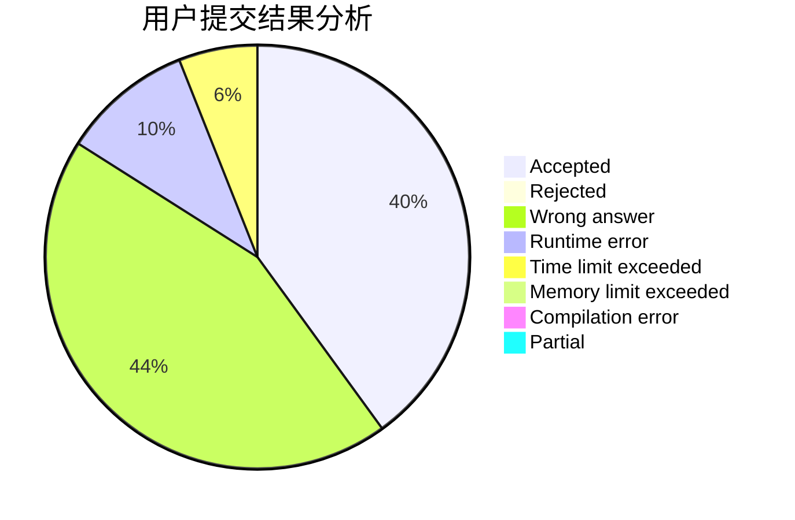
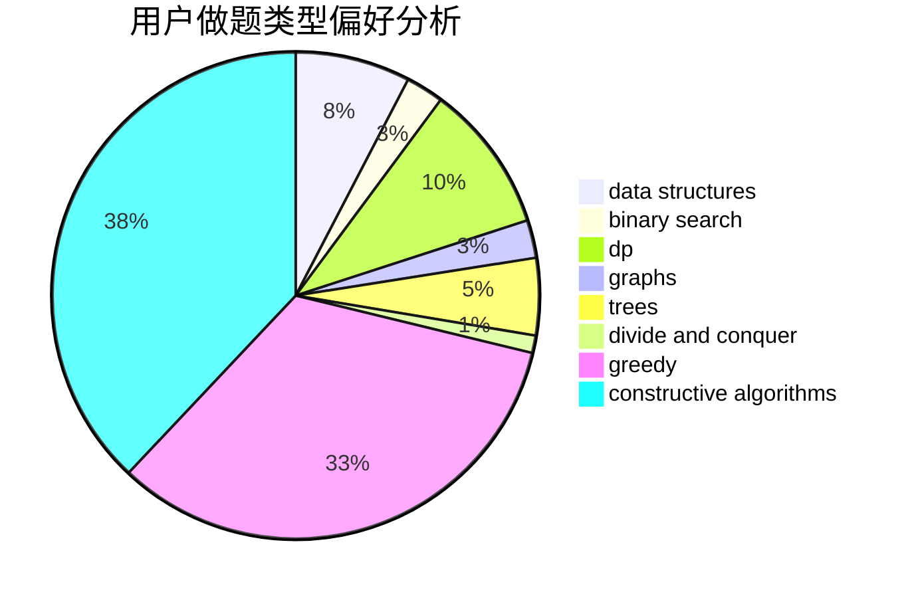
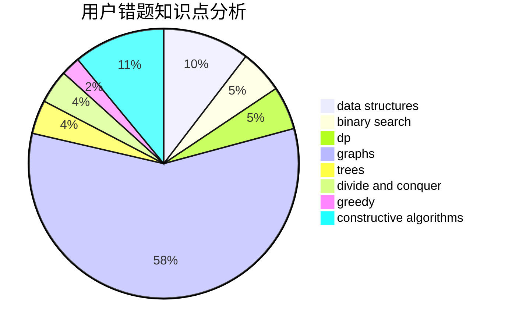

# Nanarimko

<!-- tabs:start -->

#### **用户提交结果分析**

#### **用户做题类型偏好分析**

#### **用户错题知识点分析**

<!-- tabs:end -->
# 推荐题目
[249E](https://codeforces.com/contest/249/problem/E)		math		  
[912C](https://codeforces.com/contest/912/problem/C)		brute force,
                        greedy,
                        sortings		  
[634B](https://codeforces.com/contest/634/problem/B)		dsu,graphs,sortings,trees		  
[1250B](https://codeforces.com/contest/1250/problem/B)		brute force,
                        constructive algorithms,
                        greedy,
                        math		  
[398A](https://codeforces.com/contest/398/problem/A)		constructive algorithms,
                        implementation		  
[102B](https://codeforces.com/contest/102/problem/B)		implementation		  
[1280F](https://codeforces.com/contest/1280/problem/F)		combinatorics,
                        constructive algorithms,
                        math		  
[721A](https://codeforces.com/contest/721/problem/A)		implementation		  
[431A](https://codeforces.com/contest/431/problem/A)		implementation		  
[807A](https://codeforces.com/contest/807/problem/A)		implementation,
                        sortings		  
