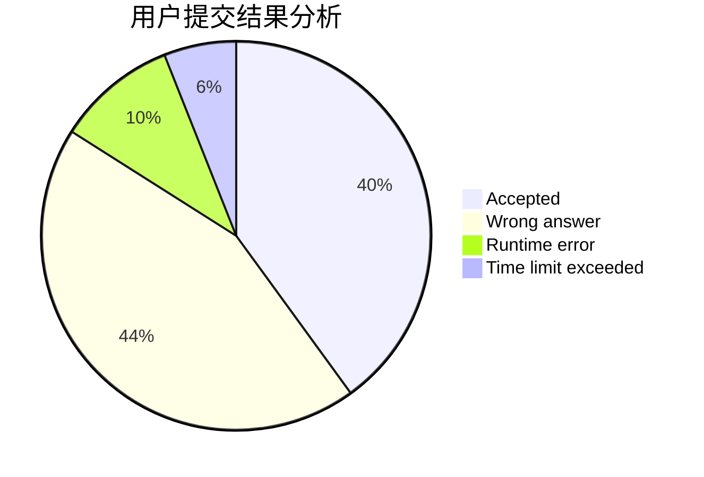
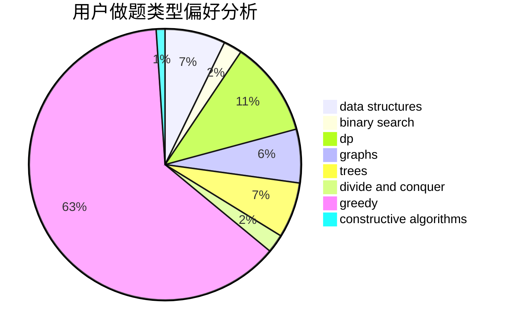
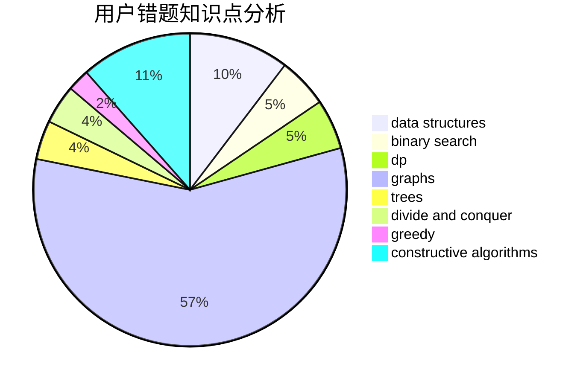

# Nanarimko
<!-- tabs:start -->
#### **用户提交结果分析**

#### **用户做题类型偏好分析**

#### **用户错题知识点分析**

<!-- tabs:end -->
# 推荐题目
[Sum of Remainders](http://codeforces.com/problemset/problem/616/E)		implementation,
                        math,
                        number theory		  
[Portals](http://codeforces.com/problemset/problem/1271/D)		data structures,
                        dp,
                        greedy,
                        implementation,
                        sortings		  
[Ralph And His Tour in Binary Country](http://codeforces.com/problemset/problem/894/D)		brute force,
                        data structures,
                        trees		  
[Towers](http://codeforces.com/problemset/problem/229/D)		dp,
                        greedy,
                        two pointers		  
[Running in Pairs](http://codeforces.com/problemset/problem/1244/G)		constructive algorithms,
                        greedy,
                        math		  
[Rook, Bishop and King](http://codeforces.com/problemset/problem/370/A)		graphs,
                        math,
                        shortest paths		  
[Huawei Graph Mining Challenge](https://codeforces.com/contest/1377/problem/A1)		nan		  
[Death Stars (medium)](http://codeforces.com/problemset/problem/958/A2)		hashing,
                        strings		  
[A Trivial Problem](http://codeforces.com/problemset/problem/633/B)		brute force,
                        constructive algorithms,
                        math,
                        number theory		  
[A Game With Numbers](http://codeforces.com/problemset/problem/919/F)		games,
                        graphs,
                        shortest paths		  
<!-- tabs:start -->
#### **data structures**
[Portals](http://codeforces.com/problemset/problem/1271/D)		data structures,
                        dp,
                        greedy,
                        implementation,
                        sortings		  
[Ralph And His Tour in Binary Country](http://codeforces.com/problemset/problem/894/D)		brute force,
                        data structures,
                        trees		  
[Not Equal on a Segment](http://codeforces.com/problemset/problem/622/C)		data structures,
                        implementation		  
[Domino Principle](http://codeforces.com/problemset/problem/56/E)		binary search,
                        data structures,
                        sortings		  
[Median Mountain Range](http://codeforces.com/problemset/problem/1322/E)		data structures		  
[Vika and Segments](http://codeforces.com/problemset/problem/610/D)		constructive algorithms,
                        data structures,
                        geometry,
                        two pointers		  
[Sereja ans Anagrams](http://codeforces.com/problemset/problem/367/B)		binary search,
                        data structures		  
[Games on a CD](http://codeforces.com/problemset/problem/727/E)		data structures,
                        hashing,
                        string suffix structures,
                        strings		  
[Buy a Ticket](http://codeforces.com/problemset/problem/938/D)		data structures,
                        graphs,
                        shortest paths		  
[New Year Domino](http://codeforces.com/problemset/problem/500/E)		data structures,
                        dp,
                        dsu		  
#### **binary search**
[Domino Principle](http://codeforces.com/problemset/problem/56/E)		binary search,
                        data structures,
                        sortings		  
[Sereja ans Anagrams](http://codeforces.com/problemset/problem/367/B)		binary search,
                        data structures		  
[Stairs and Elevators](https://codeforces.com/contest/967/problem/C)		binary search		  
[Maximum width](http://codeforces.com/problemset/problem/1492/C)		binary search,
                        data structures,
                        dp,
                        greedy,
                        two pointers		  
[Pairs](http://codeforces.com/problemset/problem/1463/D)		binary search,
                        constructive algorithms,
                        greedy,
                        two pointers		  
[Old Floppy Drive](http://codeforces.com/problemset/problem/1490/G)		binary search,
                        data structures,
                        math		  
[Odd Mineral Resource](http://codeforces.com/problemset/problem/1479/D)		binary search,
                        bitmasks,
                        brute force,
                        data structures,
                        probabilities,
                        trees		  
[Complicated Computations](http://codeforces.com/problemset/problem/1436/E)		binary search,
                        data structures,
                        two pointers		  
[Divide and Summarize](http://codeforces.com/problemset/problem/1461/D)		binary search,
                        brute force,
                        data structures,
                        divide and conquer,
                        implementation,
                        sortings		  
[K-beautiful Strings](http://codeforces.com/problemset/problem/1493/C)		binary search,
                        brute force,
                        constructive algorithms,
                        greedy,
                        strings		  
#### **dp**
[Portals](http://codeforces.com/problemset/problem/1271/D)		data structures,
                        dp,
                        greedy,
                        implementation,
                        sortings		  
[Towers](http://codeforces.com/problemset/problem/229/D)		dp,
                        greedy,
                        two pointers		  
[Upgrading Array](http://codeforces.com/problemset/problem/402/D)		dp,
                        greedy,
                        math,
                        number theory		  
[Tree with Small Distances](http://codeforces.com/problemset/problem/1029/E)		dp,
                        graphs,
                        greedy		  
[Arpa's weak amphitheater and Mehrdad's valuable Hoses](http://codeforces.com/problemset/problem/741/B)		dfs and similar,
                        dp,
                        dsu		  
[New Year Letter](http://codeforces.com/problemset/problem/379/D)		bitmasks,
                        brute force,
                        dp		  
[Around the World](http://codeforces.com/problemset/problem/1299/D)		bitmasks,
                        combinatorics,
                        dfs and similar,
                        dp,
                        graphs,
                        graphs,
                        math,
                        trees		  
[New Year Domino](http://codeforces.com/problemset/problem/500/E)		data structures,
                        dp,
                        dsu		  
[Even Harder](http://codeforces.com/problemset/problem/1453/F)		dp		  
[Little Elephant and Elections](http://codeforces.com/problemset/problem/258/B)		brute force,
                        combinatorics,
                        dp		  
#### **graph**
[Rook, Bishop and King](http://codeforces.com/problemset/problem/370/A)		graphs,
                        math,
                        shortest paths		  
[A Game With Numbers](http://codeforces.com/problemset/problem/919/F)		games,
                        graphs,
                        shortest paths		  
[Nearest Opposite Parity](http://codeforces.com/problemset/problem/1272/E)		dfs and similar,
                        graphs,
                        shortest paths		  
[Familiar Operations](https://codeforces.com/contest/1071/problem/D)		brute force,
                        graphs,
                        math		  
[Looksery Party](http://codeforces.com/problemset/problem/549/B)		constructive algorithms,
                        dfs and similar,
                        graphs,
                        greedy		  
[Tree with Small Distances](http://codeforces.com/problemset/problem/1029/E)		dp,
                        graphs,
                        greedy		  
[Underground Lab](http://codeforces.com/problemset/problem/780/E)		constructive algorithms,
                        dfs and similar,
                        graphs		  
[Tree Modification](http://codeforces.com/problemset/problem/1375/G)		brute force,
                        constructive algorithms,
                        dfs and similar,
                        graph matchings,
                        graphs,
                        trees		  
[Around the World](http://codeforces.com/problemset/problem/1299/D)		bitmasks,
                        combinatorics,
                        dfs and similar,
                        dp,
                        graphs,
                        graphs,
                        math,
                        trees		  
[Dorm Water Supply](http://codeforces.com/problemset/problem/107/A)		dfs and similar,
                        graphs		  
#### **trees**
[Ralph And His Tour in Binary Country](http://codeforces.com/problemset/problem/894/D)		brute force,
                        data structures,
                        trees		  
[Tree Modification](http://codeforces.com/problemset/problem/1375/G)		brute force,
                        constructive algorithms,
                        dfs and similar,
                        graph matchings,
                        graphs,
                        trees		  
[Around the World](http://codeforces.com/problemset/problem/1299/D)		bitmasks,
                        combinatorics,
                        dfs and similar,
                        dp,
                        graphs,
                        graphs,
                        math,
                        trees		  
[Xor-matic Number of the Graph](http://codeforces.com/problemset/problem/724/G)		bitmasks,
                        graphs,
                        math,
                        number theory,
                        trees		  
[Exam](https://codeforces.com/contest/1483/problem/F)		data structures,
                        string suffix structures,
                        trees		  
[Odd Mineral Resource](http://codeforces.com/problemset/problem/1479/D)		binary search,
                        bitmasks,
                        brute force,
                        data structures,
                        probabilities,
                        trees		  
[Yet Another Card Deck](http://codeforces.com/problemset/problem/1511/C)		brute force,
                        data structures,
                        implementation,
                        trees		  
[Diameter Cuts](http://codeforces.com/problemset/problem/1499/F)		combinatorics,
                        dfs and similar,
                        dp,
                        trees		  
[Fib-tree](http://codeforces.com/problemset/problem/1491/E)		brute force,
                        dfs and similar,
                        divide and conquer,
                        number theory,
                        trees		  
[13th Labour of Heracles](http://codeforces.com/problemset/problem/1466/D)		data structures,
                        greedy,
                        sortings,
                        trees		  
#### **divide and conquer**
[Permutations](http://codeforces.com/problemset/problem/513/B2)		bitmasks,
                        divide and conquer,
                        math		  
[Divide and Summarize](http://codeforces.com/problemset/problem/1461/D)		binary search,
                        brute force,
                        data structures,
                        divide and conquer,
                        implementation,
                        sortings		  
[Song of the Sirens](http://codeforces.com/problemset/problem/1466/G)		combinatorics,
                        divide and conquer,
                        hashing,
                        math,
                        string suffix structures,
                        strings		  
[Permutation Transformation](http://codeforces.com/problemset/problem/1490/D)		dfs and similar,
                        divide and conquer,
                        implementation		  
[Skyline Photo](https://codeforces.com/contest/1483/problem/C)		data structures,
                        divide and conquer,
                        dp		  
[Fib-tree](http://codeforces.com/problemset/problem/1491/E)		brute force,
                        dfs and similar,
                        divide and conquer,
                        number theory,
                        trees		  
[Sum of Prefix Sums](http://codeforces.com/problemset/problem/1303/G)		data structures,
                        divide and conquer,
                        geometry,
                        trees		  
[Dogeforces](http://codeforces.com/problemset/problem/1494/D)		constructive algorithms,
                        data structures,
                        dfs and similar,
                        divide and conquer,
                        dsu,
                        greedy,
                        sortings,
                        trees		  
[Logistical Questions](http://codeforces.com/problemset/problem/566/C)		dfs and similar,
                        divide and conquer,
                        trees		  
[Fruit Sequences](http://codeforces.com/problemset/problem/1428/F)		binary search,
                        data structures,
                        divide and conquer,
                        dp,
                        two pointers		  
#### **greedy**
[Portals](http://codeforces.com/problemset/problem/1271/D)		data structures,
                        dp,
                        greedy,
                        implementation,
                        sortings		  
[Towers](http://codeforces.com/problemset/problem/229/D)		dp,
                        greedy,
                        two pointers		  
[Running in Pairs](http://codeforces.com/problemset/problem/1244/G)		constructive algorithms,
                        greedy,
                        math		  
[Upgrading Array](http://codeforces.com/problemset/problem/402/D)		dp,
                        greedy,
                        math,
                        number theory		  
[Looksery Party](http://codeforces.com/problemset/problem/549/B)		constructive algorithms,
                        dfs and similar,
                        graphs,
                        greedy		  
[Tree with Small Distances](http://codeforces.com/problemset/problem/1029/E)		dp,
                        graphs,
                        greedy		  
[Bear and Different Names](https://codeforces.com/contest/791/problem/C)		constructive algorithms,
                        greedy		  
[Anti-knapsack](http://codeforces.com/problemset/problem/1493/A)		constructive algorithms,
                        greedy		  
[Numbers Box](http://codeforces.com/problemset/problem/1447/B)		greedy,
                        math		  
[Add and Divide](http://codeforces.com/problemset/problem/1485/A)		brute force,
                        greedy,
                        math,
                        number theory		  
#### **constructive algorithms**
[Running in Pairs](http://codeforces.com/problemset/problem/1244/G)		constructive algorithms,
                        greedy,
                        math		  
[A Trivial Problem](http://codeforces.com/problemset/problem/633/B)		brute force,
                        constructive algorithms,
                        math,
                        number theory		  
[Looksery Party](http://codeforces.com/problemset/problem/549/B)		constructive algorithms,
                        dfs and similar,
                        graphs,
                        greedy		  
[Underground Lab](http://codeforces.com/problemset/problem/780/E)		constructive algorithms,
                        dfs and similar,
                        graphs		  
[Difference Row](http://codeforces.com/problemset/problem/347/A)		constructive algorithms,
                        implementation,
                        sortings		  
[Tree Modification](http://codeforces.com/problemset/problem/1375/G)		brute force,
                        constructive algorithms,
                        dfs and similar,
                        graph matchings,
                        graphs,
                        trees		  
[Vika and Segments](http://codeforces.com/problemset/problem/610/D)		constructive algorithms,
                        data structures,
                        geometry,
                        two pointers		  
[Bear and Different Names](https://codeforces.com/contest/791/problem/C)		constructive algorithms,
                        greedy		  
[Anti-knapsack](http://codeforces.com/problemset/problem/1493/A)		constructive algorithms,
                        greedy		  
[Even Picture](http://codeforces.com/problemset/problem/1368/C)		constructive algorithms		  
#### **sortings**
[Portals](http://codeforces.com/problemset/problem/1271/D)		data structures,
                        dp,
                        greedy,
                        implementation,
                        sortings		  
[Watering System](http://codeforces.com/problemset/problem/967/B)		math,
                        sortings		  
[Domino Principle](http://codeforces.com/problemset/problem/56/E)		binary search,
                        data structures,
                        sortings		  
[Difference Row](http://codeforces.com/problemset/problem/347/A)		constructive algorithms,
                        implementation,
                        sortings		  
[Anton and Lines](http://codeforces.com/problemset/problem/593/B)		geometry,
                        sortings		  
[Median on Segments (General Case Edition)](http://codeforces.com/problemset/problem/1005/E2)		sortings		  
[Diamond Miner](https://codeforces.com/contest/1496/problem/C)		geometry,
                        greedy,
                        math,
                        sortings		  
[Meximization](http://codeforces.com/problemset/problem/1497/A)		brute force,
                        data structures,
                        greedy,
                        sortings		  
[Avoiding Zero](http://codeforces.com/problemset/problem/1427/A)		math,
                        sortings		  
[Divide and Summarize](http://codeforces.com/problemset/problem/1461/D)		binary search,
                        brute force,
                        data structures,
                        divide and conquer,
                        implementation,
                        sortings		  
<!-- tabs:end -->
