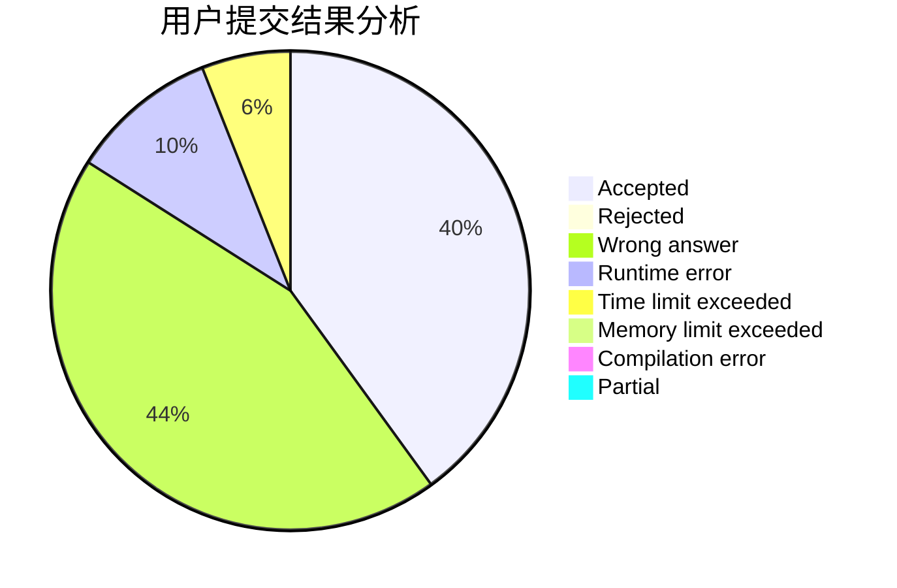
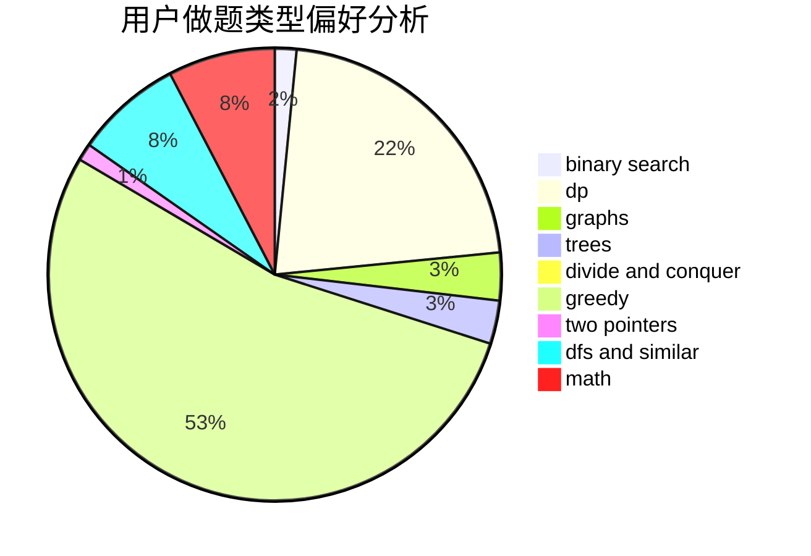

# Nanarimko

<!-- tabs:start -->

#### **用户提交结果分析**

#### **用户做题类型偏好分析**

<!-- tabs:end -->
# 推荐题目
[249E](https://codeforces.com/contest/249/problem/E)
[912C](https://codeforces.com/contest/912/problem/C)
[634B](https://codeforces.com/contest/634/problem/B)
[1250B](https://codeforces.com/contest/1250/problem/B)
[398A](https://codeforces.com/contest/398/problem/A)
[102B](https://codeforces.com/contest/102/problem/B)
[1280F](https://codeforces.com/contest/1280/problem/F)
[721A](https://codeforces.com/contest/721/problem/A)
[431A](https://codeforces.com/contest/431/problem/A)
[807A](https://codeforces.com/contest/807/problem/A)
