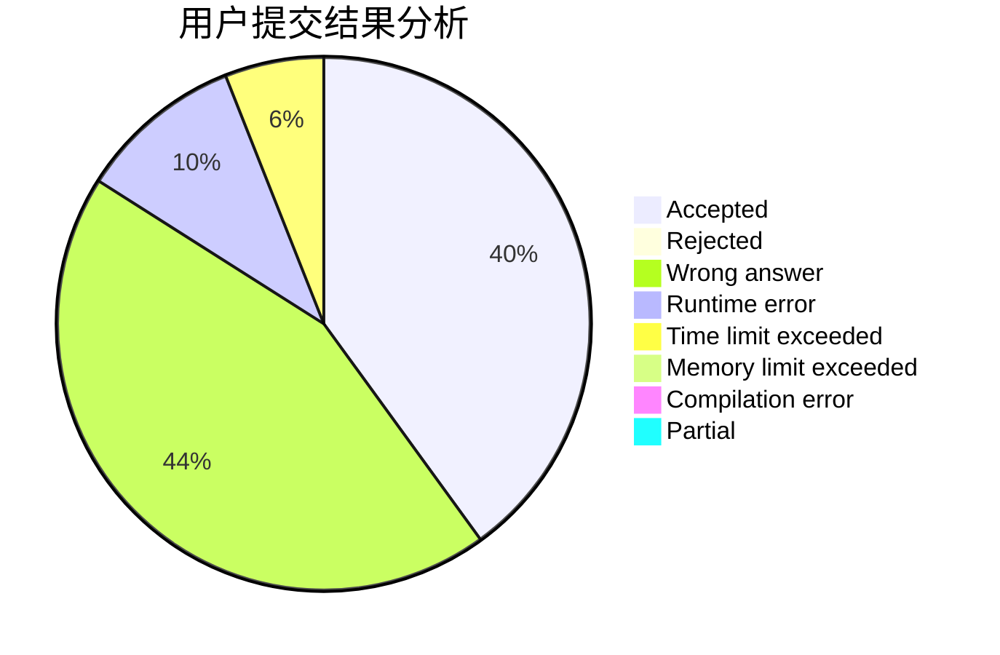
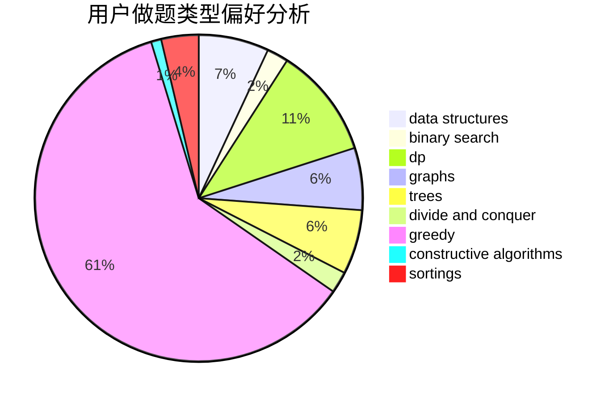
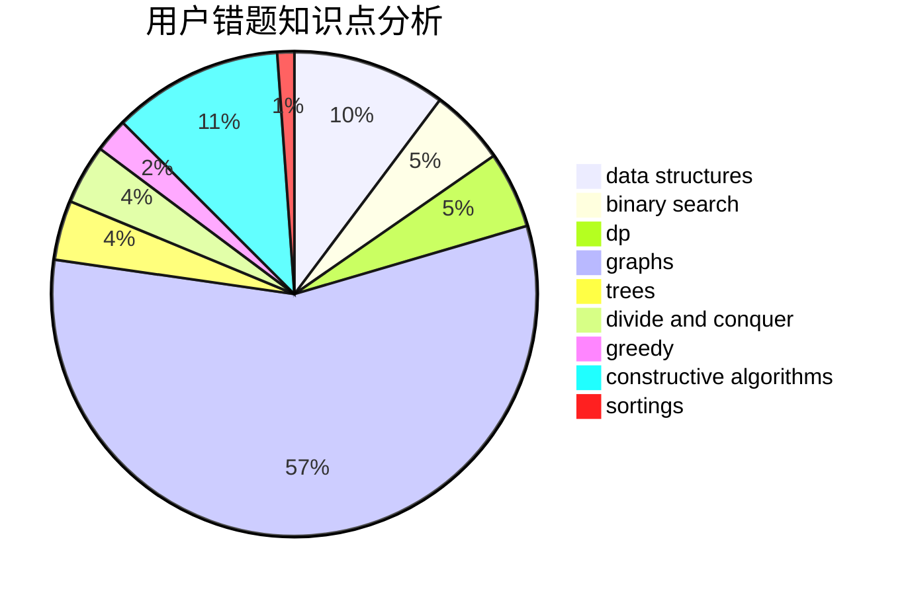

# Nanarimko
<!-- tabs:start -->
#### **用户提交结果分析**

#### **用户做题类型偏好分析**

#### **用户错题知识点分析**

<!-- tabs:end -->
# 推荐题目
[616E](http://codeforces.com/problemset/problem/616/E)		implementation,
                        math,
                        number theory		  
[1271D](http://codeforces.com/problemset/problem/1271/D)		data structures,
                        dp,
                        greedy,
                        implementation,
                        sortings		  
[894D](http://codeforces.com/problemset/problem/894/D)		brute force,
                        data structures,
                        trees		  
[229D](http://codeforces.com/problemset/problem/229/D)		dp,
                        greedy,
                        two pointers		  
[1244G](http://codeforces.com/problemset/problem/1244/G)		constructive algorithms,
                        greedy,
                        math		  
[370A](http://codeforces.com/problemset/problem/370/A)		graphs,
                        math,
                        shortest paths		  
[1377A1](https://codeforces.com/contest/1377/problem/A1)		nan		  
[958A2](http://codeforces.com/problemset/problem/958/A2)		hashing,
                        strings		  
[633B](http://codeforces.com/problemset/problem/633/B)		brute force,
                        constructive algorithms,
                        math,
                        number theory		  
[919F](http://codeforces.com/problemset/problem/919/F)		games,
                        graphs,
                        shortest paths		  
<!-- tabs:start -->
#### **data structures**
[1271D](http://codeforces.com/problemset/problem/1271/D)		data structures,
                        dp,
                        greedy,
                        implementation,
                        sortings		  
[894D](http://codeforces.com/problemset/problem/894/D)		brute force,
                        data structures,
                        trees		  
[622C](http://codeforces.com/problemset/problem/622/C)		data structures,
                        implementation		  
[56E](http://codeforces.com/problemset/problem/56/E)		binary search,
                        data structures,
                        sortings		  
[1322E](http://codeforces.com/problemset/problem/1322/E)		data structures		  
[610D](http://codeforces.com/problemset/problem/610/D)		constructive algorithms,
                        data structures,
                        geometry,
                        two pointers		  
[367B](http://codeforces.com/problemset/problem/367/B)		binary search,
                        data structures		  
[727E](http://codeforces.com/problemset/problem/727/E)		data structures,
                        hashing,
                        string suffix structures,
                        strings		  
[938D](http://codeforces.com/problemset/problem/938/D)		data structures,
                        graphs,
                        shortest paths		  
[500E](http://codeforces.com/problemset/problem/500/E)		data structures,
                        dp,
                        dsu		  
#### **binary search**
[56E](http://codeforces.com/problemset/problem/56/E)		binary search,
                        data structures,
                        sortings		  
[367B](http://codeforces.com/problemset/problem/367/B)		binary search,
                        data structures		  
[967C](https://codeforces.com/contest/967/problem/C)		binary search		  
[1492C](http://codeforces.com/problemset/problem/1492/C)		binary search,
                        data structures,
                        dp,
                        greedy,
                        two pointers		  
[1463D](http://codeforces.com/problemset/problem/1463/D)		binary search,
                        constructive algorithms,
                        greedy,
                        two pointers		  
[1490G](http://codeforces.com/problemset/problem/1490/G)		binary search,
                        data structures,
                        math		  
[1479D](http://codeforces.com/problemset/problem/1479/D)		binary search,
                        bitmasks,
                        brute force,
                        data structures,
                        probabilities,
                        trees		  
[1436E](http://codeforces.com/problemset/problem/1436/E)		binary search,
                        data structures,
                        two pointers		  
[1461D](http://codeforces.com/problemset/problem/1461/D)		binary search,
                        brute force,
                        data structures,
                        divide and conquer,
                        implementation,
                        sortings		  
[1493C](http://codeforces.com/problemset/problem/1493/C)		binary search,
                        brute force,
                        constructive algorithms,
                        greedy,
                        strings		  
#### **dp**
[1271D](http://codeforces.com/problemset/problem/1271/D)		data structures,
                        dp,
                        greedy,
                        implementation,
                        sortings		  
[229D](http://codeforces.com/problemset/problem/229/D)		dp,
                        greedy,
                        two pointers		  
[402D](http://codeforces.com/problemset/problem/402/D)		dp,
                        greedy,
                        math,
                        number theory		  
[1029E](http://codeforces.com/problemset/problem/1029/E)		dp,
                        graphs,
                        greedy		  
[741B](http://codeforces.com/problemset/problem/741/B)		dfs and similar,
                        dp,
                        dsu		  
[379D](http://codeforces.com/problemset/problem/379/D)		bitmasks,
                        brute force,
                        dp		  
[1299D](http://codeforces.com/problemset/problem/1299/D)		bitmasks,
                        combinatorics,
                        dfs and similar,
                        dp,
                        graphs,
                        graphs,
                        math,
                        trees		  
[500E](http://codeforces.com/problemset/problem/500/E)		data structures,
                        dp,
                        dsu		  
[1453F](http://codeforces.com/problemset/problem/1453/F)		dp		  
[258B](http://codeforces.com/problemset/problem/258/B)		brute force,
                        combinatorics,
                        dp		  
#### **graph**
[370A](http://codeforces.com/problemset/problem/370/A)		graphs,
                        math,
                        shortest paths		  
[919F](http://codeforces.com/problemset/problem/919/F)		games,
                        graphs,
                        shortest paths		  
[1272E](http://codeforces.com/problemset/problem/1272/E)		dfs and similar,
                        graphs,
                        shortest paths		  
[1071D](https://codeforces.com/contest/1071/problem/D)		brute force,
                        graphs,
                        math		  
[549B](http://codeforces.com/problemset/problem/549/B)		constructive algorithms,
                        dfs and similar,
                        graphs,
                        greedy		  
[1029E](http://codeforces.com/problemset/problem/1029/E)		dp,
                        graphs,
                        greedy		  
[780E](http://codeforces.com/problemset/problem/780/E)		constructive algorithms,
                        dfs and similar,
                        graphs		  
[1375G](http://codeforces.com/problemset/problem/1375/G)		brute force,
                        constructive algorithms,
                        dfs and similar,
                        graph matchings,
                        graphs,
                        trees		  
[1299D](http://codeforces.com/problemset/problem/1299/D)		bitmasks,
                        combinatorics,
                        dfs and similar,
                        dp,
                        graphs,
                        graphs,
                        math,
                        trees		  
[107A](http://codeforces.com/problemset/problem/107/A)		dfs and similar,
                        graphs		  
#### **trees**
[894D](http://codeforces.com/problemset/problem/894/D)		brute force,
                        data structures,
                        trees		  
[1375G](http://codeforces.com/problemset/problem/1375/G)		brute force,
                        constructive algorithms,
                        dfs and similar,
                        graph matchings,
                        graphs,
                        trees		  
[1299D](http://codeforces.com/problemset/problem/1299/D)		bitmasks,
                        combinatorics,
                        dfs and similar,
                        dp,
                        graphs,
                        graphs,
                        math,
                        trees		  
[724G](http://codeforces.com/problemset/problem/724/G)		bitmasks,
                        graphs,
                        math,
                        number theory,
                        trees		  
[1483F](https://codeforces.com/contest/1483/problem/F)		data structures,
                        string suffix structures,
                        trees		  
[1479D](http://codeforces.com/problemset/problem/1479/D)		binary search,
                        bitmasks,
                        brute force,
                        data structures,
                        probabilities,
                        trees		  
[1511C](http://codeforces.com/problemset/problem/1511/C)		brute force,
                        data structures,
                        implementation,
                        trees		  
[1499F](http://codeforces.com/problemset/problem/1499/F)		combinatorics,
                        dfs and similar,
                        dp,
                        trees		  
[1491E](http://codeforces.com/problemset/problem/1491/E)		brute force,
                        dfs and similar,
                        divide and conquer,
                        number theory,
                        trees		  
[1466D](http://codeforces.com/problemset/problem/1466/D)		data structures,
                        greedy,
                        sortings,
                        trees		  
#### **divide and conquer**
[513B2](http://codeforces.com/problemset/problem/513/B2)		bitmasks,
                        divide and conquer,
                        math		  
[1461D](http://codeforces.com/problemset/problem/1461/D)		binary search,
                        brute force,
                        data structures,
                        divide and conquer,
                        implementation,
                        sortings		  
[1466G](http://codeforces.com/problemset/problem/1466/G)		combinatorics,
                        divide and conquer,
                        hashing,
                        math,
                        string suffix structures,
                        strings		  
[1490D](http://codeforces.com/problemset/problem/1490/D)		dfs and similar,
                        divide and conquer,
                        implementation		  
[1483C](https://codeforces.com/contest/1483/problem/C)		data structures,
                        divide and conquer,
                        dp		  
[1491E](http://codeforces.com/problemset/problem/1491/E)		brute force,
                        dfs and similar,
                        divide and conquer,
                        number theory,
                        trees		  
[1303G](http://codeforces.com/problemset/problem/1303/G)		data structures,
                        divide and conquer,
                        geometry,
                        trees		  
[1494D](http://codeforces.com/problemset/problem/1494/D)		constructive algorithms,
                        data structures,
                        dfs and similar,
                        divide and conquer,
                        dsu,
                        greedy,
                        sortings,
                        trees		  
[1482E](http://codeforces.com/problemset/problem/1482/E)		data structures,
                        divide and conquer,
                        dp		  
[566C](http://codeforces.com/problemset/problem/566/C)		dfs and similar,
                        divide and conquer,
                        trees		  
#### **greedy**
[1271D](http://codeforces.com/problemset/problem/1271/D)		data structures,
                        dp,
                        greedy,
                        implementation,
                        sortings		  
[229D](http://codeforces.com/problemset/problem/229/D)		dp,
                        greedy,
                        two pointers		  
[1244G](http://codeforces.com/problemset/problem/1244/G)		constructive algorithms,
                        greedy,
                        math		  
[402D](http://codeforces.com/problemset/problem/402/D)		dp,
                        greedy,
                        math,
                        number theory		  
[549B](http://codeforces.com/problemset/problem/549/B)		constructive algorithms,
                        dfs and similar,
                        graphs,
                        greedy		  
[1029E](http://codeforces.com/problemset/problem/1029/E)		dp,
                        graphs,
                        greedy		  
[791C](https://codeforces.com/contest/791/problem/C)		constructive algorithms,
                        greedy		  
[1493A](http://codeforces.com/problemset/problem/1493/A)		constructive algorithms,
                        greedy		  
[1447B](http://codeforces.com/problemset/problem/1447/B)		greedy,
                        math		  
[1485A](http://codeforces.com/problemset/problem/1485/A)		brute force,
                        greedy,
                        math,
                        number theory		  
#### **constructive algorithms**
[1244G](http://codeforces.com/problemset/problem/1244/G)		constructive algorithms,
                        greedy,
                        math		  
[633B](http://codeforces.com/problemset/problem/633/B)		brute force,
                        constructive algorithms,
                        math,
                        number theory		  
[549B](http://codeforces.com/problemset/problem/549/B)		constructive algorithms,
                        dfs and similar,
                        graphs,
                        greedy		  
[780E](http://codeforces.com/problemset/problem/780/E)		constructive algorithms,
                        dfs and similar,
                        graphs		  
[347A](http://codeforces.com/problemset/problem/347/A)		constructive algorithms,
                        implementation,
                        sortings		  
[1375G](http://codeforces.com/problemset/problem/1375/G)		brute force,
                        constructive algorithms,
                        dfs and similar,
                        graph matchings,
                        graphs,
                        trees		  
[610D](http://codeforces.com/problemset/problem/610/D)		constructive algorithms,
                        data structures,
                        geometry,
                        two pointers		  
[791C](https://codeforces.com/contest/791/problem/C)		constructive algorithms,
                        greedy		  
[1493A](http://codeforces.com/problemset/problem/1493/A)		constructive algorithms,
                        greedy		  
[1368C](http://codeforces.com/problemset/problem/1368/C)		constructive algorithms		  
#### **sortings**
[1271D](http://codeforces.com/problemset/problem/1271/D)		data structures,
                        dp,
                        greedy,
                        implementation,
                        sortings		  
[967B](http://codeforces.com/problemset/problem/967/B)		math,
                        sortings		  
[56E](http://codeforces.com/problemset/problem/56/E)		binary search,
                        data structures,
                        sortings		  
[347A](http://codeforces.com/problemset/problem/347/A)		constructive algorithms,
                        implementation,
                        sortings		  
[593B](http://codeforces.com/problemset/problem/593/B)		geometry,
                        sortings		  
[1005E2](http://codeforces.com/problemset/problem/1005/E2)		sortings		  
[1496C](https://codeforces.com/contest/1496/problem/C)		geometry,
                        greedy,
                        math,
                        sortings		  
[1495A](http://codeforces.com/problemset/problem/1495/A)		geometry,
                        greedy,
                        math,
                        sortings		  
[1497A](http://codeforces.com/problemset/problem/1497/A)		brute force,
                        data structures,
                        greedy,
                        sortings		  
[1427A](http://codeforces.com/problemset/problem/1427/A)		math,
                        sortings		  
<!-- tabs:end -->
