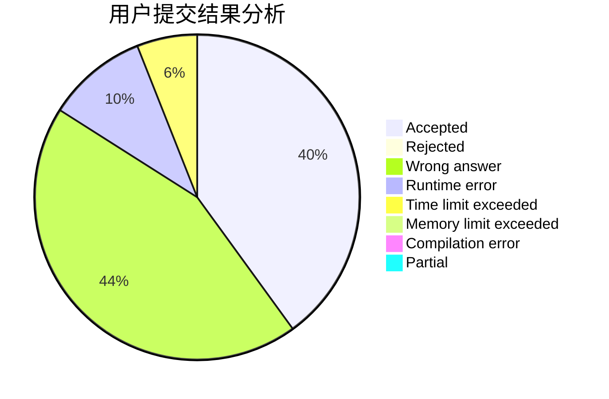
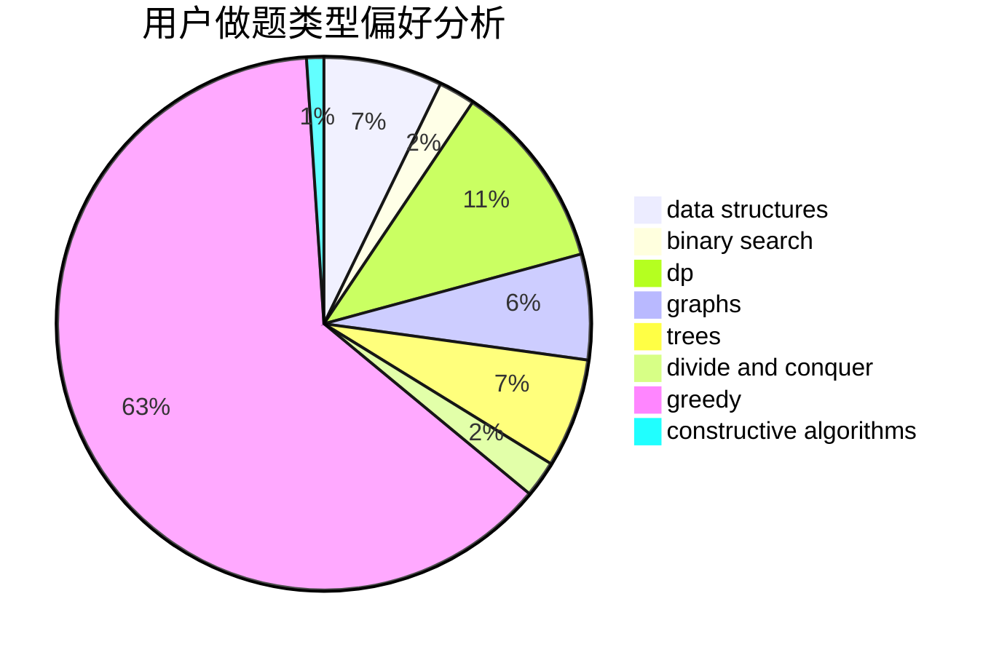
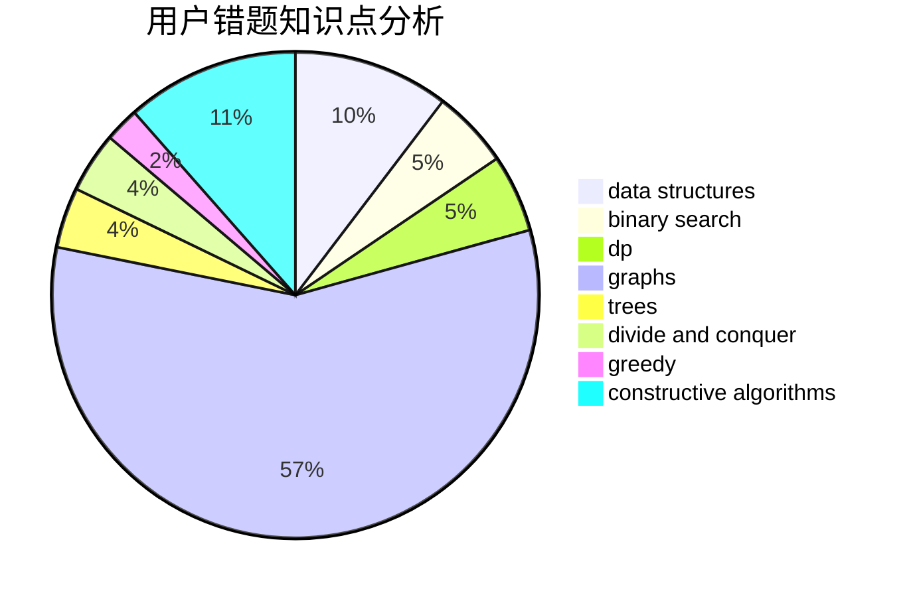

# Nanarimko

<!-- tabs:start -->

#### **用户提交结果分析**

#### **用户做题类型偏好分析**

#### **用户错题知识点分析**

<!-- tabs:end -->
# 推荐题目
[229D](https://codeforces.com/contest/229/problem/D)		dp,
                        greedy,
                        two pointers		  
[894D](https://codeforces.com/contest/894/problem/D)		brute force,
                        data structures,
                        trees		  
[616E](https://codeforces.com/contest/616/problem/E)		implementation,
                        math,
                        number theory		  
[1244G](https://codeforces.com/contest/1244/problem/G)		constructive algorithms,
                        greedy,
                        math		  
[367B](https://codeforces.com/contest/367/problem/B)		binary search,
                        data structures		  
[1029E](https://codeforces.com/contest/1029/problem/E)		dp,
                        graphs,
                        greedy		  
[1271D](https://codeforces.com/contest/1271/problem/D)		data structures,
                        dp,
                        greedy,
                        implementation,
                        sortings		  
[702B](https://codeforces.com/contest/702/problem/B)		brute force,
                        data structures,
                        implementation,
                        math		  
[402D](https://codeforces.com/contest/402/problem/D)		dp,
                        greedy,
                        math,
                        number theory		  
[791C](https://codeforces.com/contest/791/problem/C)		dsu,graphs,sortings,trees		  
