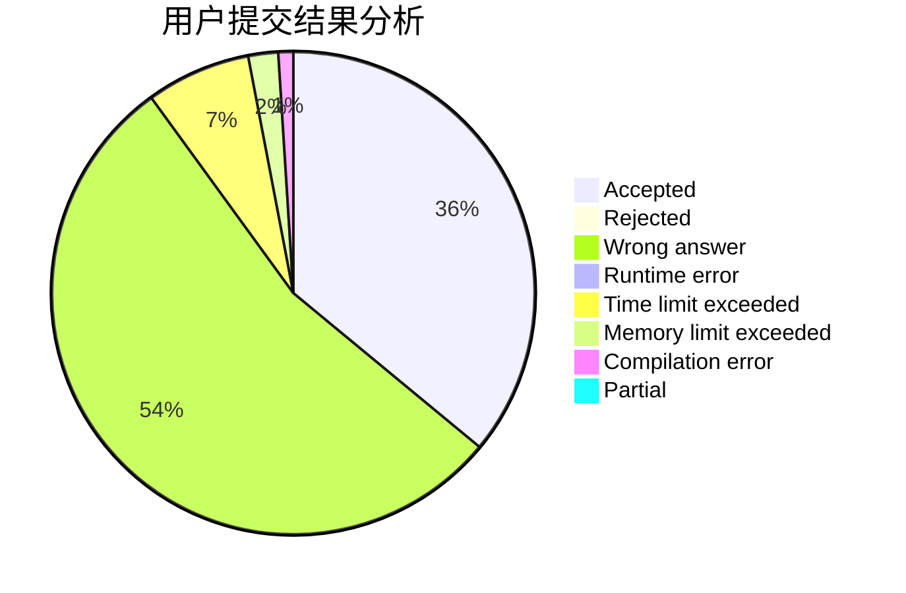
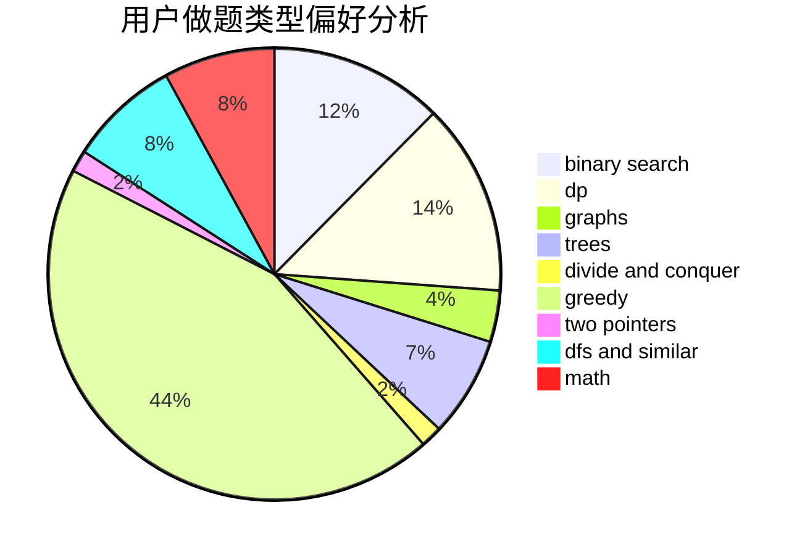

# NcSkuld

<!-- tabs:start -->

#### **用户提交结果分析**

#### **用户做题类型偏好分析**

<!-- tabs:end -->
# 推荐题目
[630F](https://codeforces.com/contest/630/problem/F)
[1023A](https://codeforces.com/contest/1023/problem/A)
[1169B](https://codeforces.com/contest/1169/problem/B)
[682E](https://codeforces.com/contest/682/problem/E)
[460E](https://codeforces.com/contest/460/problem/E)
[26B](https://codeforces.com/contest/26/problem/B)
[570A](https://codeforces.com/contest/570/problem/A)
[1007C](https://codeforces.com/contest/1007/problem/C)
[954B](https://codeforces.com/contest/954/problem/B)
[94B](https://codeforces.com/contest/94/problem/B)
