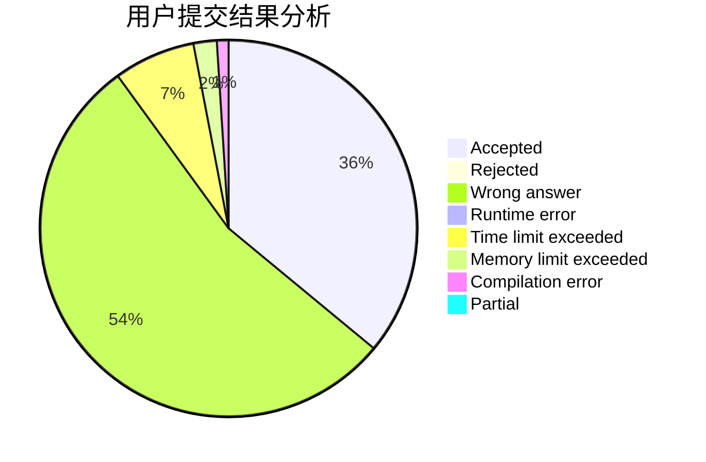
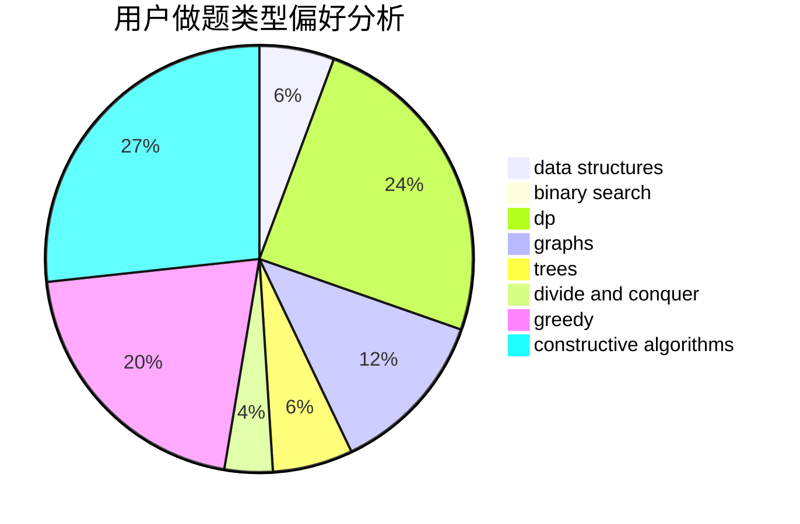
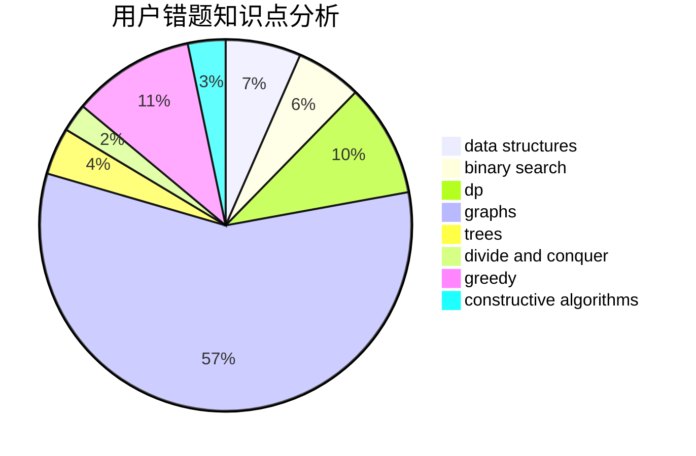

# NcSkuld

<!-- tabs:start -->

#### **用户提交结果分析**

#### **用户做题类型偏好分析**

#### **用户错题知识点分析**

<!-- tabs:end -->
# 推荐题目
[611C](https://codeforces.com/contest/611/problem/C)		dp,
                        implementation		  
[1020C](https://codeforces.com/contest/1020/problem/C)		dsu,graphs,sortings,trees		  
[1166C](https://codeforces.com/contest/1166/problem/C)		binary search,
                        sortings,
                        two pointers		  
[662E](https://codeforces.com/contest/662/problem/E)		brute force,
                        dp,
                        greedy		  
[439D](https://codeforces.com/contest/439/problem/D)		binary search,
                        sortings,
                        ternary search,
                        two pointers		  
[252A](https://codeforces.com/contest/252/problem/A)		brute force,
                        implementation		  
[545D](https://codeforces.com/contest/545/problem/D)		greedy,
                        implementation,
                        sortings		  
[1006E](https://codeforces.com/contest/1006/problem/E)		dfs and similar,
                        graphs,
                        trees		  
[932B](https://codeforces.com/contest/932/problem/B)		binary search,
                        data structures,
                        dfs and similar		  
[92B](https://codeforces.com/contest/92/problem/B)		greedy		  
