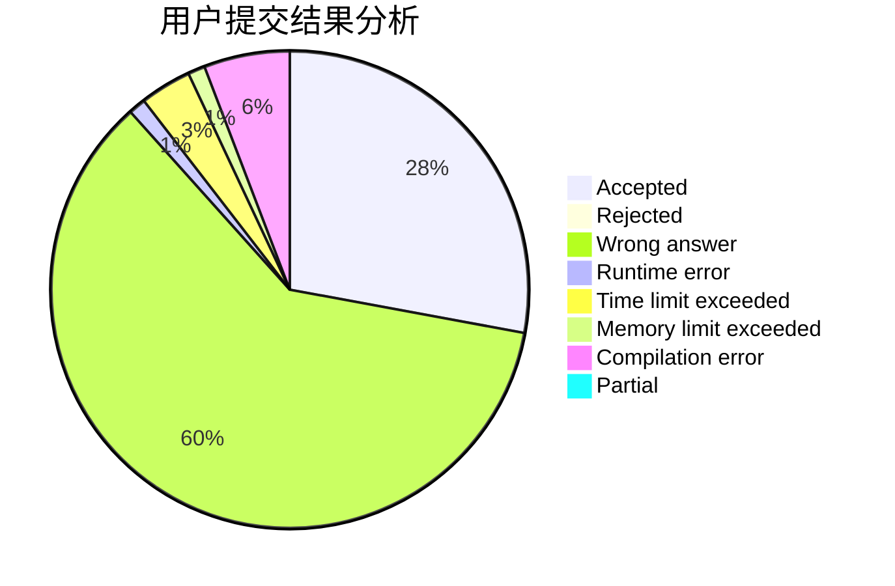
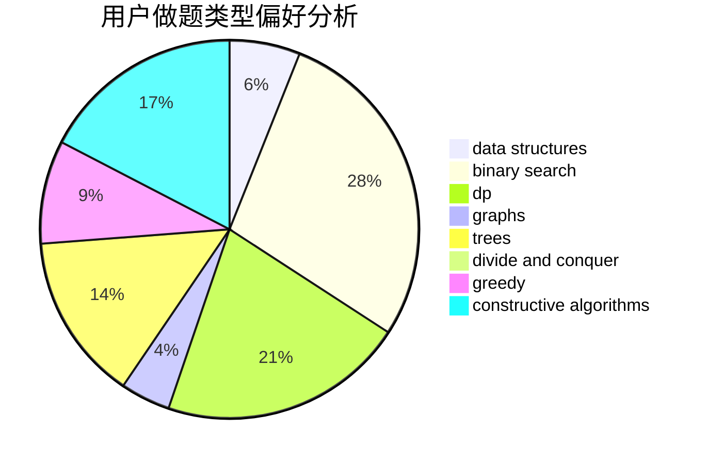
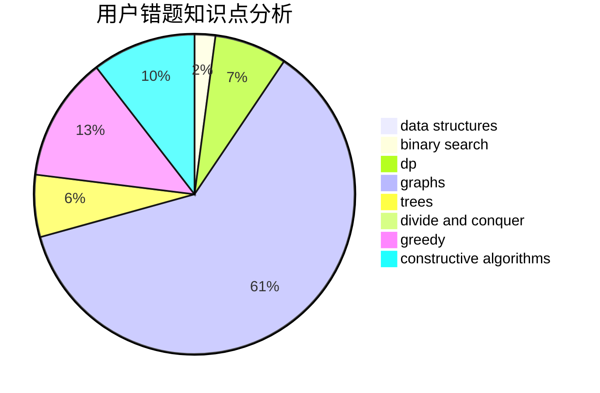

# Neal_lee

<!-- tabs:start -->

#### **用户提交结果分析**

#### **用户做题类型偏好分析**

#### **用户错题知识点分析**

<!-- tabs:end -->
# 推荐题目
[1470D](https://codeforces.com/contest/1470/problem/D)		constructive algorithms,
                        dfs and similar,
                        graph matchings,
                        graphs,
                        greedy		  
[1424G](https://codeforces.com/contest/1424/problem/G)		data structures,
                        sortings		  
[946D](https://codeforces.com/contest/946/problem/D)		dp		  
[747E](https://codeforces.com/contest/747/problem/E)		dfs and similar,
                        expression parsing,
                        implementation,
                        strings		  
[51A](https://codeforces.com/contest/51/problem/A)		implementation		  
[183D](https://codeforces.com/contest/183/problem/D)		dp,
                        greedy,
                        probabilities		  
[1145C](https://codeforces.com/contest/1145/problem/C)		bitmasks,
                        brute force		  
[498B](https://codeforces.com/contest/498/problem/B)		dp,
                        probabilities,
                        two pointers		  
[883M](https://codeforces.com/contest/883/problem/M)		greedy,
                        math		  
[1358A](https://codeforces.com/contest/1358/problem/A)		greedy,
                        math		  
