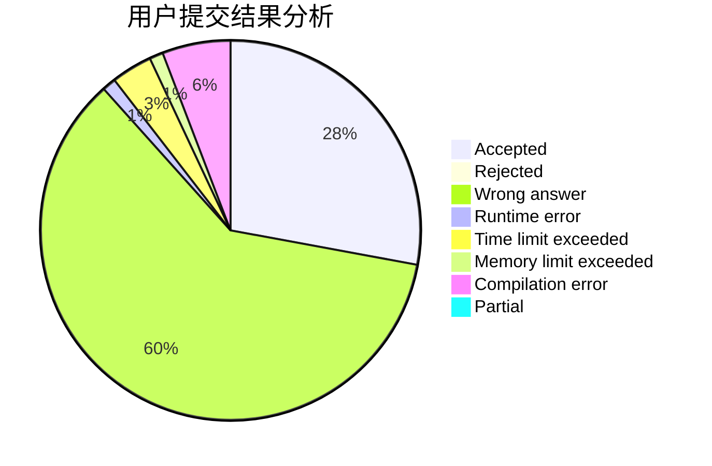
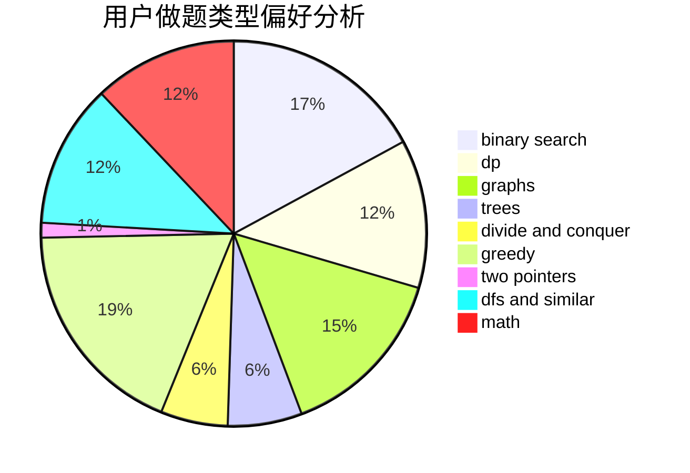

# Neal_lee

<!-- tabs:start -->

#### **用户提交结果分析**

#### **用户做题类型偏好分析**

<!-- tabs:end -->
# 推荐题目
[1470D](https://codeforces.com/contest/1470/problem/D)
[1424G](https://codeforces.com/contest/1424/problem/G)
[946D](https://codeforces.com/contest/946/problem/D)
[747E](https://codeforces.com/contest/747/problem/E)
[51A](https://codeforces.com/contest/51/problem/A)
[183D](https://codeforces.com/contest/183/problem/D)
[1145C](https://codeforces.com/contest/1145/problem/C)
[498B](https://codeforces.com/contest/498/problem/B)
[883M](https://codeforces.com/contest/883/problem/M)
[1358A](https://codeforces.com/contest/1358/problem/A)
