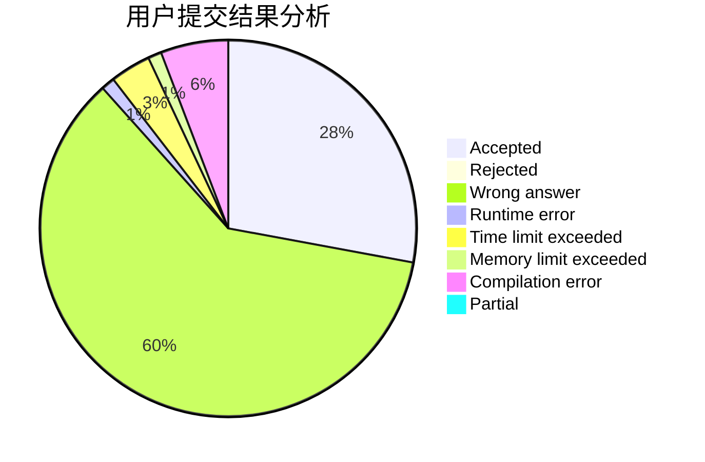
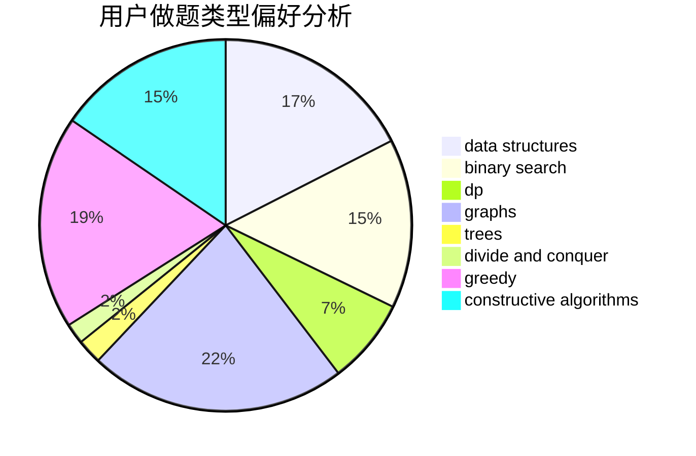
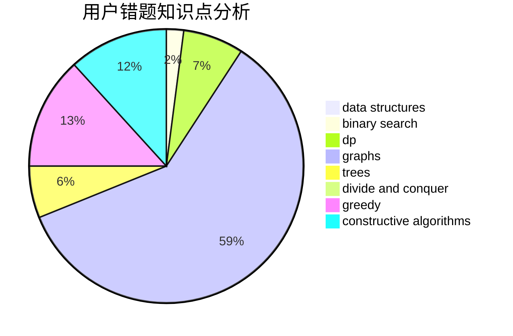

# Neal_lee
<!-- tabs:start -->
#### **用户提交结果分析**

#### **用户做题类型偏好分析**

#### **用户错题知识点分析**

<!-- tabs:end -->
# 推荐题目
[Zero Array](http://codeforces.com/problemset/problem/1201/B)		greedy,
                        math		  
[Jzzhu and Apples](http://codeforces.com/problemset/problem/449/C)		constructive algorithms,
                        number theory		  
[Density of subarrays](http://codeforces.com/problemset/problem/1158/F)		dp,
                        math		  
[Nauuo and ODT](http://codeforces.com/problemset/problem/1172/E)		data structures		  
[Showing Off](http://codeforces.com/problemset/problem/1416/F)		flows,
                        graph matchings,
                        greedy,
                        implementation		  
[Make Equal](http://codeforces.com/problemset/problem/1188/D)		dp		  
[Award Ceremony](http://codeforces.com/problemset/problem/730/E)		greedy,
                        implementation		  
[Origami](http://codeforces.com/problemset/problem/1381/E)		geometry,
                        math,
                        sortings		  
[Number Transformation](http://codeforces.com/problemset/problem/251/C)		dp,
                        greedy,
                        number theory		  
[Queen](http://codeforces.com/problemset/problem/1143/C)		dfs and similar,
                        trees		  
<!-- tabs:start -->
#### **data structures**
[Zero Array](http://codeforces.com/problemset/problem/1172/E)		data structures		  
[Jzzhu and Apples](https://codeforces.com/contest/966/problem/E)		data structures,
                        trees		  
[Density of subarrays](http://codeforces.com/problemset/problem/796/C)		constructive algorithms,
                        data structures,
                        dp,
                        trees		  
[Nauuo and ODT](http://codeforces.com/problemset/problem/292/E)		data structures		  
[Showing Off](http://codeforces.com/problemset/problem/377/B)		binary search,
                        data structures,
                        greedy,
                        sortings		  
[Make Equal](http://codeforces.com/problemset/problem/1348/F)		data structures,
                        dfs and similar,
                        graphs,
                        greedy		  
[Award Ceremony](http://codeforces.com/problemset/problem/258/E)		data structures,
                        dfs and similar,
                        trees		  
[Origami](http://codeforces.com/problemset/problem/91/B)		binary search,
                        data structures		  
[Number Transformation](http://codeforces.com/problemset/problem/482/B)		constructive algorithms,
                        data structures,
                        trees		  
[Queen](http://codeforces.com/problemset/problem/915/F)		data structures,
                        dsu,
                        graphs,
                        trees		  
#### **binary search**
[Zero Array](http://codeforces.com/problemset/problem/231/C)		binary search,
                        sortings,
                        two pointers		  
[Jzzhu and Apples](http://codeforces.com/problemset/problem/377/B)		binary search,
                        data structures,
                        greedy,
                        sortings		  
[Density of subarrays](http://codeforces.com/problemset/problem/91/B)		binary search,
                        data structures		  
[Nauuo and ODT](http://codeforces.com/problemset/problem/1288/A)		binary search,
                        brute force,
                        math,
                        ternary search		  
[Showing Off](http://codeforces.com/problemset/problem/1492/C)		binary search,
                        data structures,
                        dp,
                        greedy,
                        two pointers		  
[Make Equal](http://codeforces.com/problemset/problem/1463/D)		binary search,
                        constructive algorithms,
                        greedy,
                        two pointers		  
[Award Ceremony](http://codeforces.com/problemset/problem/1490/G)		binary search,
                        data structures,
                        math		  
[Origami](http://codeforces.com/problemset/problem/1479/D)		binary search,
                        bitmasks,
                        brute force,
                        data structures,
                        probabilities,
                        trees		  
[Number Transformation](http://codeforces.com/problemset/problem/1436/E)		binary search,
                        data structures,
                        two pointers		  
[Queen](http://codeforces.com/problemset/problem/1461/D)		binary search,
                        brute force,
                        data structures,
                        divide and conquer,
                        implementation,
                        sortings		  
#### **dp**
[Zero Array](http://codeforces.com/problemset/problem/1158/F)		dp,
                        math		  
[Jzzhu and Apples](http://codeforces.com/problemset/problem/1188/D)		dp		  
[Density of subarrays](http://codeforces.com/problemset/problem/251/C)		dp,
                        greedy,
                        number theory		  
[Nauuo and ODT](https://codeforces.com/contest/483/problem/E)		bitmasks,
                        dp,
                        probabilities		  
[Showing Off](http://codeforces.com/problemset/problem/796/C)		constructive algorithms,
                        data structures,
                        dp,
                        trees		  
[Make Equal](http://codeforces.com/problemset/problem/1282/B2)		dp,
                        greedy,
                        sortings		  
[Award Ceremony](https://codeforces.com/contest/1397/problem/E)		dp,
                        greedy,
                        implementation		  
[Origami](http://codeforces.com/problemset/problem/1451/B)		dp,
                        greedy,
                        implementation,
                        strings		  
[Number Transformation](http://codeforces.com/problemset/problem/1324/E)		dp,
                        implementation		  
[Queen](http://codeforces.com/problemset/problem/628/D)		dp		  
#### **graph**
[Zero Array](http://codeforces.com/problemset/problem/1416/F)		flows,
                        graph matchings,
                        greedy,
                        implementation		  
[Jzzhu and Apples](http://codeforces.com/problemset/problem/1348/F)		data structures,
                        dfs and similar,
                        graphs,
                        greedy		  
[Density of subarrays](https://codeforces.com/contest/1350/problem/E)		dfs and similar,
                        graphs,
                        implementation,
                        shortest paths		  
[Nauuo and ODT](http://codeforces.com/problemset/problem/915/F)		data structures,
                        dsu,
                        graphs,
                        trees		  
[Showing Off](http://codeforces.com/problemset/problem/893/C)		dfs and similar,
                        graphs,
                        greedy		  
[Make Equal](https://codeforces.com/contest/1459/problem/F)		data structures,
                        graphs,
                        greedy		  
[Award Ceremony](http://codeforces.com/problemset/problem/545/E)		graphs,
                        greedy,
                        shortest paths		  
[Origami](http://codeforces.com/problemset/problem/1142/E)		graphs,
                        interactive		  
[Number Transformation](http://codeforces.com/problemset/problem/1487/C)		brute force,
                        constructive algorithms,
                        dfs and similar,
                        graphs,
                        greedy,
                        implementation,
                        math		  
[Queen](http://codeforces.com/problemset/problem/1437/C)		dp,
                        flows,
                        graph matchings,
                        greedy,
                        math,
                        sortings		  
#### **trees**
[Zero Array](http://codeforces.com/problemset/problem/1143/C)		dfs and similar,
                        trees		  
[Jzzhu and Apples](https://codeforces.com/contest/966/problem/E)		data structures,
                        trees		  
[Density of subarrays](http://codeforces.com/problemset/problem/796/C)		constructive algorithms,
                        data structures,
                        dp,
                        trees		  
[Nauuo and ODT](http://codeforces.com/problemset/problem/258/E)		data structures,
                        dfs and similar,
                        trees		  
[Showing Off](http://codeforces.com/problemset/problem/482/B)		constructive algorithms,
                        data structures,
                        trees		  
[Make Equal](http://codeforces.com/problemset/problem/915/F)		data structures,
                        dsu,
                        graphs,
                        trees		  
[Award Ceremony](http://codeforces.com/problemset/problem/1479/D)		binary search,
                        bitmasks,
                        brute force,
                        data structures,
                        probabilities,
                        trees		  
[Origami](http://codeforces.com/problemset/problem/1511/C)		brute force,
                        data structures,
                        implementation,
                        trees		  
[Number Transformation](http://codeforces.com/problemset/problem/1499/F)		combinatorics,
                        dfs and similar,
                        dp,
                        trees		  
[Queen](http://codeforces.com/problemset/problem/1491/E)		brute force,
                        dfs and similar,
                        divide and conquer,
                        number theory,
                        trees		  
#### **divide and conquer**
[Zero Array](http://codeforces.com/problemset/problem/1461/D)		binary search,
                        brute force,
                        data structures,
                        divide and conquer,
                        implementation,
                        sortings		  
[Jzzhu and Apples](http://codeforces.com/problemset/problem/1466/G)		combinatorics,
                        divide and conquer,
                        hashing,
                        math,
                        string suffix structures,
                        strings		  
[Density of subarrays](http://codeforces.com/problemset/problem/1490/D)		dfs and similar,
                        divide and conquer,
                        implementation		  
[Nauuo and ODT](https://codeforces.com/contest/1483/problem/C)		data structures,
                        divide and conquer,
                        dp		  
[Showing Off](http://codeforces.com/problemset/problem/1491/E)		brute force,
                        dfs and similar,
                        divide and conquer,
                        number theory,
                        trees		  
[Make Equal](http://codeforces.com/problemset/problem/1303/G)		data structures,
                        divide and conquer,
                        geometry,
                        trees		  
[Award Ceremony](http://codeforces.com/problemset/problem/1494/D)		constructive algorithms,
                        data structures,
                        dfs and similar,
                        divide and conquer,
                        dsu,
                        greedy,
                        sortings,
                        trees		  
[Origami](http://codeforces.com/problemset/problem/1482/E)		data structures,
                        divide and conquer,
                        dp		  
[Number Transformation](http://codeforces.com/problemset/problem/566/C)		dfs and similar,
                        divide and conquer,
                        trees		  
[Queen](http://codeforces.com/problemset/problem/1428/F)		binary search,
                        data structures,
                        divide and conquer,
                        dp,
                        two pointers		  
#### **greedy**
[Zero Array](http://codeforces.com/problemset/problem/1201/B)		greedy,
                        math		  
[Jzzhu and Apples](http://codeforces.com/problemset/problem/1416/F)		flows,
                        graph matchings,
                        greedy,
                        implementation		  
[Density of subarrays](http://codeforces.com/problemset/problem/730/E)		greedy,
                        implementation		  
[Nauuo and ODT](http://codeforces.com/problemset/problem/251/C)		dp,
                        greedy,
                        number theory		  
[Showing Off](http://codeforces.com/problemset/problem/377/B)		binary search,
                        data structures,
                        greedy,
                        sortings		  
[Make Equal](http://codeforces.com/problemset/problem/1348/F)		data structures,
                        dfs and similar,
                        graphs,
                        greedy		  
[Award Ceremony](http://codeforces.com/problemset/problem/864/C)		greedy,
                        implementation,
                        math		  
[Origami](http://codeforces.com/problemset/problem/922/D)		greedy,
                        sortings		  
[Number Transformation](http://codeforces.com/problemset/problem/16/B)		greedy,
                        implementation,
                        sortings		  
[Queen](http://codeforces.com/problemset/problem/1282/B2)		dp,
                        greedy,
                        sortings		  
#### **constructive algorithms**
[Zero Array](http://codeforces.com/problemset/problem/449/C)		constructive algorithms,
                        number theory		  
[Jzzhu and Apples](http://codeforces.com/problemset/problem/796/C)		constructive algorithms,
                        data structures,
                        dp,
                        trees		  
[Density of subarrays](http://codeforces.com/problemset/problem/581/D)		bitmasks,
                        brute force,
                        constructive algorithms,
                        geometry,
                        implementation,
                        math		  
[Nauuo and ODT](http://codeforces.com/problemset/problem/482/B)		constructive algorithms,
                        data structures,
                        trees		  
[Showing Off](http://codeforces.com/problemset/problem/1119/G)		constructive algorithms,
                        implementation		  
[Make Equal](http://codeforces.com/problemset/problem/478/B)		combinatorics,
                        constructive algorithms,
                        greedy,
                        math		  
[Award Ceremony](http://codeforces.com/problemset/problem/1493/A)		constructive algorithms,
                        greedy		  
[Origami](http://codeforces.com/problemset/problem/1463/D)		binary search,
                        constructive algorithms,
                        greedy,
                        two pointers		  
[Number Transformation](https://codeforces.com/contest/1456/problem/B)		bitmasks,
                        brute force,
                        constructive algorithms		  
[Queen](http://codeforces.com/problemset/problem/1492/D)		bitmasks,
                        constructive algorithms,
                        greedy,
                        math		  
#### **sortings**
[Zero Array](http://codeforces.com/problemset/problem/1381/E)		geometry,
                        math,
                        sortings		  
[Jzzhu and Apples](http://codeforces.com/problemset/problem/231/C)		binary search,
                        sortings,
                        two pointers		  
[Density of subarrays](http://codeforces.com/problemset/problem/377/B)		binary search,
                        data structures,
                        greedy,
                        sortings		  
[Nauuo and ODT](http://codeforces.com/problemset/problem/922/D)		greedy,
                        sortings		  
[Showing Off](http://codeforces.com/problemset/problem/16/B)		greedy,
                        implementation,
                        sortings		  
[Make Equal](http://codeforces.com/problemset/problem/1282/B2)		dp,
                        greedy,
                        sortings		  
[Award Ceremony](http://codeforces.com/problemset/problem/160/A)		greedy,
                        sortings		  
[Origami](http://codeforces.com/problemset/problem/1216/B)		greedy,
                        implementation,
                        sortings		  
[Number Transformation](https://codeforces.com/contest/1496/problem/C)		geometry,
                        greedy,
                        math,
                        sortings		  
[Queen](http://codeforces.com/problemset/problem/1495/A)		geometry,
                        greedy,
                        math,
                        sortings		  
<!-- tabs:end -->
