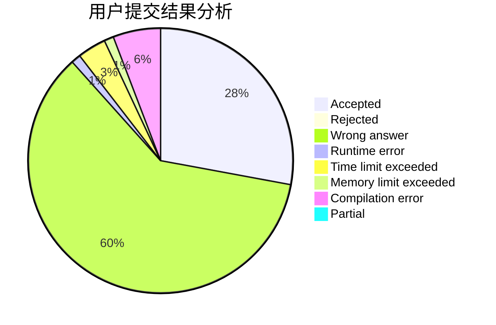
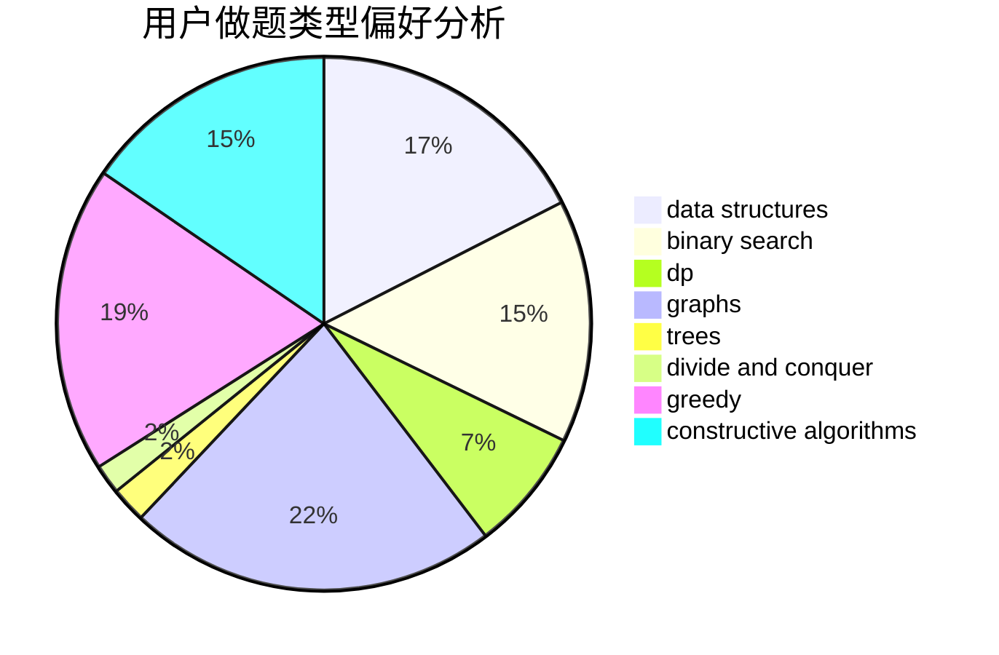
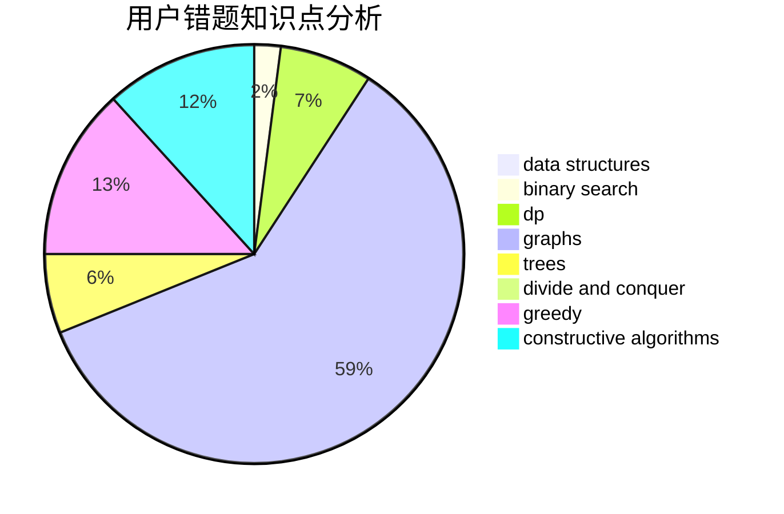

# Neal_lee

<!-- tabs:start -->

#### **用户提交结果分析**

#### **用户做题类型偏好分析**

#### **用户错题知识点分析**

<!-- tabs:end -->
# 推荐题目
[1463C](https://codeforces.com/contest/1463/problem/C)		implementation		  
[1416F](https://codeforces.com/contest/1416/problem/F)		flows,
                        graph matchings,
                        greedy,
                        implementation		  
[922D](https://codeforces.com/contest/922/problem/D)		greedy,
                        sortings		  
[730E](https://codeforces.com/contest/730/problem/E)		greedy,
                        implementation		  
[499C](https://codeforces.com/contest/499/problem/C)		dsu,graphs,sortings,trees		  
[160A](https://codeforces.com/contest/160/problem/A)		greedy,
                        sortings		  
[1143C](https://codeforces.com/contest/1143/problem/C)		dfs and similar,
                        trees		  
[478B](https://codeforces.com/contest/478/problem/B)		combinatorics,
                        constructive algorithms,
                        greedy,
                        math		  
[864C](https://codeforces.com/contest/864/problem/C)		greedy,
                        implementation,
                        math		  
[1350E](https://codeforces.com/contest/1350/problem/E)		dsu,graphs,sortings,trees		  
