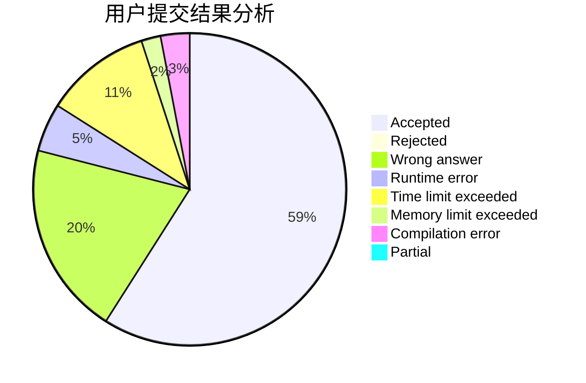
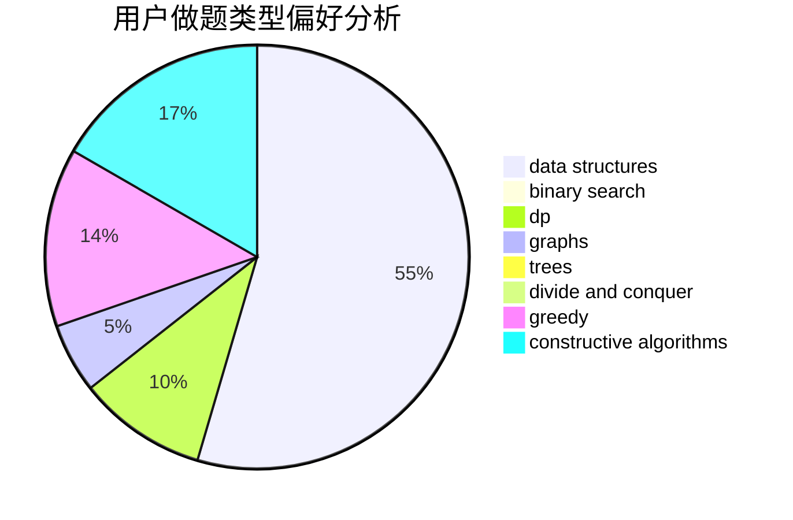

# Nemaleswang

<!-- tabs:start -->

#### **用户提交结果分析**

#### **用户做题类型偏好分析**

#### **用户错题知识点分析**

<!-- tabs:end -->
# 推荐题目
[1291A](https://codeforces.com/contest/1291/problem/A)		greedy,
                        math,
                        strings		  
[1042D](https://codeforces.com/contest/1042/problem/D)		data structures,
                        divide and conquer,
                        two pointers		  
[370B](https://codeforces.com/contest/370/problem/B)		implementation		  
[1152F1](https://codeforces.com/contest/1152F/problem/1)		bitmasks,
                        dp,
                        matrices		  
[199B](https://codeforces.com/contest/199/problem/B)		geometry		  
[4C](https://codeforces.com/contest/4/problem/C)		data structures,
                        hashing,
                        implementation		  
[1098E](https://codeforces.com/contest/1098/problem/E)		binary search,
                        implementation,
                        math,
                        number theory		  
[1427H](https://codeforces.com/contest/1427/problem/H)		binary search,
                        games,
                        geometry,
                        ternary search		  
[785E](https://codeforces.com/contest/785/problem/E)		brute force,
                        data structures		  
[209C](https://codeforces.com/contest/209/problem/C)		constructive algorithms,
                        dsu,
                        graphs,
                        greedy		  
