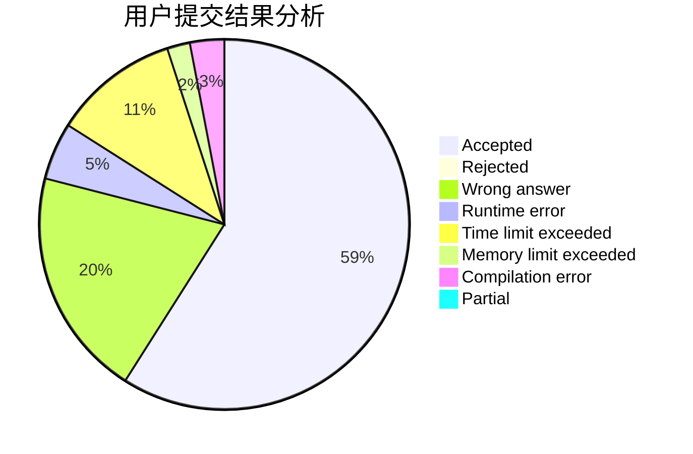
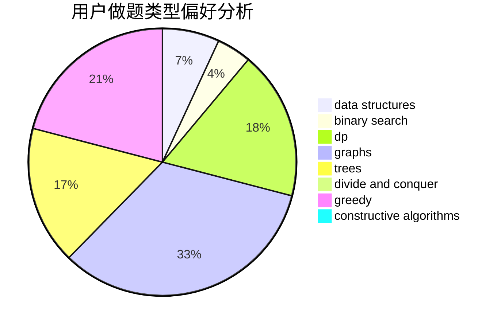

# Nemaleswang

<!-- tabs:start -->

#### **用户提交结果分析**

#### **用户做题类型偏好分析**

#### **用户错题知识点分析**

<!-- tabs:end -->
# 推荐题目
[1297D](https://codeforces.com/contest/1297/problem/D)		*special problem,
                        binary search,
                        greedy,
                        sortings		  
[1043A](https://codeforces.com/contest/1043/problem/A)		implementation,
                        math		  
[3D](https://codeforces.com/contest/3/problem/D)		greedy		  
[1154F](https://codeforces.com/contest/1154/problem/F)		dp,
                        greedy,
                        sortings		  
[220B](https://codeforces.com/contest/220/problem/B)		constructive algorithms,
                        data structures		  
[520C](https://codeforces.com/contest/520/problem/C)		math,
                        strings		  
[1099B](https://codeforces.com/contest/1099/problem/B)		binary search,
                        constructive algorithms,
                        math		  
[1436F](https://codeforces.com/contest/1436/problem/F)		combinatorics,
                        math,
                        number theory		  
[802J](https://codeforces.com/contest/802/problem/J)		dfs and similar,
                        graphs,
                        trees		  
[231B](https://codeforces.com/contest/231/problem/B)		constructive algorithms,
                        greedy		  
