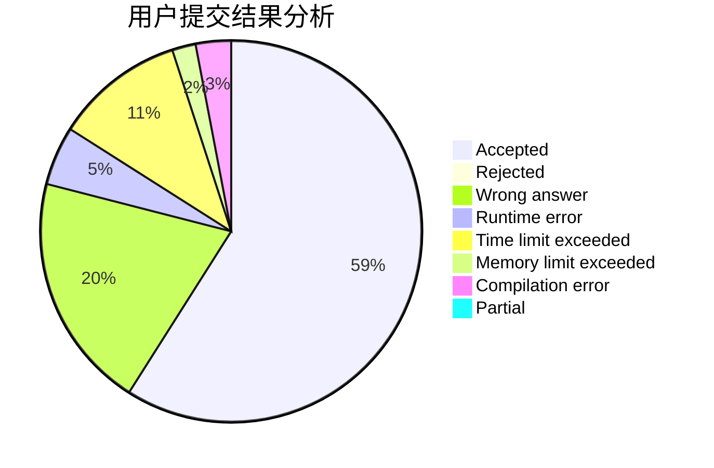
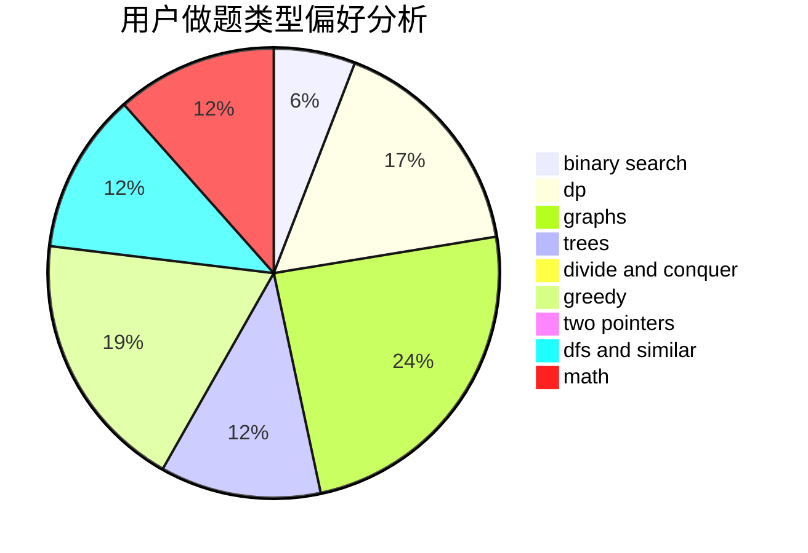

# Nemaleswang

<!-- tabs:start -->

#### **用户提交结果分析**

#### **用户做题类型偏好分析**

<!-- tabs:end -->
# 推荐题目
[1297D](https://codeforces.com/contest/1297/problem/D)
[1043A](https://codeforces.com/contest/1043/problem/A)
[3D](https://codeforces.com/contest/3/problem/D)
[1154F](https://codeforces.com/contest/1154/problem/F)
[220B](https://codeforces.com/contest/220/problem/B)
[520C](https://codeforces.com/contest/520/problem/C)
[1099B](https://codeforces.com/contest/1099/problem/B)
[1436F](https://codeforces.com/contest/1436/problem/F)
[802J](https://codeforces.com/contest/802/problem/J)
[231B](https://codeforces.com/contest/231/problem/B)
