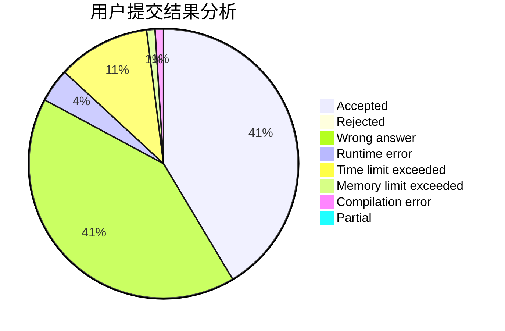
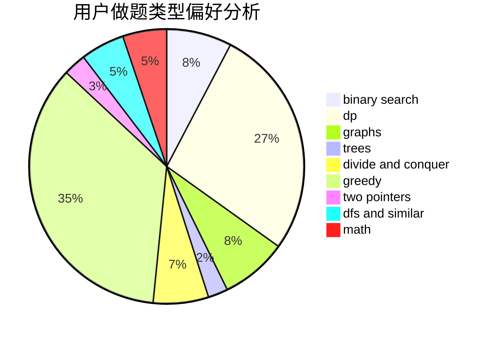

# Nero

<!-- tabs:start -->

#### **用户提交结果分析**

#### **用户做题类型偏好分析**

<!-- tabs:end -->
# 推荐题目
[56A](https://codeforces.com/contest/56/problem/A)
[9581](https://codeforces.com/contest/958/problem/1)
[916B](https://codeforces.com/contest/916/problem/B)
[916D](https://codeforces.com/contest/916/problem/D)
[1099F](https://codeforces.com/contest/1099/problem/F)
[574B](https://codeforces.com/contest/574/problem/B)
[444D](https://codeforces.com/contest/444/problem/D)
[868A](https://codeforces.com/contest/868/problem/A)
[337D](https://codeforces.com/contest/337/problem/D)
[1772](https://codeforces.com/contest/177/problem/2)
