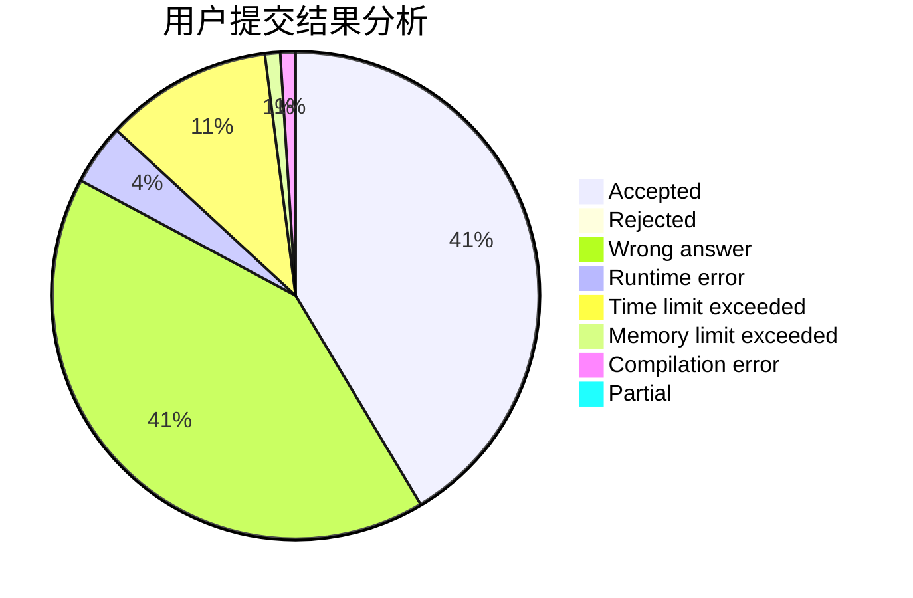
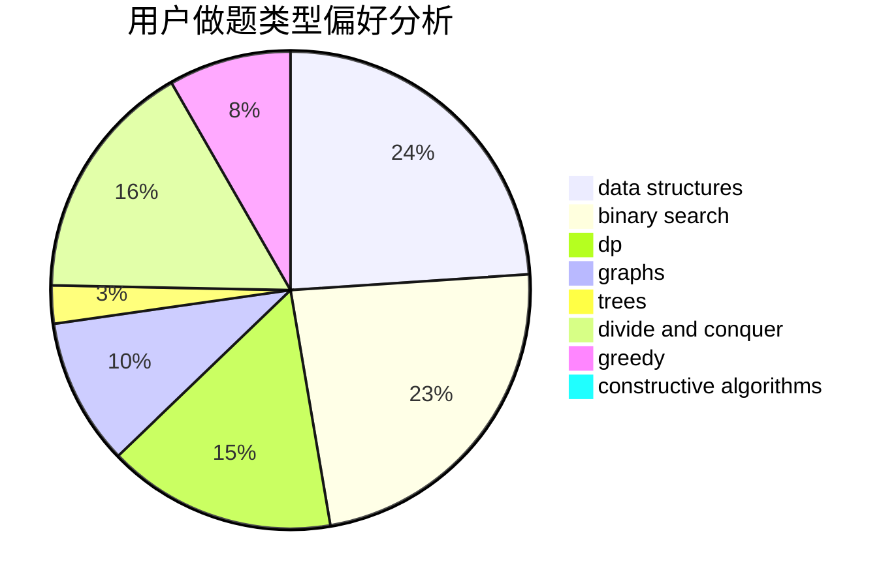
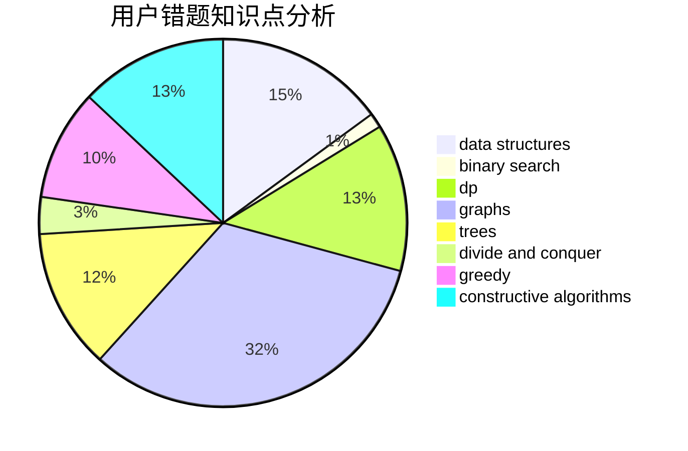

# Nero
<!-- tabs:start -->
#### **用户提交结果分析**

#### **用户做题类型偏好分析**

#### **用户错题知识点分析**

<!-- tabs:end -->
# 推荐题目
[Clues](http://codeforces.com/problemset/problem/156/D)		combinatorics,
                        graphs		  
[Shake It!](http://codeforces.com/problemset/problem/848/D)		combinatorics,
                        dp,
                        flows,
                        graphs		  
[Dreamoon Loves AA](http://codeforces.com/problemset/problem/1329/E)		binary search,
                        greedy		  
[Toy Cars](http://codeforces.com/problemset/problem/545/A)		implementation		  
[How Many Squares?](http://codeforces.com/problemset/problem/11/C)		implementation		  
[Paint the Tree](https://codeforces.com/contest/1241/problem/E)		brute force,
                        constructive algorithms,
                        dp,
                        graphs,
                        implementation,
                        trees		  
[Find Extra One](http://codeforces.com/problemset/problem/900/A)		geometry,
                        implementation		  
[Spyke Chatting](http://codeforces.com/problemset/problem/413/B)		implementation		  
[Greg and Graph](https://codeforces.com/contest/296/problem/D)		dp,
                        graphs,
                        shortest paths		  
[To Add or Not to Add](http://codeforces.com/problemset/problem/231/C)		binary search,
                        sortings,
                        two pointers		  
<!-- tabs:start -->
#### **data structures**
[Clues](http://codeforces.com/problemset/problem/1167/F)		combinatorics,
                        data structures,
                        math,
                        sortings		  
[Shake It!](http://codeforces.com/problemset/problem/1196/D2)		data structures,
                        dp,
                        implementation,
                        two pointers		  
[Dreamoon Loves AA](http://codeforces.com/problemset/problem/418/E)		data structures		  
[Toy Cars](http://codeforces.com/problemset/problem/212/D)		binary search,
                        data structures,
                        dsu		  
[How Many Squares?](http://codeforces.com/problemset/problem/1511/F)		brute force,
                        data structures,
                        dp,
                        matrices,
                        string suffix structures,
                        strings		  
[Paint the Tree](http://codeforces.com/problemset/problem/438/D)		data structures,
                        math		  
[Find Extra One](http://codeforces.com/problemset/problem/1375/C)		constructive algorithms,
                        data structures,
                        greedy		  
[Spyke Chatting](http://codeforces.com/problemset/problem/700/D)		data structures,
                        greedy		  
[Greg and Graph](http://codeforces.com/problemset/problem/1492/C)		binary search,
                        data structures,
                        dp,
                        greedy,
                        two pointers		  
[To Add or Not to Add](http://codeforces.com/problemset/problem/1490/G)		binary search,
                        data structures,
                        math		  
#### **binary search**
[Clues](http://codeforces.com/problemset/problem/1329/E)		binary search,
                        greedy		  
[Shake It!](http://codeforces.com/problemset/problem/231/C)		binary search,
                        sortings,
                        two pointers		  
[Dreamoon Loves AA](http://codeforces.com/problemset/problem/96/B)		binary search,
                        bitmasks,
                        brute force		  
[Toy Cars](http://codeforces.com/problemset/problem/8/D)		binary search,
                        geometry		  
[How Many Squares?](http://codeforces.com/problemset/problem/212/D)		binary search,
                        data structures,
                        dsu		  
[Paint the Tree](http://codeforces.com/problemset/problem/936/A)		binary search,
                        implementation,
                        math		  
[Find Extra One](http://codeforces.com/problemset/problem/1165/F2)		binary search,
                        greedy,
                        implementation		  
[Spyke Chatting](http://codeforces.com/problemset/problem/181/B)		binary search,
                        brute force		  
[Greg and Graph](http://codeforces.com/problemset/problem/1486/C2)		binary search,
                        interactive		  
[To Add or Not to Add](http://codeforces.com/problemset/problem/1492/C)		binary search,
                        data structures,
                        dp,
                        greedy,
                        two pointers		  
#### **dp**
[Clues](http://codeforces.com/problemset/problem/848/D)		combinatorics,
                        dp,
                        flows,
                        graphs		  
[Shake It!](https://codeforces.com/contest/1241/problem/E)		brute force,
                        constructive algorithms,
                        dp,
                        graphs,
                        implementation,
                        trees		  
[Dreamoon Loves AA](https://codeforces.com/contest/296/problem/D)		dp,
                        graphs,
                        shortest paths		  
[Toy Cars](http://codeforces.com/problemset/problem/1196/D2)		data structures,
                        dp,
                        implementation,
                        two pointers		  
[How Many Squares?](https://codeforces.com/contest/861/problem/C)		dp,
                        greedy,
                        implementation		  
[Paint the Tree](http://codeforces.com/problemset/problem/313/D)		dp		  
[Find Extra One](http://codeforces.com/problemset/problem/1038/E)		bitmasks,
                        brute force,
                        dfs and similar,
                        dp,
                        graphs		  
[Spyke Chatting](http://codeforces.com/problemset/problem/1511/F)		brute force,
                        data structures,
                        dp,
                        matrices,
                        string suffix structures,
                        strings		  
[Greg and Graph](http://codeforces.com/problemset/problem/316/D3)		dp,
                        math		  
[To Add or Not to Add](http://codeforces.com/problemset/problem/1172/C1)		dp,
                        probabilities		  
#### **graph**
[Clues](http://codeforces.com/problemset/problem/156/D)		combinatorics,
                        graphs		  
[Shake It!](http://codeforces.com/problemset/problem/848/D)		combinatorics,
                        dp,
                        flows,
                        graphs		  
[Dreamoon Loves AA](https://codeforces.com/contest/1241/problem/E)		brute force,
                        constructive algorithms,
                        dp,
                        graphs,
                        implementation,
                        trees		  
[Toy Cars](https://codeforces.com/contest/296/problem/D)		dp,
                        graphs,
                        shortest paths		  
[How Many Squares?](http://codeforces.com/problemset/problem/1038/E)		bitmasks,
                        brute force,
                        dfs and similar,
                        dp,
                        graphs		  
[Paint the Tree](http://codeforces.com/problemset/problem/1487/C)		brute force,
                        constructive algorithms,
                        dfs and similar,
                        graphs,
                        greedy,
                        implementation,
                        math		  
[Find Extra One](http://codeforces.com/problemset/problem/1437/C)		dp,
                        flows,
                        graph matchings,
                        greedy,
                        math,
                        sortings		  
[Spyke Chatting](http://codeforces.com/problemset/problem/1470/D)		constructive algorithms,
                        dfs and similar,
                        graph matchings,
                        graphs,
                        greedy		  
[Greg and Graph](http://codeforces.com/problemset/problem/1476/C)		dp,
                        graphs,
                        greedy		  
[To Add or Not to Add](http://codeforces.com/problemset/problem/1304/D)		constructive algorithms,
                        graphs,
                        greedy,
                        two pointers		  
#### **trees**
[Clues](https://codeforces.com/contest/1241/problem/E)		brute force,
                        constructive algorithms,
                        dp,
                        graphs,
                        implementation,
                        trees		  
[Shake It!](http://codeforces.com/problemset/problem/288/D)		combinatorics,
                        dfs and similar,
                        trees		  
[Dreamoon Loves AA](http://codeforces.com/problemset/problem/1479/D)		binary search,
                        bitmasks,
                        brute force,
                        data structures,
                        probabilities,
                        trees		  
[Toy Cars](http://codeforces.com/problemset/problem/1511/C)		brute force,
                        data structures,
                        implementation,
                        trees		  
[How Many Squares?](http://codeforces.com/problemset/problem/1499/F)		combinatorics,
                        dfs and similar,
                        dp,
                        trees		  
[Paint the Tree](http://codeforces.com/problemset/problem/1491/E)		brute force,
                        dfs and similar,
                        divide and conquer,
                        number theory,
                        trees		  
[Find Extra One](http://codeforces.com/problemset/problem/1466/D)		data structures,
                        greedy,
                        sortings,
                        trees		  
[Spyke Chatting](http://codeforces.com/problemset/problem/1495/D)		combinatorics,
                        dfs and similar,
                        graphs,
                        math,
                        shortest paths,
                        trees		  
[Greg and Graph](http://codeforces.com/problemset/problem/1303/G)		data structures,
                        divide and conquer,
                        geometry,
                        trees		  
[To Add or Not to Add](http://codeforces.com/problemset/problem/1454/E)		combinatorics,
                        dfs and similar,
                        graphs,
                        trees		  
#### **divide and conquer**
[Clues](http://codeforces.com/problemset/problem/1461/D)		binary search,
                        brute force,
                        data structures,
                        divide and conquer,
                        implementation,
                        sortings		  
[Shake It!](http://codeforces.com/problemset/problem/1466/G)		combinatorics,
                        divide and conquer,
                        hashing,
                        math,
                        string suffix structures,
                        strings		  
[Dreamoon Loves AA](http://codeforces.com/problemset/problem/1490/D)		dfs and similar,
                        divide and conquer,
                        implementation		  
[Toy Cars](https://codeforces.com/contest/1483/problem/C)		data structures,
                        divide and conquer,
                        dp		  
[How Many Squares?](http://codeforces.com/problemset/problem/1491/E)		brute force,
                        dfs and similar,
                        divide and conquer,
                        number theory,
                        trees		  
[Paint the Tree](http://codeforces.com/problemset/problem/1303/G)		data structures,
                        divide and conquer,
                        geometry,
                        trees		  
[Find Extra One](http://codeforces.com/problemset/problem/1494/D)		constructive algorithms,
                        data structures,
                        dfs and similar,
                        divide and conquer,
                        dsu,
                        greedy,
                        sortings,
                        trees		  
[Spyke Chatting](http://codeforces.com/problemset/problem/1482/E)		data structures,
                        divide and conquer,
                        dp		  
[Greg and Graph](http://codeforces.com/problemset/problem/566/C)		dfs and similar,
                        divide and conquer,
                        trees		  
[To Add or Not to Add](http://codeforces.com/problemset/problem/1428/F)		binary search,
                        data structures,
                        divide and conquer,
                        dp,
                        two pointers		  
#### **greedy**
[Clues](http://codeforces.com/problemset/problem/1329/E)		binary search,
                        greedy		  
[Shake It!](https://codeforces.com/contest/861/problem/C)		dp,
                        greedy,
                        implementation		  
[Dreamoon Loves AA](http://codeforces.com/problemset/problem/1165/F2)		binary search,
                        greedy,
                        implementation		  
[Toy Cars](http://codeforces.com/problemset/problem/1365/A)		games,
                        greedy,
                        implementation		  
[How Many Squares?](http://codeforces.com/problemset/problem/1203/E)		greedy,
                        sortings		  
[Paint the Tree](http://codeforces.com/problemset/problem/1375/C)		constructive algorithms,
                        data structures,
                        greedy		  
[Find Extra One](http://codeforces.com/problemset/problem/1394/A)		dp,
                        greedy,
                        sortings,
                        two pointers		  
[Spyke Chatting](http://codeforces.com/problemset/problem/700/D)		data structures,
                        greedy		  
[Greg and Graph](http://codeforces.com/problemset/problem/1492/C)		binary search,
                        data structures,
                        dp,
                        greedy,
                        two pointers		  
[To Add or Not to Add](https://codeforces.com/contest/1496/problem/C)		geometry,
                        greedy,
                        math,
                        sortings		  
#### **constructive algorithms**
[Clues](https://codeforces.com/contest/1241/problem/E)		brute force,
                        constructive algorithms,
                        dp,
                        graphs,
                        implementation,
                        trees		  
[Shake It!](http://codeforces.com/problemset/problem/347/A)		constructive algorithms,
                        implementation,
                        sortings		  
[Dreamoon Loves AA](http://codeforces.com/problemset/problem/1099/C)		constructive algorithms,
                        implementation		  
[Toy Cars](http://codeforces.com/problemset/problem/1427/D)		constructive algorithms,
                        implementation		  
[How Many Squares?](http://codeforces.com/problemset/problem/1375/C)		constructive algorithms,
                        data structures,
                        greedy		  
[Paint the Tree](http://codeforces.com/problemset/problem/1477/A)		constructive algorithms,
                        math,
                        number theory		  
[Find Extra One](http://codeforces.com/problemset/problem/1493/A)		constructive algorithms,
                        greedy		  
[Spyke Chatting](http://codeforces.com/problemset/problem/1463/D)		binary search,
                        constructive algorithms,
                        greedy,
                        two pointers		  
[Greg and Graph](https://codeforces.com/contest/1456/problem/B)		bitmasks,
                        brute force,
                        constructive algorithms		  
[To Add or Not to Add](http://codeforces.com/problemset/problem/1492/D)		bitmasks,
                        constructive algorithms,
                        greedy,
                        math		  
#### **sortings**
[Clues](http://codeforces.com/problemset/problem/231/C)		binary search,
                        sortings,
                        two pointers		  
[Shake It!](http://codeforces.com/problemset/problem/1167/F)		combinatorics,
                        data structures,
                        math,
                        sortings		  
[Dreamoon Loves AA](http://codeforces.com/problemset/problem/347/A)		constructive algorithms,
                        implementation,
                        sortings		  
[Toy Cars](http://codeforces.com/problemset/problem/1294/B)		implementation,
                        sortings		  
[How Many Squares?](http://codeforces.com/problemset/problem/1203/E)		greedy,
                        sortings		  
[Paint the Tree](http://codeforces.com/problemset/problem/1394/A)		dp,
                        greedy,
                        sortings,
                        two pointers		  
[Find Extra One](https://codeforces.com/contest/1496/problem/C)		geometry,
                        greedy,
                        math,
                        sortings		  
[Spyke Chatting](http://codeforces.com/problemset/problem/1495/A)		geometry,
                        greedy,
                        math,
                        sortings		  
[Greg and Graph](http://codeforces.com/problemset/problem/1497/A)		brute force,
                        data structures,
                        greedy,
                        sortings		  
[To Add or Not to Add](http://codeforces.com/problemset/problem/1427/A)		math,
                        sortings		  
<!-- tabs:end -->
