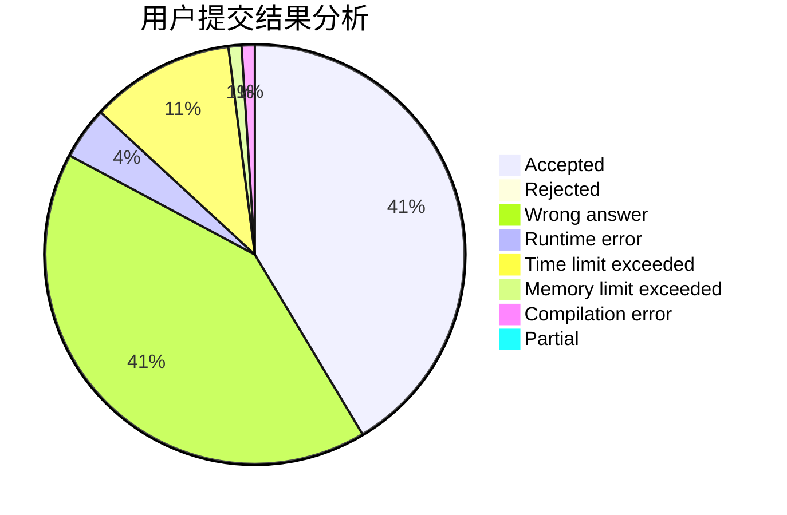
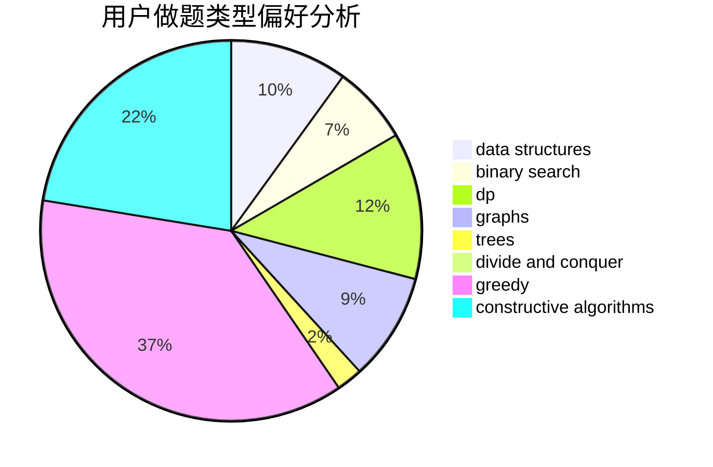
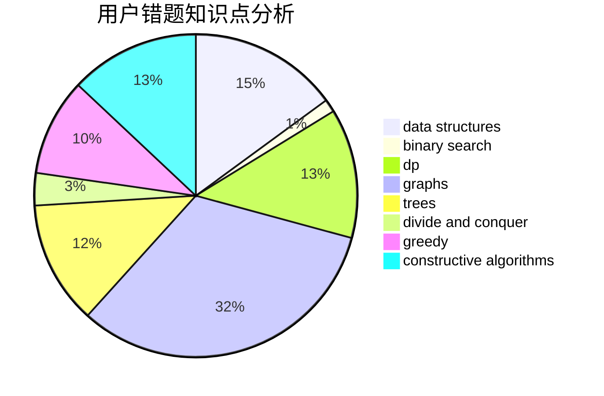

# Nero

<!-- tabs:start -->

#### **用户提交结果分析**

#### **用户做题类型偏好分析**

#### **用户错题知识点分析**

<!-- tabs:end -->
# 推荐题目
[56A](https://codeforces.com/contest/56/problem/A)		implementation		  
[9581](https://codeforces.com/contest/958/problem/1)		dsu,graphs,sortings,trees		  
[916B](https://codeforces.com/contest/916/problem/B)		bitmasks,
                        greedy,
                        math		  
[916D](https://codeforces.com/contest/916/problem/D)		data structures,
                        interactive,
                        trees		  
[1099F](https://codeforces.com/contest/1099/problem/F)		binary search,
                        data structures,
                        dfs and similar,
                        dp,
                        games,
                        trees		  
[574B](https://codeforces.com/contest/574/problem/B)		brute force,
                        dfs and similar,
                        graphs,
                        hashing		  
[444D](https://codeforces.com/contest/444/problem/D)		binary search,
                        hashing,
                        strings,
                        two pointers		  
[868A](https://codeforces.com/contest/868/problem/A)		brute force,
                        implementation,
                        strings		  
[337D](https://codeforces.com/contest/337/problem/D)		dfs and similar,
                        divide and conquer,
                        dp,
                        trees		  
[1772](https://codeforces.com/contest/177/problem/2)		dsu,graphs,sortings,trees		  
