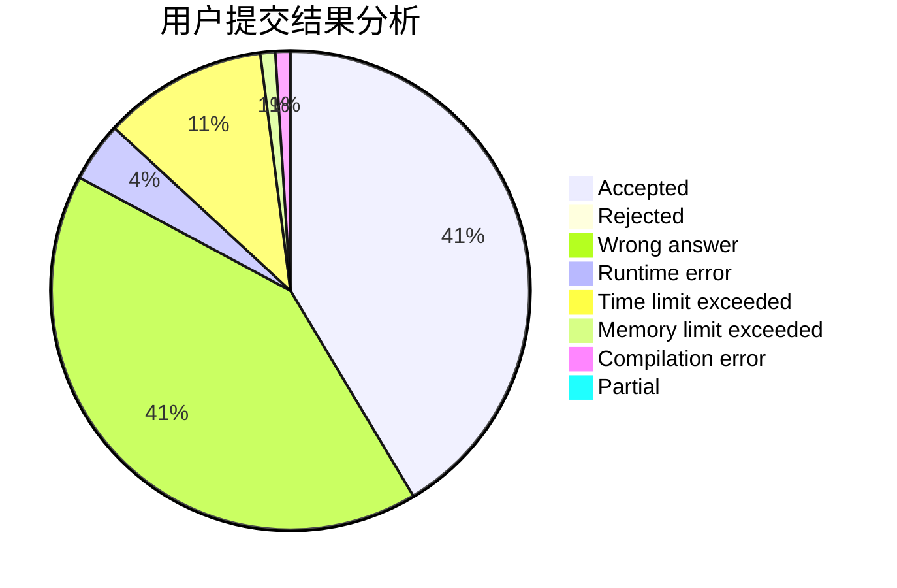
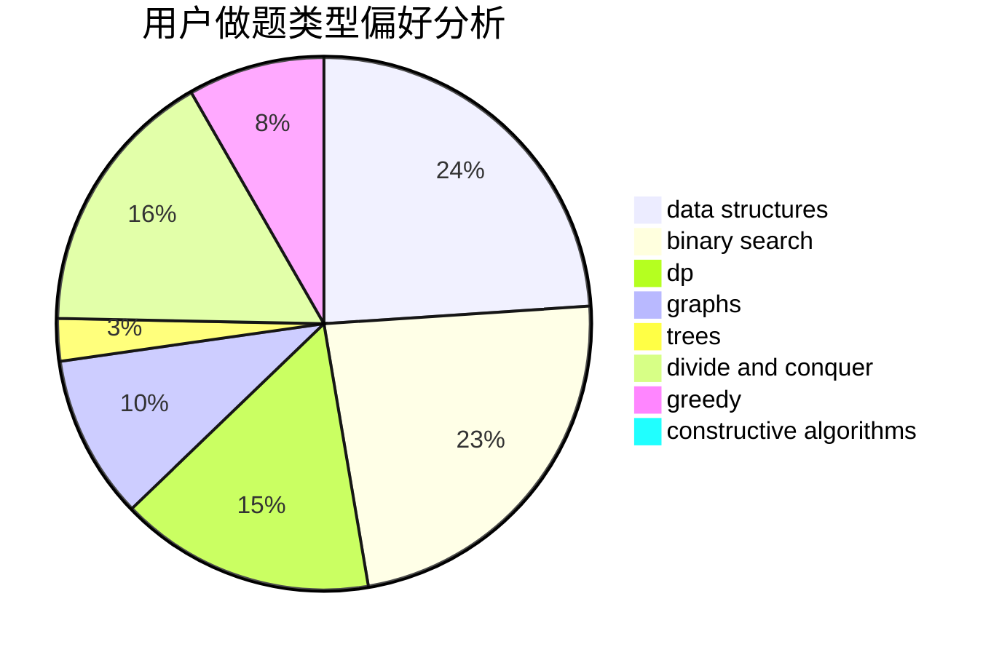
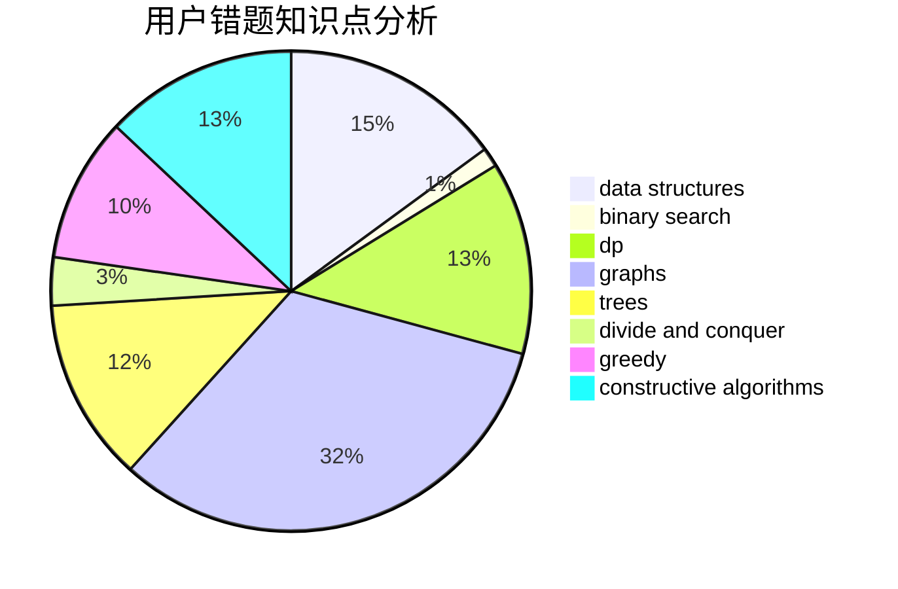

# Nero

<!-- tabs:start -->

#### **用户提交结果分析**

#### **用户做题类型偏好分析**

#### **用户错题知识点分析**

<!-- tabs:end -->
# 推荐题目
[545A](https://codeforces.com/contest/545/problem/A)		implementation		  
[936A](https://codeforces.com/contest/936/problem/A)		binary search,
                        implementation,
                        math		  
[8D](https://codeforces.com/contest/8/problem/D)		binary search,
                        geometry		  
[900A](https://codeforces.com/contest/900/problem/A)		geometry,
                        implementation		  
[1099C](https://codeforces.com/contest/1099/problem/C)		constructive algorithms,
                        implementation		  
[549C](https://codeforces.com/contest/549/problem/C)		games		  
[418E](https://codeforces.com/contest/418/problem/E)		data structures		  
[848D](https://codeforces.com/contest/848/problem/D)		combinatorics,
                        dp,
                        flows,
                        graphs		  
[313D](https://codeforces.com/contest/313/problem/D)		dp		  
[156D](https://codeforces.com/contest/156/problem/D)		combinatorics,
                        graphs		  
