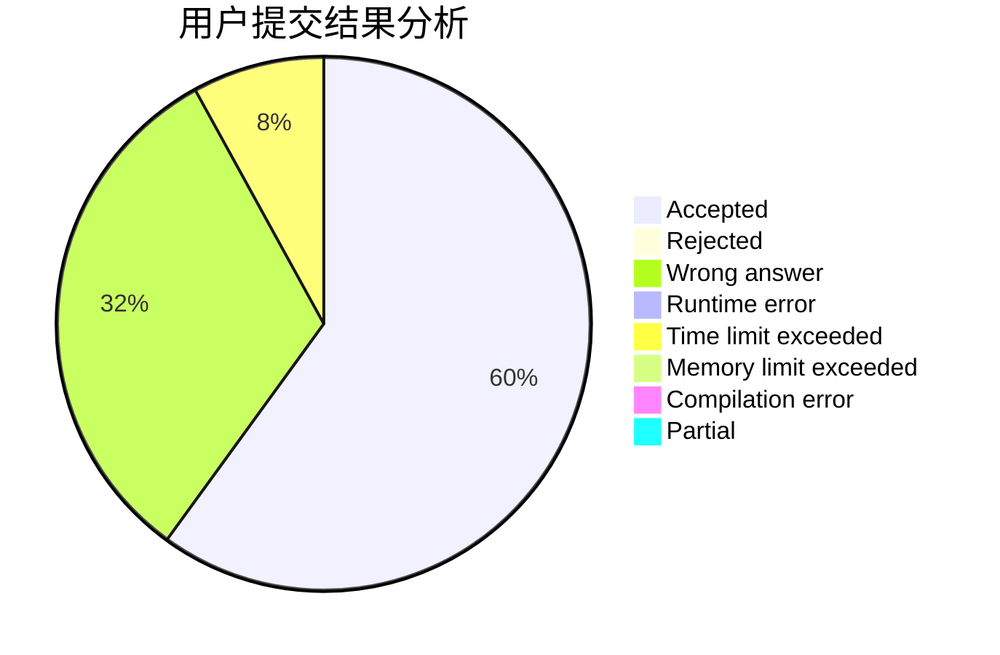
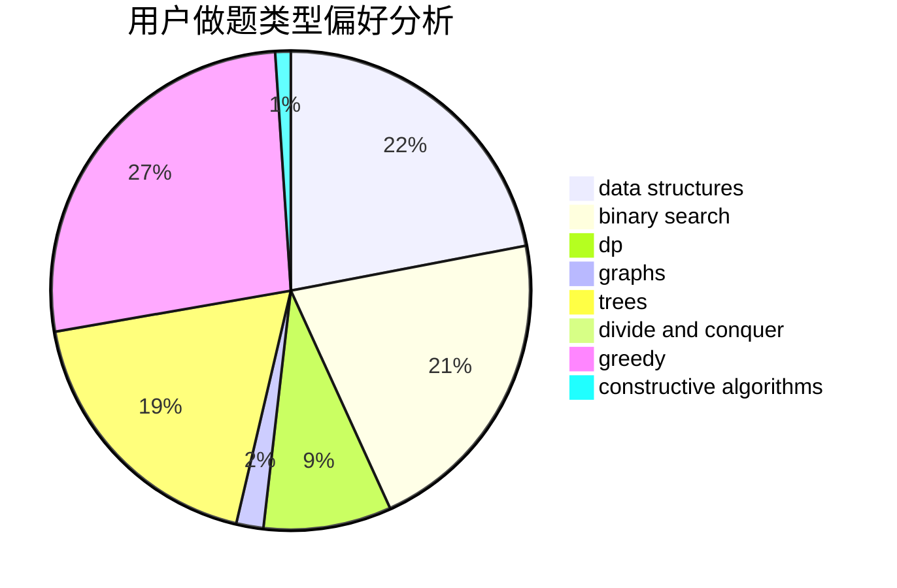
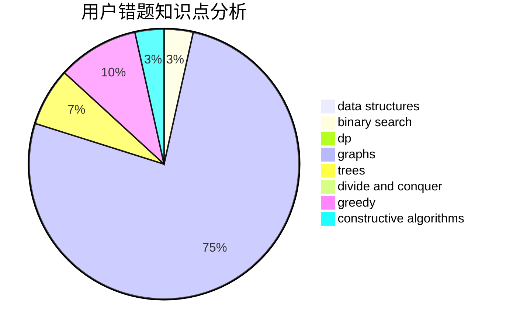

# Nero_Yuzurizaki

<!-- tabs:start -->

#### **用户提交结果分析**

#### **用户做题类型偏好分析**

#### **用户错题知识点分析**

<!-- tabs:end -->
# 推荐题目
[2A](https://codeforces.com/contest/2/problem/A)		hashing,
                        implementation		  
[1250F](https://codeforces.com/contest/1250/problem/F)		brute force,
                        implementation		  
[103D](https://codeforces.com/contest/103/problem/D)		brute force,
                        data structures,
                        sortings		  
[424B](https://codeforces.com/contest/424/problem/B)		binary search,
                        greedy,
                        implementation,
                        sortings		  
[434A](https://codeforces.com/contest/434/problem/A)		dsu,graphs,sortings,trees		  
[18E](https://codeforces.com/contest/18/problem/E)		dp		  
[240F](https://codeforces.com/contest/240/problem/F)		data structures		  
[689E](https://codeforces.com/contest/689/problem/E)		combinatorics,
                        data structures,
                        dp,
                        geometry,
                        implementation		  
[1182B](https://codeforces.com/contest/1182/problem/B)		dfs and similar,
                        implementation,
                        strings		  
[1314D](https://codeforces.com/contest/1314/problem/D)		dsu,graphs,sortings,trees		  
