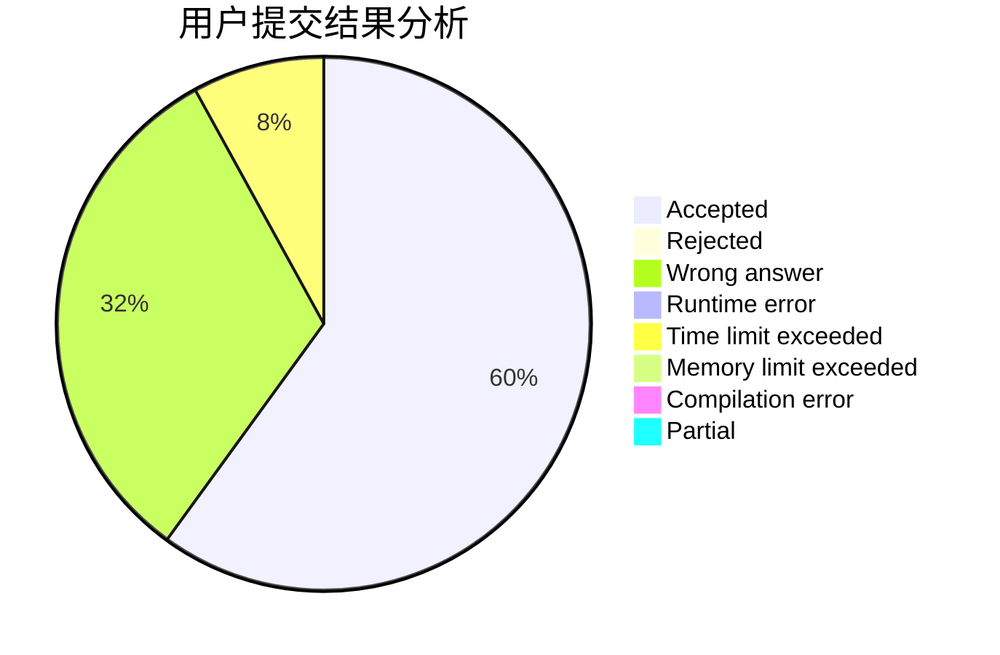
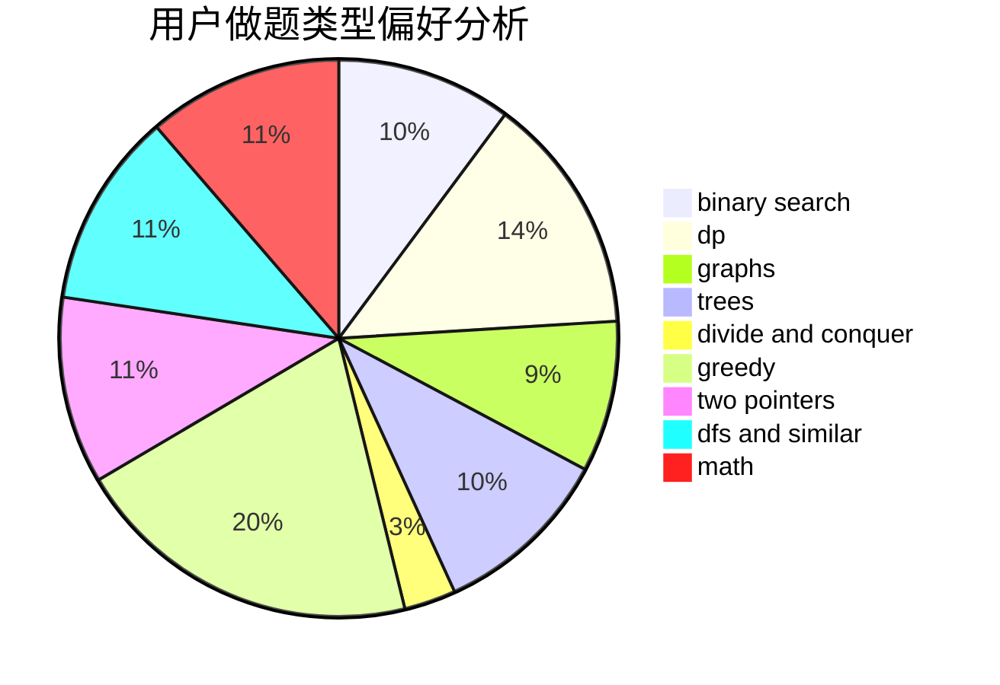

# Nero_Yuzurizaki

<!-- tabs:start -->

#### **用户提交结果分析**

#### **用户做题类型偏好分析**

<!-- tabs:end -->
# 推荐题目
[317E](https://codeforces.com/contest/317/problem/E)
[1254E](https://codeforces.com/contest/1254/problem/E)
[1040B](https://codeforces.com/contest/1040/problem/B)
[447A](https://codeforces.com/contest/447/problem/A)
[454A](https://codeforces.com/contest/454/problem/A)
[215C](https://codeforces.com/contest/215/problem/C)
[261D](https://codeforces.com/contest/261/problem/D)
[70E](https://codeforces.com/contest/70/problem/E)
[11843](https://codeforces.com/contest/1184/problem/3)
[1324C](https://codeforces.com/contest/1324/problem/C)
