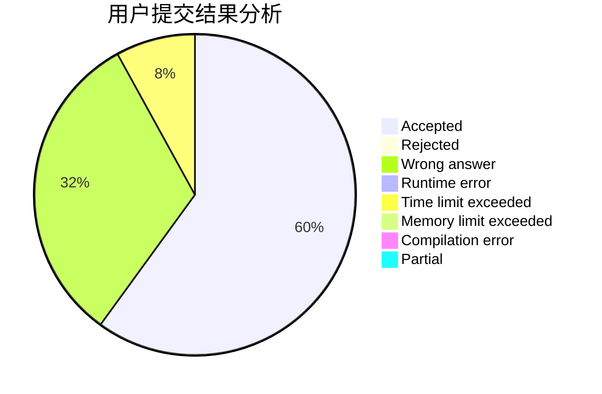
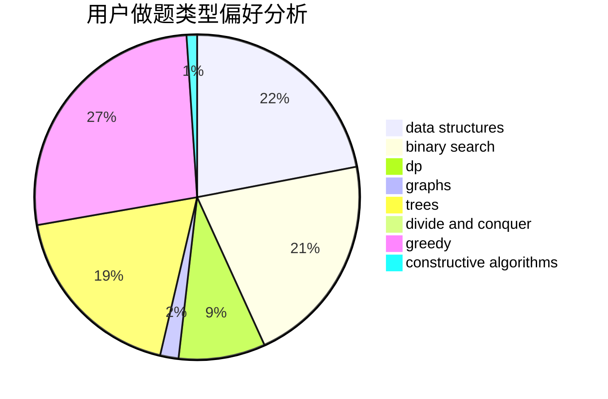
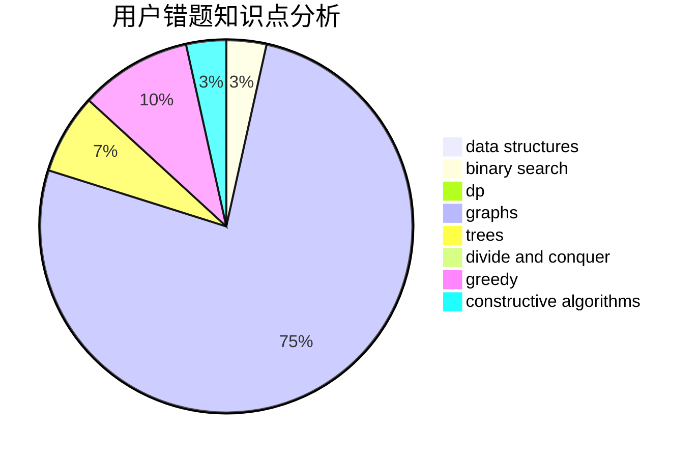

# Nero_Yuzurizaki
<!-- tabs:start -->
#### **用户提交结果分析**

#### **用户做题类型偏好分析**

#### **用户错题知识点分析**

<!-- tabs:end -->
# 推荐题目
[Vasya And The Matrix](http://codeforces.com/problemset/problem/1016/D)		constructive algorithms,
                        flows,
                        math		  
[Jury Marks](http://codeforces.com/problemset/problem/831/C)		brute force,
                        constructive algorithms		  
[Winner](http://codeforces.com/problemset/problem/2/A)		hashing,
                        implementation		  
[Anton and Fairy Tale](http://codeforces.com/problemset/problem/785/C)		binary search,
                        math		  
[Repainting Street](http://codeforces.com/problemset/problem/1415/B)		brute force,
                        brute force,
                        greedy		  
[Peter and Snow Blower](http://codeforces.com/problemset/problem/613/A)		binary search,
                        geometry,
                        ternary search		  
[The Intriguing Obsession](http://codeforces.com/problemset/problem/869/C)		combinatorics,
                        dp,
                        math		  
[Ivan and Powers of Two](http://codeforces.com/problemset/problem/305/C)		greedy,
                        implementation		  
[Ryouko's Memory Note](https://codeforces.com/contest/434/problem/A)		implementation,
                        math,
                        sortings		  
[New Year and Rainbow Roads](http://codeforces.com/problemset/problem/908/F)		graphs,
                        greedy,
                        implementation		  
<!-- tabs:start -->
#### **data structures**
[Vasya And The Matrix](http://codeforces.com/problemset/problem/240/F)		data structures		  
[Jury Marks](http://codeforces.com/problemset/problem/587/F)		data structures,
                        strings		  
[Winner](http://codeforces.com/problemset/problem/689/E)		combinatorics,
                        data structures,
                        dp,
                        geometry,
                        implementation		  
[Anton and Fairy Tale](http://codeforces.com/problemset/problem/103/D)		brute force,
                        data structures,
                        sortings		  
[Repainting Street](https://codeforces.com/contest/1323/problem/D)		binary search,
                        bitmasks,
                        constructive algorithms,
                        data structures,
                        math,
                        sortings		  
[Peter and Snow Blower](http://codeforces.com/problemset/problem/1492/C)		binary search,
                        data structures,
                        dp,
                        greedy,
                        two pointers		  
[The Intriguing Obsession](http://codeforces.com/problemset/problem/1490/G)		binary search,
                        data structures,
                        math		  
[Ivan and Powers of Two](http://codeforces.com/problemset/problem/1479/D)		binary search,
                        bitmasks,
                        brute force,
                        data structures,
                        probabilities,
                        trees		  
[Ryouko's Memory Note](http://codeforces.com/problemset/problem/1497/A)		brute force,
                        data structures,
                        greedy,
                        sortings		  
[New Year and Rainbow Roads](http://codeforces.com/problemset/problem/1491/C)		brute force,
                        data structures,
                        dp,
                        greedy,
                        implementation		  
#### **binary search**
[Vasya And The Matrix](http://codeforces.com/problemset/problem/785/C)		binary search,
                        math		  
[Jury Marks](http://codeforces.com/problemset/problem/613/A)		binary search,
                        geometry,
                        ternary search		  
[Winner](http://codeforces.com/problemset/problem/424/B)		binary search,
                        greedy,
                        implementation,
                        sortings		  
[Anton and Fairy Tale](https://codeforces.com/contest/1323/problem/D)		binary search,
                        bitmasks,
                        constructive algorithms,
                        data structures,
                        math,
                        sortings		  
[Repainting Street](http://codeforces.com/problemset/problem/1492/C)		binary search,
                        data structures,
                        dp,
                        greedy,
                        two pointers		  
[Peter and Snow Blower](http://codeforces.com/problemset/problem/1463/D)		binary search,
                        constructive algorithms,
                        greedy,
                        two pointers		  
[The Intriguing Obsession](http://codeforces.com/problemset/problem/1490/G)		binary search,
                        data structures,
                        math		  
[Ivan and Powers of Two](http://codeforces.com/problemset/problem/1479/D)		binary search,
                        bitmasks,
                        brute force,
                        data structures,
                        probabilities,
                        trees		  
[Ryouko's Memory Note](http://codeforces.com/problemset/problem/1436/E)		binary search,
                        data structures,
                        two pointers		  
[New Year and Rainbow Roads](http://codeforces.com/problemset/problem/1461/D)		binary search,
                        brute force,
                        data structures,
                        divide and conquer,
                        implementation,
                        sortings		  
#### **dp**
[Vasya And The Matrix](http://codeforces.com/problemset/problem/869/C)		combinatorics,
                        dp,
                        math		  
[Jury Marks](http://codeforces.com/problemset/problem/18/E)		dp		  
[Winner](https://codeforces.com/contest/1314/problem/D)		dp,
                        graphs,
                        probabilities		  
[Anton and Fairy Tale](http://codeforces.com/problemset/problem/1256/E)		dp,
                        greedy,
                        sortings		  
[Repainting Street](http://codeforces.com/problemset/problem/689/E)		combinatorics,
                        data structures,
                        dp,
                        geometry,
                        implementation		  
[Peter and Snow Blower](https://codeforces.com/contest/1341/problem/D)		bitmasks,
                        dp,
                        graphs,
                        greedy		  
[The Intriguing Obsession](http://codeforces.com/problemset/problem/1237/E)		dp,
                        math		  
[Ivan and Powers of Two](http://codeforces.com/problemset/problem/1492/C)		binary search,
                        data structures,
                        dp,
                        greedy,
                        two pointers		  
[Ryouko's Memory Note](https://codeforces.com/contest/1457/problem/C)		brute force,
                        dp,
                        implementation		  
[New Year and Rainbow Roads](http://codeforces.com/problemset/problem/1491/C)		brute force,
                        data structures,
                        dp,
                        greedy,
                        implementation		  
#### **graph**
[Vasya And The Matrix](http://codeforces.com/problemset/problem/908/F)		graphs,
                        greedy,
                        implementation		  
[Jury Marks](https://codeforces.com/contest/1314/problem/D)		dp,
                        graphs,
                        probabilities		  
[Winner](https://codeforces.com/contest/218/problem/C)		brute force,
                        dfs and similar,
                        dsu,
                        graphs		  
[Anton and Fairy Tale](http://codeforces.com/problemset/problem/1280/C)		dfs and similar,
                        graphs,
                        greedy,
                        trees		  
[Repainting Street](http://codeforces.com/problemset/problem/711/D)		combinatorics,
                        dfs and similar,
                        graphs,
                        math		  
[Peter and Snow Blower](https://codeforces.com/contest/1341/problem/D)		bitmasks,
                        dp,
                        graphs,
                        greedy		  
[The Intriguing Obsession](http://codeforces.com/problemset/problem/1487/C)		brute force,
                        constructive algorithms,
                        dfs and similar,
                        graphs,
                        greedy,
                        implementation,
                        math		  
[Ivan and Powers of Two](http://codeforces.com/problemset/problem/1437/C)		dp,
                        flows,
                        graph matchings,
                        greedy,
                        math,
                        sortings		  
[Ryouko's Memory Note](http://codeforces.com/problemset/problem/1470/D)		constructive algorithms,
                        dfs and similar,
                        graph matchings,
                        graphs,
                        greedy		  
[New Year and Rainbow Roads](http://codeforces.com/problemset/problem/1476/C)		dp,
                        graphs,
                        greedy		  
#### **trees**
[Vasya And The Matrix](http://codeforces.com/problemset/problem/1280/C)		dfs and similar,
                        graphs,
                        greedy,
                        trees		  
[Jury Marks](http://codeforces.com/problemset/problem/1438/F)		interactive,
                        probabilities,
                        trees		  
[Winner](http://codeforces.com/problemset/problem/1479/D)		binary search,
                        bitmasks,
                        brute force,
                        data structures,
                        probabilities,
                        trees		  
[Anton and Fairy Tale](http://codeforces.com/problemset/problem/1511/C)		brute force,
                        data structures,
                        implementation,
                        trees		  
[Repainting Street](http://codeforces.com/problemset/problem/1499/F)		combinatorics,
                        dfs and similar,
                        dp,
                        trees		  
[Peter and Snow Blower](http://codeforces.com/problemset/problem/1491/E)		brute force,
                        dfs and similar,
                        divide and conquer,
                        number theory,
                        trees		  
[The Intriguing Obsession](http://codeforces.com/problemset/problem/1466/D)		data structures,
                        greedy,
                        sortings,
                        trees		  
[Ivan and Powers of Two](http://codeforces.com/problemset/problem/1495/D)		combinatorics,
                        dfs and similar,
                        graphs,
                        math,
                        shortest paths,
                        trees		  
[Ryouko's Memory Note](http://codeforces.com/problemset/problem/1303/G)		data structures,
                        divide and conquer,
                        geometry,
                        trees		  
[New Year and Rainbow Roads](http://codeforces.com/problemset/problem/1454/E)		combinatorics,
                        dfs and similar,
                        graphs,
                        trees		  
#### **divide and conquer**
[Vasya And The Matrix](http://codeforces.com/problemset/problem/1461/D)		binary search,
                        brute force,
                        data structures,
                        divide and conquer,
                        implementation,
                        sortings		  
[Jury Marks](http://codeforces.com/problemset/problem/1466/G)		combinatorics,
                        divide and conquer,
                        hashing,
                        math,
                        string suffix structures,
                        strings		  
[Winner](http://codeforces.com/problemset/problem/1490/D)		dfs and similar,
                        divide and conquer,
                        implementation		  
[Anton and Fairy Tale](https://codeforces.com/contest/1483/problem/C)		data structures,
                        divide and conquer,
                        dp		  
[Repainting Street](http://codeforces.com/problemset/problem/1491/E)		brute force,
                        dfs and similar,
                        divide and conquer,
                        number theory,
                        trees		  
[Peter and Snow Blower](http://codeforces.com/problemset/problem/1303/G)		data structures,
                        divide and conquer,
                        geometry,
                        trees		  
[The Intriguing Obsession](http://codeforces.com/problemset/problem/1494/D)		constructive algorithms,
                        data structures,
                        dfs and similar,
                        divide and conquer,
                        dsu,
                        greedy,
                        sortings,
                        trees		  
[Ivan and Powers of Two](http://codeforces.com/problemset/problem/1482/E)		data structures,
                        divide and conquer,
                        dp		  
[Ryouko's Memory Note](http://codeforces.com/problemset/problem/566/C)		dfs and similar,
                        divide and conquer,
                        trees		  
[New Year and Rainbow Roads](http://codeforces.com/problemset/problem/1428/F)		binary search,
                        data structures,
                        divide and conquer,
                        dp,
                        two pointers		  
#### **greedy**
[Vasya And The Matrix](http://codeforces.com/problemset/problem/1415/B)		brute force,
                        brute force,
                        greedy		  
[Jury Marks](http://codeforces.com/problemset/problem/305/C)		greedy,
                        implementation		  
[Winner](http://codeforces.com/problemset/problem/908/F)		graphs,
                        greedy,
                        implementation		  
[Anton and Fairy Tale](http://codeforces.com/problemset/problem/1256/E)		dp,
                        greedy,
                        sortings		  
[Repainting Street](http://codeforces.com/problemset/problem/424/B)		binary search,
                        greedy,
                        implementation,
                        sortings		  
[Peter and Snow Blower](http://codeforces.com/problemset/problem/1280/C)		dfs and similar,
                        graphs,
                        greedy,
                        trees		  
[The Intriguing Obsession](https://codeforces.com/contest/1341/problem/D)		bitmasks,
                        dp,
                        graphs,
                        greedy		  
[Ivan and Powers of Two](http://codeforces.com/problemset/problem/1495/A)		geometry,
                        greedy,
                        math,
                        sortings		  
[Ryouko's Memory Note](http://codeforces.com/problemset/problem/1097/E)		constructive algorithms,
                        greedy		  
[New Year and Rainbow Roads](http://codeforces.com/problemset/problem/1492/C)		binary search,
                        data structures,
                        dp,
                        greedy,
                        two pointers		  
#### **constructive algorithms**
[Vasya And The Matrix](http://codeforces.com/problemset/problem/1016/D)		constructive algorithms,
                        flows,
                        math		  
[Jury Marks](http://codeforces.com/problemset/problem/831/C)		brute force,
                        constructive algorithms		  
[Winner](https://codeforces.com/contest/1323/problem/D)		binary search,
                        bitmasks,
                        constructive algorithms,
                        data structures,
                        math,
                        sortings		  
[Anton and Fairy Tale](http://codeforces.com/problemset/problem/1097/E)		constructive algorithms,
                        greedy		  
[Repainting Street](http://codeforces.com/problemset/problem/1493/A)		constructive algorithms,
                        greedy		  
[Peter and Snow Blower](http://codeforces.com/problemset/problem/1463/D)		binary search,
                        constructive algorithms,
                        greedy,
                        two pointers		  
[The Intriguing Obsession](https://codeforces.com/contest/1456/problem/B)		bitmasks,
                        brute force,
                        constructive algorithms		  
[Ivan and Powers of Two](http://codeforces.com/problemset/problem/1492/D)		bitmasks,
                        constructive algorithms,
                        greedy,
                        math		  
[Ryouko's Memory Note](https://codeforces.com/contest/1504/problem/D)		constructive algorithms,
                        games,
                        interactive		  
[New Year and Rainbow Roads](https://codeforces.com/contest/1483/problem/A)		brute force,
                        constructive algorithms,
                        greedy,
                        implementation		  
#### **sortings**
[Vasya And The Matrix](https://codeforces.com/contest/434/problem/A)		implementation,
                        math,
                        sortings		  
[Jury Marks](http://codeforces.com/problemset/problem/1256/E)		dp,
                        greedy,
                        sortings		  
[Winner](http://codeforces.com/problemset/problem/424/B)		binary search,
                        greedy,
                        implementation,
                        sortings		  
[Anton and Fairy Tale](http://codeforces.com/problemset/problem/103/D)		brute force,
                        data structures,
                        sortings		  
[Repainting Street](https://codeforces.com/contest/1323/problem/D)		binary search,
                        bitmasks,
                        constructive algorithms,
                        data structures,
                        math,
                        sortings		  
[Peter and Snow Blower](http://codeforces.com/problemset/problem/1495/A)		geometry,
                        greedy,
                        math,
                        sortings		  
[The Intriguing Obsession](https://codeforces.com/contest/1496/problem/C)		geometry,
                        greedy,
                        math,
                        sortings		  
[Ivan and Powers of Two](http://codeforces.com/problemset/problem/1495/A)		geometry,
                        greedy,
                        math,
                        sortings		  
[Ryouko's Memory Note](http://codeforces.com/problemset/problem/1497/A)		brute force,
                        data structures,
                        greedy,
                        sortings		  
[New Year and Rainbow Roads](http://codeforces.com/problemset/problem/1427/A)		math,
                        sortings		  
<!-- tabs:end -->
