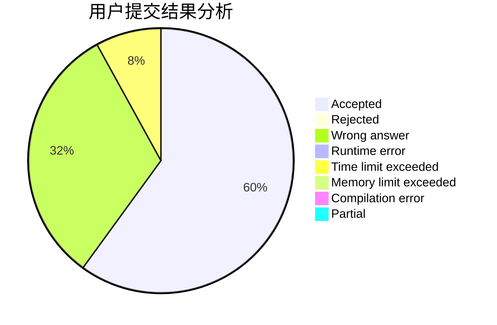
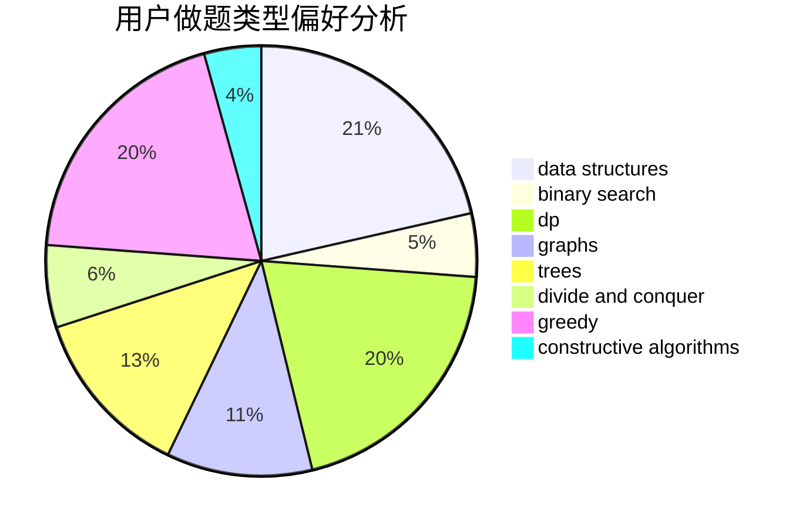
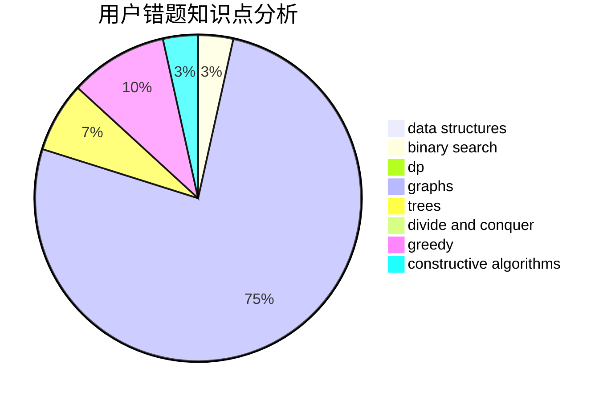

# Nero_Yuzurizaki

<!-- tabs:start -->

#### **用户提交结果分析**

#### **用户做题类型偏好分析**

#### **用户错题知识点分析**

<!-- tabs:end -->
# 推荐题目
[317E](https://codeforces.com/contest/317/problem/E)		constructive algorithms,
                        shortest paths		  
[1254E](https://codeforces.com/contest/1254/problem/E)		combinatorics,
                        dfs and similar,
                        dsu,
                        trees		  
[1040B](https://codeforces.com/contest/1040/problem/B)		dp,
                        greedy,
                        math		  
[447A](https://codeforces.com/contest/447/problem/A)		implementation		  
[454A](https://codeforces.com/contest/454/problem/A)		implementation		  
[215C](https://codeforces.com/contest/215/problem/C)		brute force,
                        implementation		  
[261D](https://codeforces.com/contest/261/problem/D)		dp		  
[70E](https://codeforces.com/contest/70/problem/E)		dp,
                        implementation,
                        trees		  
[11843](https://codeforces.com/contest/1184/problem/3)		dsu,graphs,sortings,trees		  
[1324C](https://codeforces.com/contest/1324/problem/C)		binary search,
                        data structures,
                        dfs and similar,
                        greedy,
                        implementation		  
