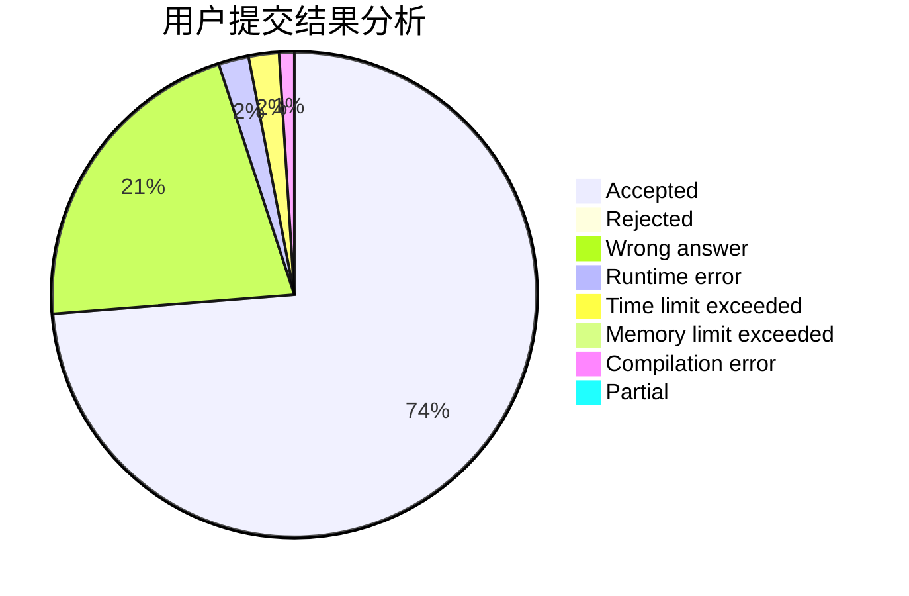
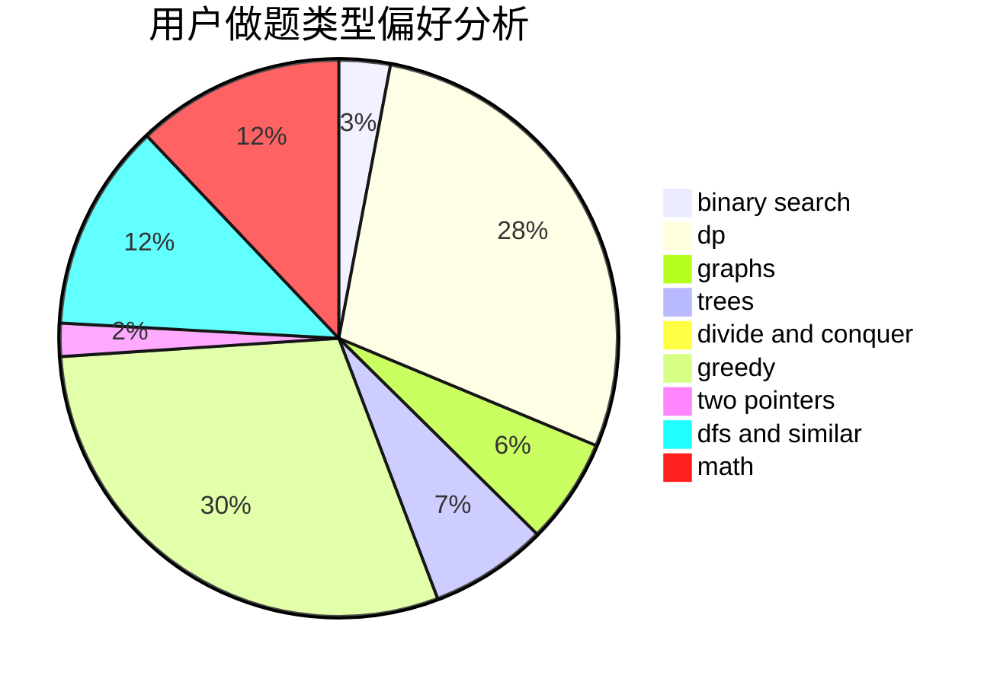

# 0x3F

<!-- tabs:start -->

#### **用户提交结果分析**

#### **用户做题类型偏好分析**

<!-- tabs:end -->
# 推荐题目
[1065C](https://codeforces.com/contest/1065/problem/C)
[1064C](https://codeforces.com/contest/1064/problem/C)
[1065G](https://codeforces.com/contest/1065/problem/G)
[1065B](https://codeforces.com/contest/1065/problem/B)
[1065F](https://codeforces.com/contest/1065/problem/F)
[1066F](https://codeforces.com/contest/1066/problem/F)
[1064F](https://codeforces.com/contest/1064/problem/F)
[1059D](https://codeforces.com/contest/1059/problem/D)
[1066B](https://codeforces.com/contest/1066/problem/B)
[1064B](https://codeforces.com/contest/1064/problem/B)
